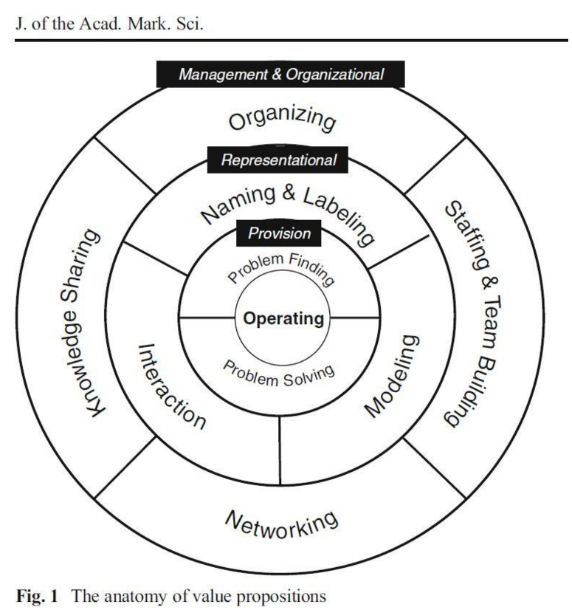

# Don't be disrupted a Strategy for IT Enabled Information Capability

*Indicate Submission Type: Completed Research Paper*

## Introduction

IT-enabled Information Management Capability (IMC) enables firms to respond rapidly to changing market needs, supports digital transformation and reconfiguration of business through enabling easier decisions, facilitates flexibility to fulfill more customers' needs without incurring extra cost, and provides a technological platform for expanding the business. The strategic use of information has already enabled digital firms such as Amazon, Alibaba, and Facebook to implement new business models, which have deeply influenced the structures of their industries. However, the abundance of data, privacy regulations, and security threats are now compelling firms to rethink how to best utilize IMC.

The API (Application Programming Interface) concept predates computing and the web and is as old as computing itself. APIs have served as an entry point into a system, so the system's functionality can be used. In a web context, APIs are ways of making services available over the internet in an easy-to-use way. This ability to share functionality and data over the web provided building blocks whereby bits of functionality can be combined into larger interconnected capabilities. Think of these APIs as Lego blocks that build the foundation of your imagination.

Today's digital economy is built on Web APIs which opens the possibility of how business can be built and reconfigured. For brands that are looking to leverage APIs to expand their services into the digital economy they must identify the data and service vacancies in the market and expose the valuable currency (your data) and have a good understanding of managing APIs and a sensible API strategy that allows a firm to participate in the API economy. You see companies leveraging services from docusign to bring in digital form creation and digital signature to transform their in-person and web signature-based onboarding processes. You also see companies leveraging health startups that provide intelligent services and data to accelerate development of vaccine through genetic testing from companies like Helix that provide insight Web APIs that provide access to data on users' genetic traits.

The ProgrammableWeb directory passed 22,000 public web APIs and this growth has been accelerating since 2005. Although the concept of building for reuse (building a capability once) seems intuitive, large enterprises continue to struggle to encapsulate these capabilities across organization boundaries, manage the discovery, usage (usability) and evolution of these Web API assets. Web APIs (application program interfaces) are the ways that software talks to other software (over web protocols) that enable developers to leverage data and functions to build new products and services. Look at any mobile application, they exist primarily because they can leverage capabilities made available through third-party Web APIs. Take a ride-sharing application that leverages the Google Maps API for navigation, payment API to facilitate paying for the ride. Harvard Business Reviews (January 2015) states that Salesforce generates 50% of its revenue (currently 17.1 billion USD 2020) through APIs.

The economical return on investment compounds with each new consumer, however many organizations have yet to fully embrace this opportunity due to the traditional project-based (just in time development of APIs) with siloed (point-to-point) integration remaining the rule. Legacy applications that were not designed to cleanly expose data and business logic in the form of Web APIs. Web APIs are becoming the center piece to enterprise modernization strategies and with the increasing pressure to deliver new digital capabilities across the value chain (external consumers, partners, and internal consumers) we need a taxonomy that increases our ability to leverage capabilities across organizational boundaries, principles that support the evolvability of an API, methods that aid in the discovery of APIs in a digital platform that enables a mall-map experience to rapidly reconfigure and enterprise.

Modern companies are architecting and designing their technology as technology building blocks intended to be reused which is recognized as a key attribute in improving software productivity and quality. Looking back as successful industrial revolutions we find that modularity and interchangeable components key to the strategy. This same growth and digital revolution is powered in the technological world through digital platforms. The organizations that will succeed in their digital transformation will be the ones that solve for these digital building blocks that support discoverability and interoperability in this burgeoning API economy. Companies will realize the critical role that Web APIs play in innovation and modernization of their ecosystem.

Prior research in information systems has explored three areas relevant to API and the value creation process. First, several studies suggest API and economic value creation process through a lens of software reuse to increase software development productivity and quality while at the same time decrease costs (Panagiotou et all, 2010 & Morisio, 2002). Second, studies have suggested that Web APIs have emerged as the prominent paradigm for the development of distributed software systems as they provide the potential for software to be modularized in way that the functionality can be described, discovered and deployed in a platform independent manner over a network and that they are the main asset of this intellectual capital (Bell, 2007 & Panagiotou, 2011). However, a gap remains in the existing literature in linking the anatomy of APIs to the value of co-creation. We further extend this view of software reuse to include Web APIs and leverage an attribution method to understand the behavior of the engineers, provide a shared language and discovery approach grounded in SD logic so that "they expand actor-to-actor networks beyond their temporal, organizational, and spatial boundaries".

We ask the research questions: 
1. How can the anatomy of APIs influence knowledge sharing in a digital platform at an interorganizational level?
2. How will a mechanism for discovery of Web APIs influence value co-creation for an organization?

In this study include both quantitative and qualitative data gathered concurrently. We will leverage a survey oriented mixed methods SD logic design in which value propositions will provide an overarching framework for the study and lead to methods that aid in the discovery of Web APIs as a service to empower organizations. The survey questions will be based on attribution theory to understand the causal influences that lead to explore the behaviors related to Web API reuse to understand how individuals interpret the reasoning for the importance of leveraging these capabilities in the enterprise. Furthermore, service-dominant-logic (SDL) will be leveraged to provide key insights into the intangible resources of Web APIs and the value of reuse in an organization. This lens will explore knowledge sharing across the dimensions of SDL (organization level, representation level and provisional layer) to provide strategic insights into co-creation that can be leveraged to motive and support reuse in a large enterprise firm. Successful Web API reuse is not only contingent on having the right resources (Web APIs), taxonomy (anatomy of the API); practices for discovery and co-creating these capabilities into attractive value-in-use propositions are also needed within a digital platform.

The quantitative data will be used to test the theory that predicts that an aid of discovery of Web APIs will influence positively the value of co-creation (variable) for software engineers (participant) at a Large firm (research site). The qualitative data will explore the attribution struggle of large enterprise to encapsulate these capabilities across organizational boundaries (phenomena) for software engineers across verticals (participants) at a Large insurance provider (research site).

The two forms of data will be combined to highlight the challenges in enterprise reuse of Web APIs and argue for argue for:
1. The creation of a service taxonomy (anatomy of an API) that provides a language to understand the intent of an API in an ecosystem
2. Principles in the design of a service to support evolvability of the Web APIs
3. A method for gaining strategic advantage through aiding in information management capabilities in support of the API economy. 

Just like the assembly lines ushered in an era of mass production; Web APIs provide the key building blocks to reconfigure the enterprise.

These results are in conformance with prior studies on reuse, however this is the first study, to our knowledge, to align the concepts of reuse with both attributional theory and service-dominant logic as a theoretical lens to validate the models of success in Web API reuse. Of central importance are the effects of attributions on Web API reuse and how co-creation can be leveraged to motive and support Web API reuse in a large enterprise firm. The key insight we develop is Web API service reuse must be conducted with the lens of how co-creation and value propositions are evaluated from the perspective of the consumers' value creation, and actions that influences the antecedents to produce positive organizational outcomes. This contributes to value co-creation literature and provides tangible technology-enabled value co-creation aimed at the digital transformation building blocks of Web API.

## Literature Review

Software reuse is recognized as the key attribute in improving software productivity and quality. Morisio notes that failure factors include non-awareness and commitment from management (Morisio, 2002). They further note that changes in high level design to account for availability of assets, adding in new processes to drive the identification of reusable assets, addressing human factors through awareness events and finally setting up a repository. We believe in understanding the underlying attributes of the behavior and providing self-service discovery will address the awareness condition noted by Morisio et al.

Bell expands the definition in that "Web services have emerged as the prominent paradigm for the development of distributed software systems as they provide the potential for software to be modularized in way that the functionality can be described, discovered and deployed in a platform independent manner over a network" (Bell, 2007). Web services as defined by the W3C as a software system designed to support interoperate machine-to-machine interaction over a network. Its interface describes in a processable format (specifically WSDL). Defined here the web service is SOAP-messages based on Service Oriented Architecture. Modern Web APIs tend to leverage an OpenAPI specification and leverage the HTTP protocol to send data in JSON or XML formats. Bell, et al (2007) develop a service discovery architecture to assist in semantic discovery and knowledge discovery. The semantic web we were promised has yet to be delivered, however this paper does provide an OWL ontology for describing services which influences the Web API taxonomy developed in this paper which we believe provides a more complete model in communicating the opportunity, audience and further details related to data classification and data residency concerns that were not part of these earlier research papers.

Panagiotou, et al. (2011) states "the main asset of a software organization consists of its intellectual capital", and they take a knowledge management theoretical lens and again the promise of a semantic web in solving this knowledge communication and coordination problem. The promise of applying semantic web technologies to include reusability and extensibility, and even enhanced discovery. We do agree with Panagiotou that "there is a need for managing knowledge in software development".

Although the semantic-based knowledge system is based on libraries this concept can be expanded to Web APIs described in a Swagger or OpenAPI specification and instead leverage natural language processing to extract key words to determine existing services and even identify similar services that exist within a large enterprise providing a map to opportunities of reuse within the enterprise. We agree that "individual knowledge has to be shared and leveraged at a project and organization level, and this is exactly what knowledge management proposes" (Panagiotou, et. al), we believe that making discovery, awareness and guidelines for Web API development will provide a positive outcome on a firm's ability to drive improvement in over reuse across the organization.

While knowledge management efforts in the software development domain traditionally involved technical initiatives such as knowledge repositories, experience factories, and lessons-to-learn databases, there is a growing appreciation in the software community of the role of developers' personal knowledge networks in software development (Balijepally & Nerur, 2019). As noted by this research "It is not uncommon for software developers to scour the Internet---blogs, technical forums and list serves, among others--- to acquire problem-specific knowledge (Assimakopoulos & Yan, 2006). Knowledge management (KM) systems, where available, could serve as valuable sources of information relating to business processes, or the technology domain." (Balijepally & Nerur, 2019). We agree with VenuGopal in the criticality of knowledge exchange which is at the heart of this expanded research into a IT digital platform to support discovery and co-creation to meet there ever increasing demands on software development in large enterprise. We further share the appreciation of the criticality of knowledge exchange and believe this research furthers insights into how a knowledge management can address the behavior and provide not only knowledge transfer but the ability to co-create across organizational boundaries.

Sugathan et al. (2018) uses attribution theory to explain theoretical relationships and tests hypothesis in experiments to stimulate co-creation. Like Sugathan et al. we look to understand the effect of co-creation on attribution however rather than link attribution to the failure of co-creation with customers we leverage attribution theory to link the antecedents to motivate co-creation with Web APIs within the firm across organizational boundaries.

## Theory Background

### Attribution Theory

Attribution theory is concerned with how individuals perceive events and how it relates to their thinking and behavior. An attribution is a causal explanation for a behavior. To illustrate, if a developer observes a colleague duplicate existing functionality, they are likely to try to form an attributional explanation of this behavior. The observer might conclude that their colleague is poorly trained (attributing the behavior to skills). The theory assumes that people try to determine why people do what they do (attribute causes behavior). The qualitative analysis will leverage the research paradigm of social psychology to understand the casual dimensions of behavior across (1) locus of control (the source internal or external), (2) stability (ability), (3) controllability (can influence); Weiner et al. (1971).

Research shows that people attribute success internally (the source is internal), and failure externally (to the firm). The success or failure factors may be controllable or uncontrollable and we look to understand the controllable factors that will alter or influence a positive impact on Web API reuse.

Weiner (1985) states that attribution theory holds that attributions for these behaviors and outcomes help to shape emotional and behavioral responses. Attributions can help us identify and avoid the behaviors through the causal factors that caused them. The Attribution-Emotion-Behavior process is depicted below.

| **Stability** | **Locus of control** |                |
|---------------|----------------------|----------------|
|               | Internal             | External       |
| Stable        | Ability              | Task difficulty|
| Unstable      | Effort               | Luck           |

*Table: Weiner et al (1971)*

Kelly and Michela (1980) clearly define the elements of attribution research. First the investigator has a concept of the explanations of the behavior. Second a hypothesis about the antecedents of the cause. Finally, the investigator has a hypothesis of the subject making a particular attribution.

Within the context of co-creation, the explanation of the behavior is more observable to the API developer that is creating duplicate Web APIs and who is involved in the creation of the product or service. Within the locus of control, we look at the API producers who have the ability and skills necessary to create and co-create Web APIs so that the operant resource such as effort and skills are controlled.

### Co-Creation

Service Dominant Logic holds that firms offer value propositions, that value is co-created during interactions, and that value is subjectively determined by the customer in context (Edvardsson et al. 2011; Vargo and Lusch 2008a). The basic premise is that it entails the creation of value for each other by two or more entities across the producer and consumer markets. In this paper we look at the enterprise services produced and consumed at the company, business unit or team.

**SDL Premises**

- FP1 - Service is the fundamental basis of exchange.
- FP4 - Operant (knowledge and skill) resources are the fundamental source of strategic benefit.
- FP6 - Value is cocreated by multiple actors, always including the beneficiary. (service-oriented view)
- FP9 - All social and economic actors are resource integrators.

Service for service exchange (FP1) is inherently learning and knowledge discovery focused; it is through this interaction between actors (service-benefit and service-providing) where they learn about the nature of the value in their exchange.

These premises imply, that value is co-created by multiple stakeholders (consumer and producer). Therefore, the value creation process is the process of consuming and interaction, which is dependent on the operant (FP4) (knowledge or awareness of the service), which is uniquely reliant on the ability to for actors to be resource integrators (FP9). Hence customer value created can be defined as the reuse of a service, which companies have to maximize by providing a service-oriented view of cocreation through established methods of discovery, taxonomy and practice for integrating these capabilities (FP6).

S-D logic and its core concept of value co-creation have been influential in theorizing IS phenomena (Srivastava, 2015). S-D logic offers new, distinctive philosophical assumptions about economic exchange, the fourth stream of research promotes S-D logic and value co-creation as a theoretical lens to study various IS phenomena, and value co-creation holds that actors integrate resources through service exchange which is configured by institutional arrangements through which service ecosystems endogenously emerge (Blaschke, 2018).

As Lusch and Vargo (2014) state knowledge, the most critical of all resource, is applied to other potential resources to create "resourceness", and when applied can provide service to benefit other actor (or the actor themselves). Furthermore, information technologies and the digital revolution, including the spread of the Internet, enable more and more actors and resources to be connected and more easily integrated (Lusch and Vargo, 2014). Three factors are noted to drive this trend: open standards, connectivity and network ubiquity. In this case to address the knowledge, skills and leverage rapid business transformation we argue for the need of consistent language to enable actors to develop and share rules, connectivity to allow actors to engage in the cocreation of service, and network ubiquity in the discovery to enable service-to-service exchange. It is through collaborative communication, learning that promotes discovery of Web APIs for integration and enhanced creation possibilities through more effective leverage of technology.

## Hypothesis

Knowledge Management Co-ordination defined a meta-model that aligns with our hypothesis of a knowledge digital platform and creation of knowledge is developed through the sharing of knowledge. "The general goal of KM (digital platform) can be formatted as making these processes known the persons involved, improving them where shortcoming can be identified, and assisting them with technical means where possible and reasonable." (Kucza et al, 2001). This further validating our hypothesis of the need for a discovery capability. The authors further identify that cultural and behavioral aspects are the most important aspects to study so that the organizational commitment as researched in this paper. This paper further expresses reuse and enhanced processes through the concept of co-creation in the support of knowledge discovery. The problem noted in cultural aspects of reusable assets found that the problem searching is not performed (culture), and assets cannot be found with reasonable effort (insufficient descriptions which we note as a taxonomy) and adaptation is too complicated (improper codification) which we address through the anatomy of APIs.

The Main KM process defined by Kucza et al aligns to H1a (anatomy of API in addressing ability to reasonably search for the reusable APIs) and further aligns to the sharing of knowledge through a knowledge collection and storage mechanism defined in our hypotheses as a digital platform of discovery. Further expanding on the process improvement model through establishment of a supporting culture we find that the mechanism is through organizational commitment and process evangelism through leadership aligning to the understanding of H3 and H4 in support of the culture. We expand on the insights of the KM model through the introduction of a co-creation t address the knowledge, skills and enable and address issues of reuse in the organization.

Spoelstra et al. notes three organizational factors that align to the model, first top management support and instrumental mechanisms, organizational structures and reuse roles and communication channels and organization support. "Top management support and instrumental mechanisms are taken as a factor for indicating the commitment of top management" (Spoelstra et al, 2011) which aligns to H3 and concept of commitment. "The organizational structure and related reuse roles are often approached as a formal separation between producers of reusable assets and consumers of reusable assets" (Spoelstra et al, 2011) aligns to H2 and the concept of co-creation through service-dominant logic. They further explain this through the concept of "producers of reusable assets are those who create the assets, and the consumers are those who use the assets in building new solutions." Finally, the authors note the identification of communications channels and how they are supported which we believe is done through knowledge sharing and digital platform of discovery H1. Figure 1 below is the model based on the research of knowledge management and software reuse this study is oriented around.

The level at which this study will be done will be at the Unit of analysis at API level and whether users are using the API.

| **Variable Name** | **Definition** |
|-------------------|----------------|
| API Anatomy | The API Anatomy represents the taxonomy of the API which includes the API Classification (from simple to complex) and API Audience (number of different audiences that can call the API).  Anatomy of API = API Classification + API Audience  Example: - Integration API (3) + company-internal (3) 6 - Façade API (1) + component-internal (1) 2  The anatomy communicates potential increase to Knowledge Sharing |
| API Classification | An aggregated score of 8 different API types (from simple to complex), measured through an inter-rater reliability instrument. Inter-rater reliability is a score of the consistency given by the same person across multiple instances. Using the manually classified APIs. The survey questions related to anatomy of an API include question number (5) -- how important with an average of 6.7 out of 7 indicating that this is the important aspect of knowledge discovery. Three members of the interview panel were asked as part of the API classification (types of APIs) which ones were simple, medium and more complex as related to API design. Members were asked to rate APIs with the following complexity for (1 -- Simple, 3- Medium and 5 -- Complex)  Simple due to the simple nature of the type of API (score of 1) - Façade API - Data API  Medium due to the nature of multiple steps and integration with systems or end-user applications (score of 3) - Integration - Orchestration - Choreography - Experience  Complex -- do to the perceived complexity in difference options to drive search, crawl and workflow (score of 5) - Workflow - Hypermedia - Search  Cohen's Kappa: P­0 = 1.0 |
| API Audience | An aggregated score of 5 different audience using a simple count of audiences that have a potential to call the API; external-partner APIs by definition are built for external reuse (external, company, business unit and internal), company-internal (company, business unit and internal) are built for internal reuse, business-unit-internal (business unit and internal) are build for reuse within a department and component-internal (internal) was meant for the specific component  - external-public - 5 - external-partner -- 4 - company-internal -- 3 - business-unit-internal -- 2 - component-internal -- 1  This is the degree of reuse potential based on the number of audiences that can consume the API. API Audience as measured as by number of consumers have the potential to call the service is represented as a value for the number of different consumers that can call. External-public is accessible by all (5) audiences so will have a value of 5. |
| Discovery | Defined as the ability to discover what Web APIs exist in an organization |
| Knowledge | Ability for developer to know what capabilities exist within the organization |
| Reuse | Dependent variable that leads to cross-enterprise reuse of a Web API asset |
| Evangelism | Measure of organization commitment to reuse |
| Commitment | Measure of commitment from management |

| | Variable | Observations | Mean | SD | Min | Max | Notes |
|-|----------|--------------|------|----|----|-----|-------|
| 1 | API Anatomy | 343 | 2.4 | 0.98 | 1 | 8 | |
| 2 | API Classification | 343 | .9 | 0.5 | 0 | 5 | |
| 3 | API Audience | 343 | 1.4 | 0.7 | 1 | 4 | |
| 4 | Discovery | 75 | 5.8 | 1.2 | 2 | 7 | 50% percentile is 6; there is high significance to discovery |
| 5 | Knowledge (QualCause) | 75 | No Catalog: 36 Awareness: 3 | | | | Qualitative answers include that No Catalog is the primary cause (H1) |
| 6 | Reuse (QualSol) | 75 | Build Catalog: 45 Organization: 20 | | | | Qualitative answers include that building for Discovery (H1) is the primary solution followed by organization commitment (H3) |
| 7 | Evangelism | 75 | 3.9 | 1.4 | 1 | 7 | 50% percentile is 4; there is a positive correlation to evangelism moderating |
| 8 | Commitment | 75 | 4.4 | 2.7 | 1 | 7 | 50% percentile is 5; most believe organizational commitment is important |

Those that qualitatively note that not having a digital platform for knowledge management were significantly more likely to recommend building a catalog (6:1) as a solution to Web API reuse

Those that qualitatively note that not having a catalog for knowledge management also noted that a taxonomy, capability or usage was also needed (anatomy of an API) (6 out of 7)

**H1a:** Knowledge sharing is positively influenced with an API anatomy

Those that qualitatively note the importance of an API anatomy also strongly recommend a knowledge sharing digital platform; highly correlated at .86)

Reviewing the 334 services with anatomy annotations increases both understanding and applicability in potential reuse.

**H1:** Digital Platforms Discovery is associated with knowledge sharing

Those that qualitatively note that knowledge of Web API assets as a primary factor were more likely to note having a digital platform as a solution over organizational process (2:1).

**H2:** Web API reuse is influence positively impacted with a digital platform that supports discovery

Those that note other attributes like organizational or legacy application note that organizational process is more likely a solution (3:1).

**H3:** Organizational (management) lack of commitment negatively moderates Web API reuse

It therefore leads that including evangelism of Web API reuse would also positively impact awareness and positively influence towards Web API reuse.

**H4:** Organizational (management) evangelism positively moderates Web API reuse

## Research Setting and Methods

The main data source for this survey is a set of interview questions that are qualitative and quantitative gathered concurrently driven by attribution theory to understand the participants motivation in not building for reuse. In detail the following steps will encompass the research approach.

1. Identification and selection of Web APIs within the Global retirement business. The retirement vertical has hundreds of APIs that can be analyzed in more detail

2. Development of a questionnaire based on attribution theory to understand the behavior that led to the proliferation of Web APIs

3. Development of nomenclature and service taxonomy to aid in the discoverability and improve task difficulty related to external locus of control

4. Data analysis to extract findings and trends to validate the challenges of enterprise reuse and alignment to the anatomy of value propositions to identify action

The questionnaire will be used to guide structured interviews and influenced from Morisio et al. in success and failure factors in software reuse but organized to the attributional style questionnaire by Peterson et al. (1982). Respondents had to rate their own attributions on three dimensions: locus, stability and control. Using a 7-point semantic differential scale, respondents had to indicate whether causes (1) reflected on the internal or external factors of the environment or situation, (2) were unstable or stable, and (3) were uncontrollable or controllable, with 3 items used for each dimension (Russell et al., 1987; Swanson and Kelley, 2001). Open ended questions are used to at a dimensionality to confirm the attributions and confirm the hypothesis. To address validity issues and bias factors associated with the subgroup of Web API developers who are experienced in developing and consuming Web APIs will be surveyed as noted in addressing and improving the precision of survey questions as the respondents have the necessary skills and experience (Hufnagel & Conca, 1994, MacKenzie & Podsakoff, 2012).

Global retirement is across three major continents; however, the basic premise is the same to provide sponsors (companies) and participants (employees) with retirement wealth management capabilities. The commonality of the business capabilities and service domain will provide an environment where reuse should be considered (common retirement capabilities) and highlight challenges with enterprise reuse.

The manual inventory of Web APIs was collected across three countries within the retirement capability space. 334 services are classified as private to the application; and 126 are classified at some level of reuse (platform, company or external).

Aligning to the taxonomy highlights key observations at the selection phase; there is a high percentage of private services (over 72%) that were not identified to be shared.

| **API Audience** | **Count** | **Percentage** |
|------------------|-----------|----------------|
| component-internal | 334 | 72.61% |
| business-unit-internal | 81 | 17.61% |
| company-internal | 35 | 7.61% |
| external-partner | 10 | 2.17% |

- Definition in Appendix

Most are also identified as integration APIs as a means to exchange data

| **API Classification** | **Count** | **Percentage** |
|------------------------|-----------|----------------|
| Aggregation API | 3 | .65% |
| Data API | 11 | 2.39% |
| Experience API | 18 | 3.91% |
| Façade API | 1 | .22% |
| Integration API | 369 | 80.22% |
| Hypermedia API | 1 | 0.22% |
| Orchestration API | 2 | 0.43% |
| (Unclassified) | 55 | 11.96% |

- Definition in Appendix

This manual analysis of the API ecosystem shows the cost of not having a reuse program and was also eye-opening to the management team. Here point to point APIs are the norm as it is difficult to discover or even engage with other team members across organization boundaries. Given the taxonomy the API developers were able to quickly categorize the APIs across scope, classification and audience immediately increasing the understanding of their API ecosystem. By focusing the catalog of discovery on external-partner, company-internal we can start documenting the most appropriate APIs for reuse with nothing more than the nomenclature described in the appendix. This taxonomy is noted as positively impacting discussion with the API developers and their understanding of their API ecosystem consistent with our hypothesis 2.

## Results

- Questions 2, 3 and 4 confirm that when noted that the behavior is negative that the producers believe it is due to external factors.
  - Confirms prior research related to attribution theory and negative behavior is seen as something external to the person.

- Question 5 shows that the API developers surveyed all believe it is important to have both a taxonomy (anatomy of API) and digital platform of discovery to promote reuse.
  - Confirming Hypothesis H1 and H2 that both an anatomy and discovery are necessary to promote reuse

- Those that note knowledge also note the impact of management commitment (question 6)
  - Confirming Hypothesis H3 that there is an element of management responsibility

- Those that note organization commitment also note the organizational issues as being more significant (question 7)
  - Confirming Hypothesis H4 that the organization must be committed

Figure All Responses

Across all surveyed individuals we don't see as strong correlation between the questions; however when we look at the API professional developers we see stronger correlation to the conceptual model.

Figure (14 API Professionals)

|            | *Reuse*      | *Knowledge* | *Discovery*  | *Anatomy*   | *Evangelism* | *Commitment* |
|------------|--------------|-------------|--------------|-------------|--------------|--------------|
| Reuse      | 1            |             |              |             |              |              |
| Knowledge  | -0.5822591   | 1           |              |             |              |              |
| Discovery  | **0.96628239**| -0.522233  | 1            |             |              |              |
| Anatomy    | 0.8368251    | -0.452267   | **0.8660254**| 1           |              |              |
| Evangelism | 0.44011055   | -0.1694347  | 0.40555355   | 0.37463432  | 1            |              |
| Commitment | 0.24340246   | 0.01212856  | 0.2090199    | 0.23129892  | **0.68662699**| 1           |

Correlation of variables

Correlation of the variables show a strong relationship of discovery on reuse, and a strong relationship of anatomy on knowledge which is consistent with the conceptual framework (when we look at the 14 API professionals in the survey). In addition, management commitment and evangelism are noted as moderating consistent with the conceptual model

Service Dominant Logic holds that firms offer value propositions, that value is co-created during interactions, and that value is subjectively determined by the customer in context (Edvardsson et al. 2011; Vargo and Lusch 2008a). Applying this lens to the data analysis will provide insights into the actions and behaviors across three main value propositions: (1) provision layer -- the problem of lack of reuse, (2) representational layer -- related to the taxonomy of Web APIs and how to interact, and (3) management and organizational layer - to support knowledge sharing and practice of reuse.

Combinatorial Evolution "A novel technology emerges always from accumulation of previous components and functionalities already in place." (Arthur 2009, p. 124)

The underlying idea of S-D logic is that humans apply their competences to benefit others and reciprocally benefit from others' applied competences through service-for-service exchange.

As Griss stated (Griss, 1995) "Reuse is a business issue that involves technology transition and organizational change. Instituting a reuse culture, providing training, adhering to standard and securing management commitment are the key success factors." Aligning this to attribution theory those individuals that attributed the failure based on external factors with lack of commitment from leadership at 22%, lack of awareness at 21% and a whopping 50% of the Web API experts in a 600-person organization stated that the main contributing factor to reuse was lack of the knowledge management capability such as a catalog.

Frakes and Fox (Frakes 1996) asked respondents to identify the problems with reuse with the assumption of a component-based approach to reuse in place. Their results show that:

- 32% no attempt to reuse -- relating to attribution theory finding in this paper regarding management buy-in and evangelism of reuse and principles that drive behavior

- 22% components don't integrate -- relating to software components this is addressed through standard Web API integration

- 21% component not valid -- relating to attribution theory and awareness where a taxonomy is needed to increase definition and understanding

- 18% component does not exist, 12% not found, 7% not available -- relating to the attribution for the concept of a catalog to support discovery and publishing of Web API

As Morisio et al (Morisio, 2002) summarizes a decision sequence and definition of a reuse capability as first get commitment of top management to obtain resources and power to (1) change non-reuse specific processes, (2) add reuse-specific processes, (3) address human factors, (4) set up a repository. This paper expands on Morisio insights and aligns the results to service-dominant language. Service for service exchange (FP1) is inherently learning and knowledge discovery focused and by addressing discovery through the creation of a Web API catalog we address the barriers of reuse; it is through this interaction between actors (service-benefit and service-providing) where they learn about the nature of the value in their exchange. Operant (knowledge and skill) (FP4) are the fundamental source of strategic benefit which aligns to Morisio findings around addressing human factors, "one of more techniques (such as training, awareness, events, discussion groups, newsletters) can be uses". Therefore, the value creation process is the process of consuming and interaction, which is dependent on the operant (knowledge or awareness of the service), which is uniquely reliant on the ability to for actors to be resource integrators (FP9). Finally, customer value created can be defined as the reuse of a service, which companies have to maximize by providing a service-oriented view of cocreation through established methods of discovery, taxonomy and practice for integrating these capabilities (FP6).

This paper provides evidence of the benefits of a taxonomy, practice and discovery to enable a Web API reuse practice at a firm. These premises imply, that value is co-created by multiple stakeholders (consumer and producer).

As in figure 1 from the Journal of Academy we align the representational layer to the development of the taxonomy and principles to support co-creation; this taxonomy provides a clear and concise language to describe the aspects of the Web APIs to provide interaction opportunities. We further provide tooling to support problem finding within the provision layer -- a tool to support finding opportunities for reuse within the organization. We further provide evidence supporting the creation of a practice that supports co-creation in addition to a Web API discovery process to support knowledge sharing across organizational boundaries.

## Discussion

Although the concept of building for reuse (building a capability once) seems intuitive, large enterprises continue to struggle to encapsulate these capabilities across organization boundaries, manage the discovery, usage (reuse) and evolution of these Web API assets. To understand the causal attributions of influence attribution theory will provide influences that lead to this organizational struggle. Of central importance are the effects of attributions on Web API reuse. Through this research we will answer the question can service dominant logic (SDL) provide key insights into the intangible resources of Web APIs and the value of reuse in organization. This will provide additional evidence in SDL theory being applied to organizational issues of Web API reuse.

Actions contributing to value co-creation process require a taxonomy that increases definition. Methods to increase knowledge and discovery that leads to reuse. This contributes to value co-creation literature and provides tangible technology-enabled value co-creation aimed at the digital transformation building blocks of Web APIs.

The key enterprise insight provided by the paper is that Web API service reuse must be conducted with the lens of how co-creation and value propositions are evaluated from the perspective of the consumers' value creation, and actions that influences the antecedents to produce positive organizational outcomes. Successful Web API reuse is not only contingent on having the right resources (Web APIs), established platform of discovery (knowledge and discovery), anatomy (aid in discovery); practices for integrating these capabilities into attractive value-in-use propositions are also needed. By combining these elements, a firm can develop a successful Web API reuse strategy.

The taxonomy (anatomy of API) provided in this research paper, governing principles to guide behavior, a catalog that supports both discovery and co-creation between Web API producers and Web API consumers and management commitment are the secret ingredients to power the backbone of a Web API strategy to accelerate the next wave of digital transformation in modernizing firms. For those serious on taking this journey tooling concepts are also provided to identify duplicity and provide insights into opportunities of consolidating and rationalizing Web API components.

These results are in conformance with prior studies on reuse, however this is the first study, to our knowledge, to align the concepts of reuse with both attributional theory and service-dominant logic as a theoretical lens to validate the models of success in Web API reuse.

Further, we observe a shift from reusable assets based on libraries, to reusable Web APIs, discovered or developed internally. Reuse should therefore focus more on the implications of the Web API paradigm on people, process and technology to support organizational reuse programs.

## Managerial Discussion

As noted by Timothy Olsen, "Managing IT as a portfolio of services is a significant departure from traditional IT management." Timothy notes two key benefits, first a key enabler of critical business processes and choreography of business to consumer and business to business services can enable delivery across organizational boundaries. This paper at its core is looking at those opportunities to enable cross-organizational boundaries in a service economy. We expand on these novel concepts with addressing the people interaction and knowledge discovery aspects that really enable this shared service or reusable mindset. Also as noted by Timothy Olsen is the promise of cost savings (2012) and independent efficiency review conducted. Furthermore, the managerial challenges related to adopting a shared service is further addressed by the research in this paper through the concept of co-creation, discovery and enablement that facilitates an organization into aspect that contribute to this organizational capability along the same intent described in realizing shared services.

Our findings suggest that co-creation can be leveraged to motivate and support reuse in a large enterprise firm. As in Sugathan (2018) co-creation can be used as a proactive strategy, in addition their findings of embedding simple co-creation tools on an online platform can additionally be leveraged in large enterprise software development.

Each new Web API consumer represents success for the firm, in deduplication and contribute to the firm's future co-creation tasks. Unfortunately, Web API reuse is seldom part of a defined strategy despite the potential for success where you can build once and apply many.

Revitalizing a legacy system with modern APIs and making this information reusable by new developers allow managers to extract more value from legacy IT assets.

Deloite (2018) describes the API imperative -- the strategic deployment of application programming interfaces to facilitate self-service publishing and consumption of services within and beyond the enterprise. "In embracing the API imperative, companies are making a commitment to evolve their expectation of technology investments to include the creation of reusable assets and build a lasting culture of reuse to inform future project planning."

We provide tooling to assist in identifying common reusable services, as well as concepts through both taxonomies and principles to guide the way people work to encourage reuse before building new Web APIs in order to support a broader discovery and collaboration framework. This taxonomy and guiding principles provide the cornerstone to the development of a Web API strategy.

We used Service Dominant Language to ground the data analysis and value propositions to identify actions to modify the phenomena to improve Web API reuse in a firm that managers can use to implement their own reuse and discovery programs. Management can find great success in leveraging SDL through principles of co-creation to support their reuse programs, and if they sign up for their management responsibility this commitment and evangelism will produce the corrective attribution and behavior of supporting Web API reuse in their organizations.

## Theoretical Contribution

- Contributes to attribution theory will provide causal influences that lead to this organizational struggle, of central importance are the effects of attributions on Web API reuse.

- We further answer can service dominant logic (SDL) provide key insights into the intangible resources of Web APIs and the value of reuse in an organization. Our findings suggest that co-creation can be leveraged to motivate and support reuse in a large enterprise firm. 

- Successful Web API reuse is not only contingent on having the right resources (Web APIs), established methods of discovery (knowledge and discovery), taxonomy (anatomy of APIs); practices for integrating these capabilities into attractive value-in-use propositions are also needed

- Key Insight: Web API service reuse must be conducted with the lens of how co-creation and value propositions are evaluated from the perspective of the consumers' value creation, and actions that influences the antecedents to produce positive organizational outcomes. This contributes to value co-creation literature and provides tangible technology-enabled value co-creation aimed at the digital transformation building blocks of Web API.

## Limitations and future research

Our examination of the failure of Web API reuse was limited to the API developers of a large development team and their viewpoint. We did not examine firm-wide perspective on such impact of Web API reuse. Further, there are new entrants into technology such as stoplight.io that looks to solve the issue of discoverability and provide technology to solve co-creation facilitated by technology.

Looking at how this technology influences both attribution of the developers, business, product owners and how it influences co-creation would be an interesting future study. In the way that employees perceive the technology solution to support co-creation is a very important aspect of study. Is that influence of attribution impacted by a tool like stoplight.io that's facilitates interaction between API providers and API consumers?

Attribution theory looks to explain behavior (internal or external) and we look to address external factors such as discovery, management commitment and leadership evangelism where co-creation can influence positively attribution leading to Web API reuse. However, other factors are also in play (e.g. project timelines) and the complexity of supporting co-creation across organizational boundaries that can also influence this attribution. Researching attributions while testing the stimuli of co-creation and success of Web API needs further investigation.

Attempts to generalize our results to other software domains should be performed cautiously (such as SDKs, software libraries); Web APIs were specifically chosen by their inherent design around service-oriented architecture in support of building blocks of software reuse.

# Appendix

## 1. Survey

**Scenario**: You have been assigned to develop a new feature for development and have not looked to the enterprise for complementary capabilities (Web API) that already exist, the following questions look to understand if it's things within your control our outside your control and your beliefs on the cause.

1. Write down one major cause

2. Is the cause of not searching for reuse something about you or due to other circumstances?
   a. Scale (Due to you) 1 - 7 (Due to external factors)

3. Is the cause of not leveraging APIs for reuse due to internal factors (ability to determine applicability, effort to integrate and knowledge of an API, desire to solve internally) or external factors (difficulty in discovery, your success based on another team)
   a. Scale (internal factors) 1 – 7 (external factors)

4. Is the cause of not leveraging APIs for reuse due to things within your control or outside your control (lack of support, lack of processes to promote, lack of discovery)
   a. Scale (within control) 1 – 7 (outside of control)

5. How important would it be to be able to have a service taxonomy (well defined terms) and ability to discover and promote web api reuse to you?
   a. Scale (Not important) 1 – 7 (Extremely important)

6. Is the motivation for reuse at the segment level due to management commitment or personal awareness?
   a. Scale (local management commitment missing / no evangelist to encourage reuse) 1 – 7 (lack of awareness)

7. Is reuse impacted due to organizational issues or lack of process to communicate
   a. Scale (organizational commitment) 1 – 7 (lack of process)

8. Write down one major improvement that would drive cross-enterprise reuse for you

## 2. Taxonomy of Web APIs

Suddaby (2010) provides the essence of construct clarity across four basic elements. The first element is definitions and the need "to create precise and parsimonious categorical distinctions between concepts."

In order to provide scope of clarity on the categories of APIs the first definition of API classification is needed to communicate the primary architectural scenario a Web API is leveraging.

**API Classification**

- Experience API -- An experience API is a device or channel aligned service typically created as a Backend for Frontend which is a service consumed by a specific front-end application. This allows different frontends such as mobile and web to provide specific functionality related to the frontend experience.

- Integration API -- An integration API is a integration aligned service typically created as a system of integration for external consumption (3rd party). Typically this type of integration is between applications as a means of exchanging data.

- Façade API -- A façade is a simple layer that serves to simplify a complex service or protocol that improves the readability and usability. May augment a service to provide more context-specific capabilities (e.g. validations), or serve as an anti-corruption layer to support larger monolithic refactoring efforts.

- Data API -- A simple CRUD (create, read, update and delete) layer to simply inserting data into a database or other data storage mechanism. Often used as a façade over a data platform.

- Orchestration (Command) API -- Service orchestration represents a single API that coordinates between multiple services generally in an aggregation pattern. Often used to improve performance and aggregate data and resources from multiple services into a combined complex type.

- Choreography (Event) API -- Service choreography is a decentralized messaging model where services observe for events in an asynchronous manner. Typically leveraged in event-based architecture such as event streams where integration between APIs is done through messaging.

- Workflow API -- A Workflow API is a service that contains a pipeline of multiple steps each with individual state. This multiple state processing is typically done through a business processing modeling language (BPML).

- Hypermedia API -- A Hypermedia API is a service that provides access to an underlying data structure that includes hypermedia links. In hypermedia next actions on the API are included in links which are relevant for that resource.

- Search API -- A Search API is a service that provides querying through an API. Generally, a search API has its own schema and type system to provide searching, search parsing and a semantic language to provide query capabilities.

The next definition that is required is to classify the API with respect to the intended consumer audience. Zalando provides a rich definition for API audience that serves to communicate (https://opensource.zalando.com/restful-api-guidelines/#219) this aspect of understanding.

**API Audience**

- component-internal -- Consumer is restricted to the application defined within the APM (Application Portfolio Management). Often referred to as private APIs contained in the same functional component.

- business-unit-internal -- Consumer is restricted to applications within the same portfolio defined in a business unit or organizational unit.

- company-internal -- Consumer is restricted to applications by business units in the same company

- external-partner -- Consumer is restricted to business partners of the company owning API

- external-public -- Openly accessible by all consumers

**Data Classification**

- public -- Data is public information and does not require additional controls when used

- internal -- Data that is internal is company-wide and should be protected with limited controls

- confidential -- Data that is confidential includes pricing, marketing materials, contact information and should be limited on a need to know basis

- restricted -- Data that is highly sensitive and its use should be limited on a need to know basis (PII, Cardholder data, Health records). This data may also need to be replaced with opaque tokens and redacted based on data protection requirements

**Data Protection**

- country-code: this would be used to identify residency rules or things like GDPR, we could then redact those fields in the response

# References

Arthur (2009). The Nature of Technology: What it Is and How it Evolved, Penguin, London, 2009 p.124

Bell, David & Ludwig, Simone & Lycett, Mark. (2007). Enterprise application reuse: Semantic discovery of business grid services. Information Technology and Management. 8. 223-239. 10.1007/s10799-007-0020-z.

Balijepally, VenuGopal & Nerur, Sridhar. (2019). Social Capital and Knowledge Networks of Software Developers: A Case Study. Journal of Database Management. 30. 41-80. 10.4018/JDM.2019100103.

Blaschke, M., Riss, U., Haki, K. et al. Design principles for digital value co-creation networks: a service-dominant logic perspective. Electron Markets 29, 443–472 (2019). https://doi.org/10.1007/s12525-019-00356-9

Blaschke, Michael & Haki, Kazem & Aier, Stephan & Winter, Robert. (2018). Value Co-creation Ontology---A Service-dominant Logic Perspective.

Dykema, Jennifer & Bergbower, Karen & Doctora, Jocelyn & Peterson, Christopher. (1996). An Attributional Style Questionnaire for General Use. Journal of Psychoeducational Assessment. 14. 10.1177/073428299601400201.

Frakes W.B., C.J. Fox, Sixteen Questions about Software Reuse, Communication of the ACM 38(6) June 1995.

Griss M.L, Software Reuse: Objects and Frameworks are not Enough, Object Magazine, February 1995, pp 77-87.

Hufnagel, E.M., & Conca, C. (1994) User response data: The Potential for Errors and Biases. Information Systems Research, Vol. 5 No. 1, pp. 48-73, available at: http://www.jstor.org/stable/23010686

Kelley, H.H., and Michela, J.L. 1980. "Attribution Theory and Research" Annual Review of Psychology (31:1), pp. 457-501.

Kucza, Timo & Nättinen, Minna & Parviainen, Päivi. (2001). Improving Knowledge Management in Software Reuse Process. 2188. 141-152. 10.1007/3-540-44813-6_15.

Lusch, R., & Vargo, S. (2014). Service-Dominant Logic: Premises, Perspectives, Possibilities. Cambridge: Cambridge University Press. doi:10.1017/CBO9781139043120

MacKenzie, S., & Podsakoff. (2012) Common Method Bias in Marketing: Causes, Mechanisms, and Procedural Remedies, Journal of Retailing 88, pp. 542-555, available at: http://dx.doi.org/10.1016/j.jretai.2012.08.001

Morisio, M., Ezran, M. and Tully, C. (2002), "Success and Failure Factors in Software Reuse", IEEE Transactions on Software Engineering, Vol. 28 No. 4, pp. 340–357, available at: http://dx.doi.org/10.1109/TSE.2002.995420

Olsen, Tim, "Realizing Shared Services - A Punctuated Process Analysis of a Public IT Department." Dissertation, Georgia State University, 2012. https://scholarworks.gsu.edu/cis_diss/49

Panagiotou, Dimitris & Mentzas, Gregoris. (2011). Leveraging Software Reuse with Knowledge Management in Software Development.. International Journal of Software Engineering and Knowledge Engineering. 21. 693-723. 10.1142/S0218194011005414.

Peterson, CH & Semmel, A. & Baeyer, C. & Abramson, L.Y. & Metalsky, Gerald & Seligman, ME.P.. (1982). The Attributional Style Questionnaire. Cognitive Therapy and Research. 6. 287-299. 10.1037/t04243-000.

Russell, D. , McAuley, E. , & Tarico, V. (1987). Measuring causal attributions for success and failure: A comparison of methodologies for assessing causal dimensions. Journal of Personality and Social Psychology, 52, 1248-1257

Skålén, P., Gummerus, J., von Koskull, C. et al. Exploring value propositions and service innovation: a service-dominant logic study. J. of the Acad. Mark. Sci. 43, 137–158 (2015). https://doi.org/10.1007/s11747-013-0365-2

Spoelstra, Wouter & Iacob, Maria-Eugenia & van Sinderen, Marten. (2011). Software reuse in agile development organizations: A conceptual management tool. Proceedings of the ACM Symposium on Applied Computing. 315-322. 10.1145/1982185.1982255.

Srivastava, S.C., Shainesh, G.: Bridging the Service Divide Through Digitally Enabled Service Innovations: Evidence from Indian Healthcare Service Providers. MIS Q. 39, 245-A19 (2015)

Sugathan, Praveen & Ranjan, Kumar & Mulky, Avinash. (2018). Atypical Shifts Post-Failure: Influence of Co-creation on Attribution and Future Motivation to Co-create (forthcoming at Journal of Interactive Marketing). Journal of Interactive Marketing. 38. 10.1016/j.intmar.2017.01.002.

Swanson, Scott & Kelley, Scott. (2001). Service recovery attributions and word-of-mouth intentions. European Journal of Marketing. 35. 194-211. 10.1108/03090560110363463.

Vargo, S.L., Lusch, R.F. Service-dominant logic: continuing the evolution. J. of the Acad. Mark. Sci. 36, 1–10 (2008). https://doi.org/10.1007/s11747-007-0069-6

Weiner, B. (1972). Attribution theory, achievement motivation, and the educational process. Review of Educational Research, 42(2), 203–215. https://doi.org/10.2307/1170017

Weiner, B. (1985). An attributional theory of achievement motivation and emotion. Psychological Review, 97, 548-573

https://opensource.zalando.com/restful-api-guidelines/#219

https://www.programmableweb.com/news/apis-show-faster-growth-rate-2019-previous-years/research/2019/07/17

https://deloitte.wsj.com/cio/2018/03/27/api-imperative-from-it-concern-to-business-mandate/
