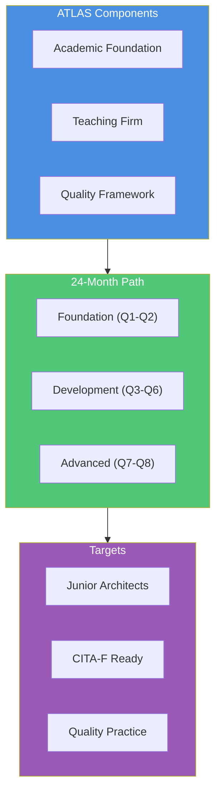
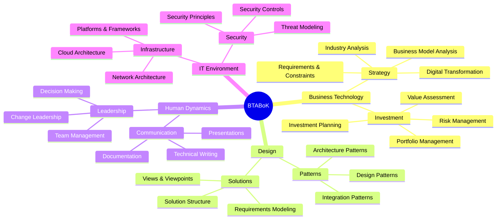
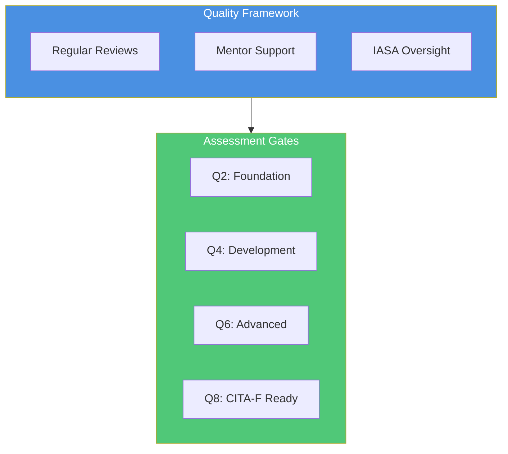
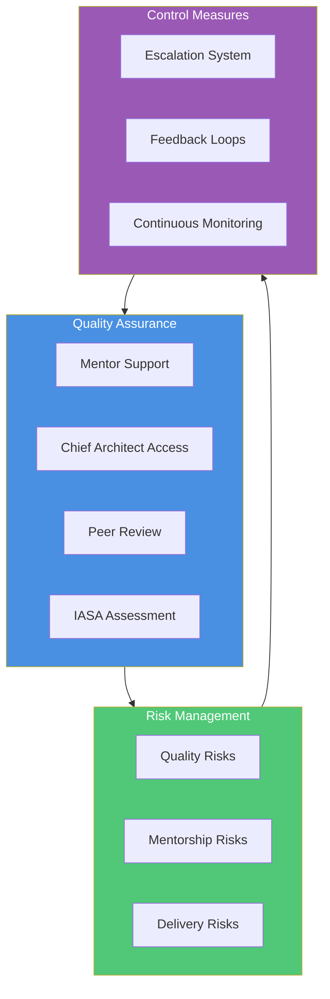

# Transform Your Architecture Practice
## IASA ATLAS Program: Building Tomorrow's Technology Leaders

*An Association for All BT Architects*

## Executive Summary

Welcome to a revolution in architect development. The IASA ATLAS (Architecture Teaching, Learning And Support) program transforms how organizations develop architectural talent through a groundbreaking approach: applying the proven teaching hospital model to technology architecture.

By 2025, successful ATLAS organizations will achieve:
- 5+ active teaching practices worldwide
- 30-40% reduction in architecture costs

## Table of Contents
1. [The Architecture Challenge](#the-architecture-challenge)
2. [The ATLAS Solution](#the-atlas-solution)
3. [Implementation Journey](#implementation-journey)
4. [Mentor Excellence Program](#mentor-excellence-program)
5. [Junior Architect Development](#junior-architect-development)
6. [Quality Framework](#quality-framework)
7. [Complete Program Details](#complete-program-details)
8. [Investment and Returns](#investment-and-returns)
9. [Getting Started](#getting-started)

## The Architecture Challenge
Every great organization needs great architects. But how do you develop them? The IASA ATLAS (Architecture Teaching, Learning And Support) program introduces a revolutionary approach: bringing the time-tested teaching hospital model to technology architecture. Through our comprehensive program and proven learning materials, we transform promising technologists into capable architects while reducing costs and improving quality.

Today's organizations face critical architectural challenges:
- Shortage of experienced architects
- High costs of senior-level dependency
- Inconsistent development practices
- Knowledge loss risks
- Limited career pathways

## The ATLAS Solution

ATLAS revolutionizes architect development through:

### Teaching Hospital Model
- Proven medical education approach adapted for technology
- Hands-on experience with expert guidance
- Real-world project application
- Structured knowledge transfer
- Quality-assured outcomes

### Comprehensive Framework
Built on IASA's industry-leading BTABoK:

## Implementation Journey

Your organization's path to architecture excellence through ATLAS unfolds in two strategic phases:

### Phase 1: Foundation Building (Months 1-6)

Transform your existing architecture team into certified ATLAS mentors through:

#### Mentor Certification Program
- BTABoK mastery development
- Teaching methodology certification
- Quality framework expertise
- Mentorship skills cultivation
- Program leadership preparation

#### Organizational Readiness
- Infrastructure establishment
- Process integration
- Quality system implementation
- Resource alignment
- Culture transformation

### Phase 2: Teaching Practice Launch (Months 4-9)

Create your architecture teaching hospital:

#### Program Structure Development
- Learning pathway customization
- Project integration planning
- Assessment framework implementation
- Quality control establishment
- Feedback system creation

#### Teaching Framework Implementation
- Mentor-mentee matching system
- Project-based learning structure
- Competency tracking tools
- Progress monitoring systems
- Continuous improvement mechanisms

## Mentor Excellence Program

The success of ATLAS relies heavily on the quality and preparation of your mentors. Our comprehensive mentor development program ensures your senior architects are ready for this crucial role.

### Mentor Development Path

#### Foundation Stage
- BTABoK competency assessment
- Advanced architecture practices
- Teaching methodology fundamentals
- Quality framework introduction
- Basic mentorship skills

#### Development Stage
- Advanced teaching techniques
- Assessment methodology
- Quality assurance practices
- Program management skills
- Mentorship workshops

#### Certification Stage
- CITA-P certification
- Teaching hospital model mastery
- Quality framework certification
- Mentorship assessment
- Program leadership preparation

### Mentor Responsibilities

#### Teaching and Guidance
- Structured learning facilitation
- Real-world project supervision
- Knowledge transfer techniques
- Progress assessment
- Feedback provision

#### Quality Assurance
- Work product review
- Competency assessment
- Performance evaluation
- Quality metrics tracking
- Continuous improvement

#### Program Management
- Learning path customization
- Resource allocation
- Progress tracking
- Stakeholder communication
- Program evolution

## Junior Architect Development

Our carefully structured program builds architectural competency through three distinct phases:

### Foundation Phase (Months 1-6)

### Quarter 1 (Months 1-3)
| Competency Area | Focus | Description |
|----------------|-------|-------------|
| Business Strategy | Requirements & Constraints | Eliciting requirements and identifying constraints |
| Human Dynamics | Collaboration & Negotiation | Interdisciplinary teamwork fundamentals |
| Design | Requirements Modeling | Accurate requirement capture and modeling |
| IT Environment | Infrastructure | Foundation of IT infrastructure |
| Quality Attributes | Balancing & Optimization | Performance, scalability, and security basics |

### Quarter 2 (Months 4-6)
| Competency Area | Focus | Description |
|----------------|-------|-------------|
| Business Strategy | Strategy Development | Technology strategy formulation |
| Human Dynamics | Writing Skills | Documentation and technical writing |
| Design | Views & Viewpoints | Stakeholder-focused architecture views |
| IT Environment | Application Development | Development tools and standards |
| Quality Attributes | Performance & Reliability | System performance and reliability design |

## Development Phase (Months 7-18)

### Quarter 3 (Months 7-9)
| Competency Area | Focus | Description |
|----------------|-------|-------------|
| Business Strategy | Business Fundamentals | Financial metrics and organizational structures |
| Human Dynamics | Peer Interaction | Workplace collaboration skills |
| Design | Patterns & Styles | Common architectural solutions |
| IT Environment | Asset Management | Organizational asset control |
| Quality Attributes | User-Centric Design | Usability and accessibility |

### Quarter 4 (Months 10-12)
| Competency Area | Focus | Description |
|----------------|-------|-------------|
| Business Strategy | Risk Management | Architectural risk assessment |
| Human Dynamics | Presentation Skills | Effective communication techniques |
| Design | Architecture Description | ADLs and documentation methods |
| IT Environment | Change Management | Production transition processes |
| Quality Attributes | Security | Core security principles |

### Quarter 5 (Months 13-15)
| Competency Area | Focus | Description |
|----------------|-------|-------------|
| Business Strategy | Investment Planning | Technology investment prioritization |
| Human Dynamics | Cultural Management | Organizational dynamics |
| Design | Lifecycle Traceability | Requirements and decisions tracking |
| IT Environment | Platforms & Frameworks | Technology selection criteria |
| Quality Attributes | Monitoring | Solution monitoring integration |

### Quarter 6 (Months 16-18)
| Competency Area | Focus | Description |
|----------------|-------|-------------|
| Business Strategy | Industry Analysis | Technology trend impact |
| Human Dynamics | Customer Relations | Stakeholder relationship management |
| Design | System Decomposition | Component reuse strategies |
| IT Environment | Project Management | Technical project oversight |
| Quality Attributes | Solution Delivery | Deployment and maintenance |

## Advanced Phase (Months 19-24)

### Quarter 7 (Months 19-21)
| Competency Area | Focus | Description |
|----------------|-------|-------------|
| Business Strategy | Architecture Methods | Advanced frameworks and methodologies |
| Human Dynamics | Leadership | Team and project leadership |
| Design | Holistic Design | Complex system integration |
| IT Environment | Knowledge Management | Organizational knowledge systems |
| Quality Attributes | System Sustainability | Long-term maintenance strategies |

### Quarter 8 (Months 22-24)
| Competency Area | Focus | Description |
|----------------|-------|-------------|
| Business Strategy | Business Valuation | Investment value assessment |
| Human Dynamics | Advanced Negotiation | High-stakes negotiation tactics |
| Design | Analysis & Testing | Comprehensive solution validation |
| IT Environment | Decision Support | Strategic architectural guidance |
| Quality Attributes | Advanced Trade-offs | Complex quality attribute optimization |

Each phase builds upon previous learning, creating a comprehensive pathway from foundational knowledge to advanced architectural expertise. The program maintains consistent focus across all five core competency areas throughout the journey.

## Quality Framework

### Assessment Gates

### Scoring System

#### Foundation Gate (Q2)
| Competency | Minimum Score | Evidence Required |
|------------|---------------|-------------------|
| Business | 2.0 | Requirements documentation, Analysis reports |
| Design | 2.0 | Architecture views, Model documentation |
| Human | 2.0 | Team feedback, Communication samples |
| IT | 2.0 | Infrastructure analysis, Technology reports |
| Quality | 2.0 | Quality scenarios, Trade-off analysis |

#### Development Gate (Q4)
| Competency | Minimum Score | Evidence Required |
|------------|---------------|-------------------|
| Business | 2.5 | Business cases, Risk assessments |
| Design | 2.5 | Pattern applications, Architecture decisions |
| Human | 2.5 | Presentations, Team leadership |
| IT | 2.5 | Change management plans, Security designs |
| Quality | 2.5 | Quality implementations, Security models |

## Complete Program Details

### Comprehensive Learning Materials
- Detailed course guides
- Workshop templates
- Case studies
- Assessment frameworks
- Practice exercises
- Mentoring guidelines

### Teaching Support Tools
- Progress tracking systems
- Assessment templates
- Quality metrics dashboards
- Feedback mechanisms
- Program management tools

## Investment and Returns

### Program Investment
- Mentor certification
- Implementation support
- Infrastructure setup
- Program materials
- Ongoing assessment

### Expected Returns
- 30-40% cost reduction
- Enhanced quality
- Faster development
- Knowledge retention
- Sustainable pipeline

## Getting Started

Beginning your ATLAS journey is straightforward:

1. Initial Consultation
   - Current state assessment
   - Goals and objectives alignment
   - Resource evaluation
   - Timeline planning

2. Mentor Selection and Certification
   - Identify potential mentors
   - Begin certification process
   - Establish teaching framework
   - Initialize quality systems

3. Program Implementation
   - Infrastructure setup
   - Material customization
   - Process integration
   - Team orientation

4. Launch and Scale
   - Pilot program initiation
   - Quality monitoring
   - Continuous improvement
   - Program expansion

## Contact Us

Transform your architecture practice with IASA Global's ATLAS program.

Email: atlas@iasaglobal.org
Web: iasaglobal.org
Schedule: [Book Your Consultation]

---

*IASA Global: Building Tomorrow's Architects Today*

Copyright © 2025 IASA Global. All rights reserved.
