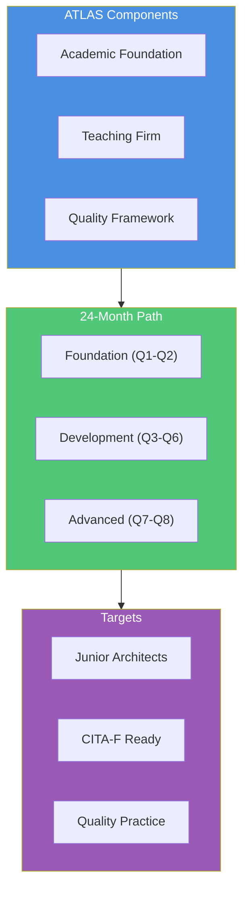
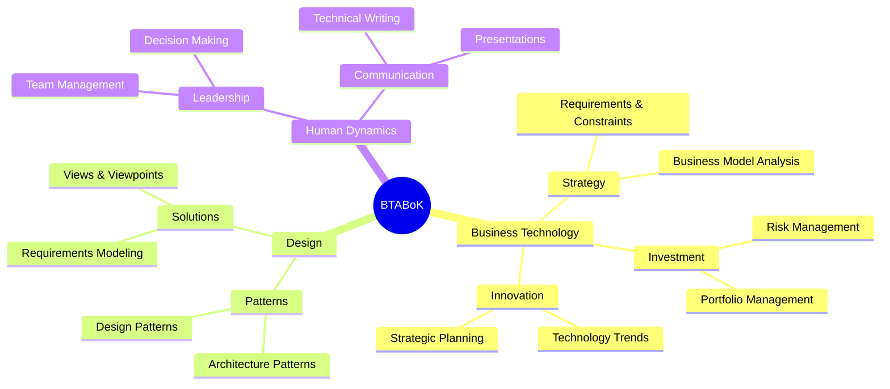
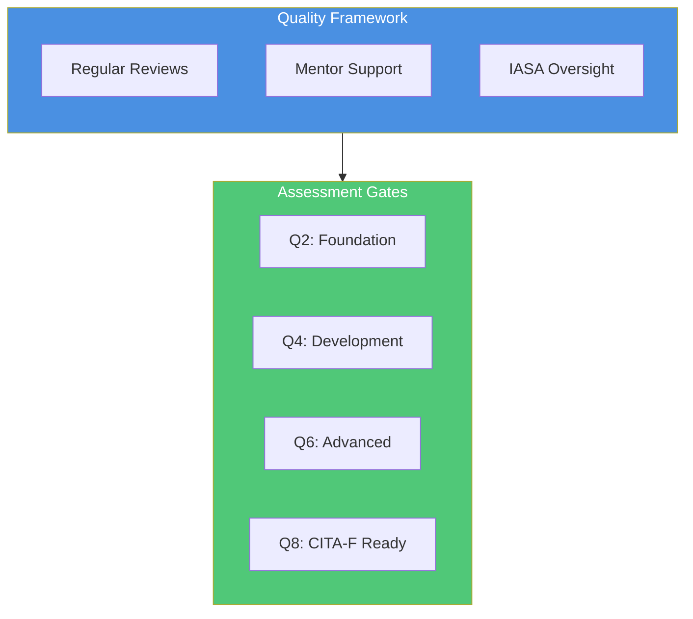

# Transform Your Architecture Practice
## Revolutionize How You Build Tomorrow's Technology Leaders

![IASA Logo]
*IASA Global: The Future of Architecture Excellence*

# Vision 2025: The Architecture Revolution

In today's rapidly evolving technology landscape, great architects aren't just found – they're cultivated. The IASA ATLAS program introduces a revolutionary approach that transforms how organizations develop architectural talent, applying the proven teaching hospital model to technology architecture.

## The Future is Here

By 2025, ATLAS partner organizations will lead the industry with:
- 40% reduction in architecture development costs
- 24-month path from engineer to certified architect
- Sustainable internal talent pipeline
- Quality-assured architecture practice
- Industry-recognized certification alignment

# Who Benefits from ATLAS?

## For Organizations
- Reduce architecture costs by 30-40%
- Build sustainable talent pipelines
- Ensure consistent quality
- Preserve institutional knowledge
- Accelerate transformation initiatives

## For Senior Architects
- Develop leadership capabilities
- Establish teaching excellence
- Gain CITA-P certification
- Create lasting impact
- Build professional legacy

## For Aspiring Architects
- Clear career progression
- Industry-recognized certification
- Hands-on experience
- Expert mentorship
- Professional network

# The ATLAS Advantage

## Revolutionary Approach
ATLAS transforms architect development through our proven teaching hospital model:
- Expert mentor guidance
- Real-world project experience
- Structured knowledge transfer
- Quality-assured outcomes
- Continuous assessment

## Comprehensive Framework
Built on IASA's industry-leading BTABoK:

# Investment and Returns

## Program Investment
Initial investment focuses on:
- Mentor certification program
- Implementation support
- Teaching materials and tools
- Quality framework setup
- Infrastructure establishment

## Expected Returns
Organizations typically achieve:
- 30-40% cost reduction in 18 months
- ROI positive within 12 months
- Sustainable talent pipeline
- Enhanced project outcomes
- Improved knowledge retention

## Timeline to Success
- Months 1-3: Mentor Certification
- Months 3-6: Program Setup
- Months 6-9: Initial Cohort Launch
- Months 9-12: Full Implementation
- Months 12+: Continuous Enhancement

# The Complete Solution

## Comprehensive Support
Everything you need for success:
- Complete learning materials
- Assessment frameworks
- Quality control systems
- Progress tracking tools
- Mentorship guidelines

## Quality Assurance
Built-in quality controls:

# Implementation Journey

## Phase 1: Foundation (Months 1-6)
Build your teaching practice:
- Mentor certification
- Infrastructure setup
- Process integration
- Quality framework
- Initial assessment

## Phase 2: Launch (Months 4-9)
Transform your practice:
- Program customization
- Junior architect selection
- Learning pathway activation
- Quality monitoring
- Continuous feedback

## The 24-Month Development Path
[Detailed quarterly progression tables as before...]

# Why Start Now?

The architecture talent gap is widening. Organizations that build sustainable talent pipelines today will lead tomorrow's technology landscape.

## Early Adopter Benefits
- Market leadership position
- Competitive advantage
- Premium talent attraction
- Enhanced capabilities
- Industry recognition

## Limited Availability
ATLAS partner positions are limited to ensure quality and success. We're selecting organizations committed to excellence in architect development.

# Next Steps

Ready to transform your architecture practice?

1. Schedule Your Consultation
   Discuss your specific needs and goals

2. Receive Custom Assessment
   Get detailed analysis and recommendations

3. Begin Your Journey
   Start your transformation with our proven approach

## Contact Us

Transform your architecture practice with IASA Global's ATLAS program.

Email: atlas@iasaglobal.org
Web: iasaglobal.org
Schedule: [Book Your Consultation]

---

*Join the Architecture Revolution with IASA Global*

Copyright © 2025 IASA Global. All rights reserved.
