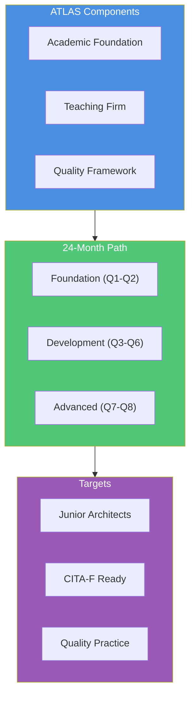
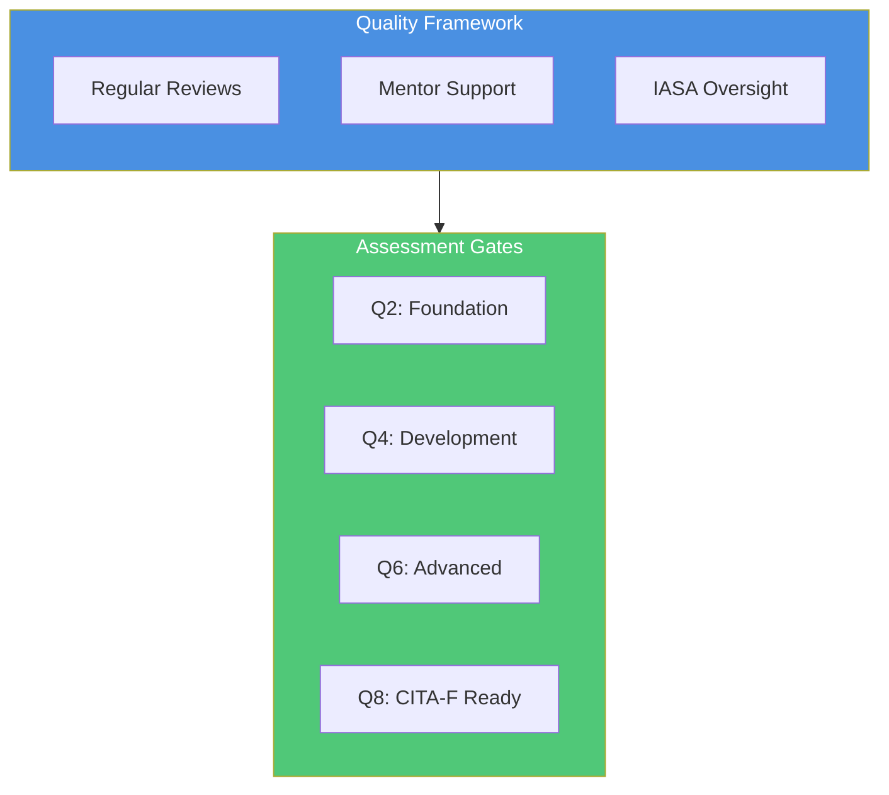

# Transform the Future of Technology Architecture

## IASA ATLAS Program: Creating Tomorrow's Architects Today

# The Architecture Crisis

Technology is transforming every industry at an unprecedented pace, yet organizations face a critical shortage of the architects needed to guide this transformation. The traditional path to becoming an architect – through years of hands-on experience and informal mentoring – can no longer meet the growing demand.

Today's organizations spend upwards of $200,000 annually per senior architect, while taking 5-10 years to develop new architectural talent. With 40% of senior architects approaching retirement in the next decade, this model isn't just expensive – it's unsustainable.

The cost of this crisis extends beyond salaries. Projects face delays, opportunities are missed, and innovation stalls while organizations struggle to find and develop architectural talent. We need a better way.

# The ATLAS Vision

IASA Global introduces ATLAS (Architecture Teaching, Learning And Support), a revolutionary approach that applies the proven teaching hospital model to technology architecture. This transformation in architect development will reshape our industry by:

- Reducing architect development time from 10 years to 24 months
- Cutting development costs by 40% through structured learning
- Creating consistent, quality-assured architecture practices
- Building sustainable talent pipelines within organizations
- Establishing a global network of teaching practices

# The Numbers That Matter

Our transformation targets are based on real industry data and proven methodologies. The traditional architect development path costs organizations over $1 million per architect when accounting for senior architect time, training costs, and productivity loss. The ATLAS program reduces this to approximately $120,000 through structured development, accelerated competency achievement, and standardized quality assurance.

This 40% cost reduction comes from:
- Structured learning replacing ad-hoc development
- Efficient knowledge transfer through proven methodologies
- Reduced senior architect time investment
- Standardized quality assurance processes
- Reusable learning materials and frameworks

# Joining the Revolution

## For Organizations

### The Journey
Organizations joining ATLAS transform their architecture practice through a structured implementation process. The journey begins with an initial consultation where we assess your current state, align goals, and create a customized implementation plan.

### Investment Model

The ATLAS program offers a strategic investment path that becomes more cost-effective as your organization builds internal teaching capability:

**Initial Investment**
- Program Accreditation: $50,000
  - Includes implementation support
  - Complete program materials
  - Quality framework setup
  - Initial mentor certification

**Ongoing Investment**
- Annual Program Maintenance: $25,000
  - Quality control framework
  - Material updates
  - Program enhancements
  - Continued support

**Per-Mentor-Architect Development**
- Initial Training Architects: $3,000
  - Complete learning materials
  - Assessment frameworks
  - Program support
  - Quality assurance

Once your organization establishes certified mentors and internal teaching capability, the cost for developing additional junior architects is included in your annual maintenance fee. This model ensures sustainable, cost-effective architect development while maintaining high quality standards through IASA's oversight and support.

### Timeline
Your transformation unfolds over three phases:

**Accreditation Phase (2-3 months)**
We begin with a thorough assessment of your organization, identify and certify mentors, and establish the necessary infrastructure and quality frameworks.

**Program Launch (3-4 months)**
During this phase, we select your first cohort, match mentors with mentees, and activate your learning pathways while integrating with existing projects.

**Full Implementation (6-12 months)**
The final phase focuses on quality monitoring, continuous improvement, and scaling the program across your organization.

## For Universities

ATLAS offers a unique opportunity to integrate industry-leading architecture education into your existing curriculum. Our approach focuses on enhancing your current programs rather than replacing them.

### Integration Options

**Curriculum Enhancement**
We work with your faculty to integrate ATLAS materials and methodologies into existing courses. This includes:
- Course material alignment
- Faculty development support
- Industry connection opportunities
- Quality framework integration

**Cost Structure**
Our university partnership model focuses on value creation rather than cost. Universities receive:
- Free curriculum integration support
- Faculty development resources
- Quality framework access
- Industry partnership opportunities

The only costs are for optional certification programs or specialized training beyond basic curriculum integration.

### Implementation Timeline

**Assessment (1 month)**
We review your current curriculum and identify integration opportunities.

**Faculty Development (2-3 months)**
Your faculty receives training in ATLAS methodologies and teaching approaches.

**Integration (3-4 months)**
We help integrate ATLAS materials into your existing courses.

**Launch (Next Semester)**
The enhanced curriculum rolls out to students.

## For Individual Architects

Whether you're beginning your architecture journey or ready to become a mentor, ATLAS offers clear development paths.

### Junior Architect Path
The 24-month structured program includes:
- Comprehensive skill development
- CITA-F certification preparation
- Hands-on project experience
- Expert mentorship
Investment: $500.00 per architect

### Mentor Certification
For experienced architects ready to shape the next generation:
- CITA-P preparation
- Teaching methodology mastery
- Quality framework expertise
- Program leadership development
Investment: $15,000

### Independent Study
A flexible option for self-paced learning:
- Access to ATLAS materials
- Community participation
- Basic assessment tools
Investment: $Available as part of program maintenance

# Quality and Success

Our comprehensive quality framework ensures consistent outcomes across all ATLAS implementations. Success is measured through:

# Join the Revolution

Ready to transform architecture development in your organization? Let's begin with a conversation about your specific needs and goals.

Schedule an executive briefing:
- Email: atlas@iasaglobal.org
- Web: iasaglobal.org
- Book directly: [Executive Briefing Calendar]

*Transform your architecture practice with IASA Global's ATLAS program – where experience meets excellence.*
