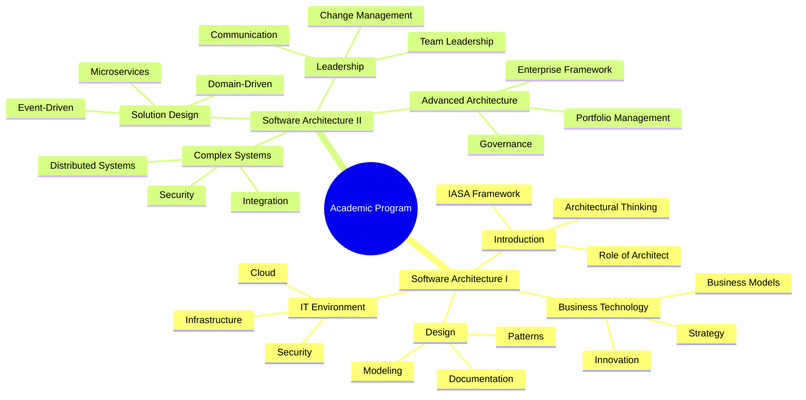
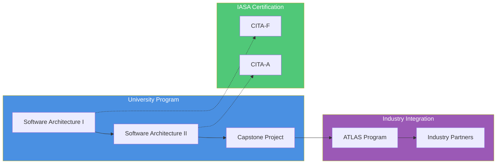
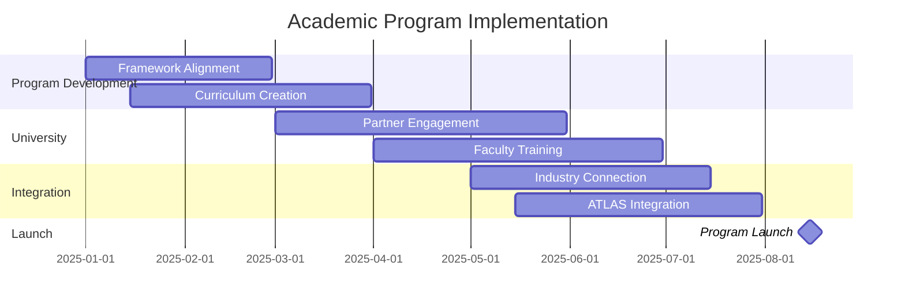

# IASA Academic Program: Executive Summary

## Vision
Transform IT architecture education by creating a structured academic pathway that bridges university education with industry practice, establishing the foundation for junior architect development through formal academic credentials.

## Value Proposition
- First comprehensive academic pathway for junior architects
- Reduces industry costs through earlier architecture adoption
- Creates standardized entry point into architecture profession
- Builds sustainable talent pipeline for organizations
- Expands IASA's influence in academic institutions

## Key Targets (5-Year)
- 25+ university partnerships globally
- 1000+ CITA-F certified graduates
- 500+ junior architects placed
- 90% graduate employment rate
- 30% reduction in architecture team costs

## Program Components

1. **Academic Integration**
   - Two-course sequence aligned with CITA-F and CITA-A
   - Integration with CS/IT programs
   - Standardized curriculum and materials
   - Faculty development program

2. **Industry Connection**
   - Direct pathway to ATLAS program
   - Industry internships
   - Mentorship opportunities
   - Capstone projects

3. **Certification Path**
   - Academic CITA-F alignment
   - Professional certification preparation
   - Continuous learning pathway
   - Industry recognition

## Implementation Timeline

- Planning: Jan-Mar 2025
- Development: Mar-May 2025
- Implementation: May-Jul 2025
- Launch: Aug 2025

## Investment and Returns
- Initial setup and curriculum development
- Faculty training and certification
- Infrastructure and materials
- ROI through certification and partnership revenues
