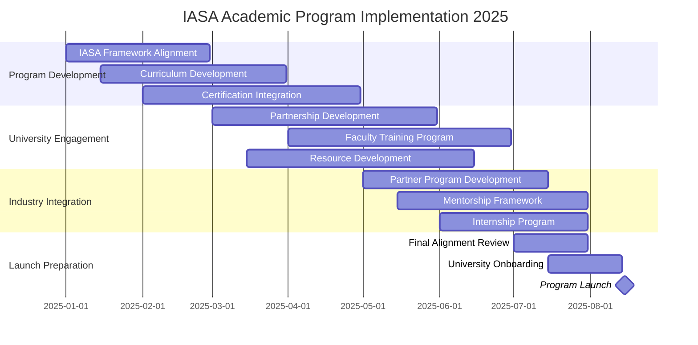

# IASA Global Architecture Academic Program
## Board of Directors Proposal - 2025 Strategic Initiative

---
## Table of Contents

1. Executive Summary
2. Strategic Vision
3. Market Analysis
4. Program Structure
5. Implementation Plan
6. Financial Overview
7. Risk Analysis
8. Governance
9. Success Metrics
10. Resource Requirements
11. Next Steps
12. Detailed Appendices

---
## 1. Executive Summary

IASA Global has the opportunity to transform the IT architecture profession through the industry's first comprehensive academic pathway for developing junior architects. This program directly addresses the critical challenge of top-heavy architecture teams while expanding IASA's influence in academic institutions globally.

### Key Outcomes (5-Year Targets)
- 25+ university partnerships globally
- 1000+ CITA-F certified graduates
- 500+ junior architects placed
- 90% graduate employment rate
- 30% reduction in architecture team costs for partner organizations

### Strategic Value
- Creates structured entry path for junior architects
- Expands IASA certification reach
- Establishes global academic partnerships
- Reduces industry costs through earlier architecture adoption
- Generates new revenue streams through academic programs

---
## 2. Strategic Vision

### Mission Statement
To transform the IT architecture profession by creating a clear pathway for junior architects through academic excellence and industry alignment.

### Market Challenge
The IT architecture profession currently faces three critical issues:
1. Top-heavy talent structure with few junior positions
2. High costs due to senior-level dependency
3. Limited early career pathways

### Solution
Create structured academic pathway through:
- Two-course sequence aligned with CITA-F and CITA-A
- Integration with university computer science programs
- Industry-aligned practical experience
- Clear certification pathway

---
## 3. Market Analysis

### Current State
- Architecture roles typically reserved for senior professionals
- High costs due to senior-level architect dependency
- Limited career pathways for emerging talent
- Inverted pyramid talent structure
- Organizations struggling with talent pipeline

### Market Opportunity
- Growing demand for architecture skills
- Universities seeking industry partnerships
- Students seeking career pathways
- Organizations needing cost-effective solutions
- Industry requiring standardized training

### Competitive Advantage
- IASA's established certification framework
- Existing industry partnerships
- Comprehensive body of knowledge
- Global reach and reputation
- Proven training methodology

---
## 4. Program Structure

### Core Curriculum

#### Software Architecture I (CITA-F Aligned)
1. **Introduction to Software Architecture**
   - Role of the architect
   - Architecture in SDLC
   - IASA framework introduction
   - Architectural thinking

2. **Business Technology Strategy**
   - Business model analysis
   - Strategic alignment
   - Innovation fundamentals
   - ROI and business cases

3. **IT Environment Foundations**
   - Infrastructure concepts
   - Cloud architecture
   - Integration principles
   - Security fundamentals

4. **Quality Attributes**
   - Non-functional requirements
   - Performance basics
   - Reliability concepts
   - Security principles

5. **Design Fundamentals**
   - Basic patterns
   - Architecture styles
   - Documentation
   - Modeling techniques

6. **Human Dynamics**
   - Communication skills
   - Team collaboration
   - Stakeholder management
   - Presentations

#### Software Architecture II (CITA-A Aligned)
1. **Advanced Architecture**
   - Enterprise frameworks
   - Governance
   - Portfolio management
   - Evaluation methods

2. **Advanced Strategy**
   - Digital transformation
   - Innovation management
   - Strategic planning
   - Business alignment

3. **Complex Environments**
   - Distributed systems
   - Advanced cloud
   - Integration patterns
   - Security architecture

4. **Quality Engineering**
   - Performance engineering
   - Scalability patterns
   - Security patterns
   - Trade-off analysis

5. **Solution Design**
   - Microservices
   - Event-driven architecture
   - Domain-driven design
   - Advanced patterns

6. **Leadership**
   - Change management
   - Conflict resolution
   - Team leadership
   - Strategic communication

### Integration Opportunities
- Capstone projects
- Industry internships
- Mentorship programs
- Research projects

---
## 5. Implementation Plan

### Phase Details

#### Planning Phase (Jan-Mar 2025)
- Program structure development
- Initial curriculum design
- University partnership framework
- IASA framework alignment

#### Development Phase (Mar-May 2025)
- Detailed course content
- Teaching materials
- Assessment framework
- Industry engagement

#### Implementation Phase (May-Jul 2025)
- Faculty training
- System setup
- Partner onboarding
- Student recruitment

#### Launch Phase (Aug 2025)
- Program initiation
- First cohort start
- Support activation
- Monitoring implementation

---
## 6. Financial Overview

### Revenue Streams
1. University Partnership Fees
2. Student Certification Revenue
3. Training Materials Licensing
4. Faculty Development Programs

### Investment Requirements
1. Program Development: [Amount]
2. Infrastructure: [Amount]
3. Staff Resources: [Amount]
4. Marketing & Outreach: [Amount]

### 5-Year Projection
[Financial projection table to be inserted based on IASA financial models]

---
## 7. Risk Analysis

### Key Risks and Mitigation

#### Academic Adoption
- **Risk**: Universities resist new program
- **Mitigation**: Strong value proposition, flexible implementation

#### Quality Control
- **Risk**: Inconsistent program delivery
- **Mitigation**: Strict standards, regular reviews

#### Market Acceptance
- **Risk**: Industry hesitation
- **Mitigation**: Early partner engagement, success metrics

---
## 8. Governance

### Program Leadership

#### Program Sponsor
**Paul Preiss**
CEO and Founder, IASA Global
[Contact Details]

#### Program Director
**Shawn McCarthy**
[Contact Details]

### Oversight Structure
- IASA Board Representative
- Academic Advisory Committee
- Industry Advisory Board
- Program Management Office

---
## 9. Success Metrics

### Key Performance Indicators
1. **Academic Success**
   - Certification pass rates
   - Course completion rates
   - Student satisfaction
   - Faculty effectiveness

2. **Market Impact**
   - Graduate employment rates
   - Industry partner satisfaction
   - Architecture cost reduction
   - Market adoption rates

3. **Financial Performance**
   - Revenue to sustain growth
   - Program sustainability
   - Partner institution ROI
   - Market share growth

---
## 10. Resource Requirements

### Immediate Needs
1. Program Director (Shawn McCarthy)
2. Academic Partnership Manager
3. Leverage existing IASA certification materials
4. Utilize IASA technical infrastructure

### Ongoing Support
1. Faculty Support
2. Quality Assurance
3. Industry Liaison
4. Administrative Support

---
## 11. Next Steps

### Board Decisions Required
1. Program approval and funding (One resource)
2. Resource allocation
3. Timeline confirmation
4. Governance structure approval

### Immediate Actions (Upon Approval)
1. Program team assembly
2. Initial university outreach
3. Curriculum development start
4. Infrastructure setup

---
## 12. Appendices

### A. Detailed Financial Projections
[Comprehensive financial models and projections]
1. Work with finance team to develop detailed models
2. Create revenue projections based on market analysis
3. Develop cost structure with resource requirements
4. Build ROI models for different scenarios

### B. University Partnership Framework
[Partnership structure and agreements]
1. Develop detailed partnership agreement templates
2. Create implementation guides
3. Define support structure requirements
4. Establish quality standards

### C. Detailed Curriculum Overview
[Complete course content and materials]
1. Finalize alignment with CITA-F/A
2. Develop detailed lesson plans
3. Create assessment materials
4. Design practical exercises

### D. Faculty Development Program
[Training and support framework]
1. Design certification pathway
2. Develop training materials
3. Create support systems
4. Establish quality metrics

### E. Quality Assurance Framework
[Standards and monitoring processes]
1. Define detailed standards
2. Create assessment tools
3. Develop monitoring systems
4. Establish review processes

---
## Contact Information

**Program Sponsor:**
Paul Preiss
CEO and Founder, IASA Global
[Contact Details]

**Program Director:**
Shawn McCarthy
[Contact Details]
