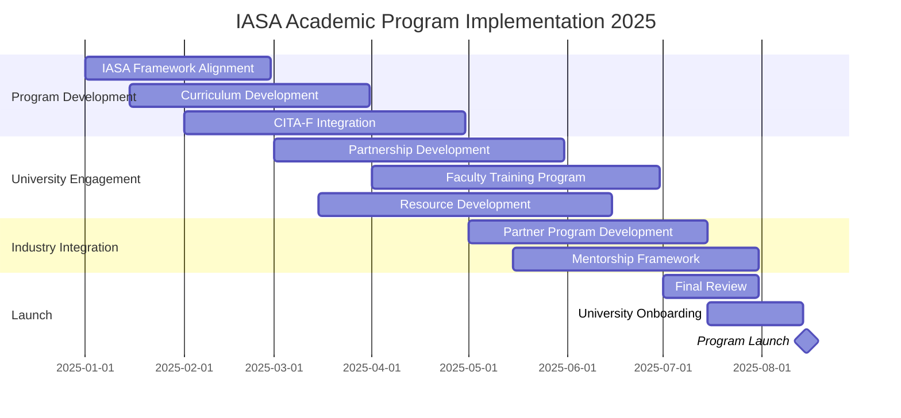

# IASA Global Architecture Academic Program
## Board of Directors Proposal - 2025 Strategic Initiative

## Table of Contents
1. Executive Summary
2. Strategic Vision
3. Market Analysis
4. Program Structure
5. Implementation Plan
6. Risk Analysis
7. Governance
8. Success Metrics
9. Resource Requirements
10. Next Steps
11. Appendices

## 1. Executive Summary

IASA Global has the opportunity to transform the IT architecture profession through the industry's first comprehensive academic pathway for developing junior architects. This program introduces architecture concepts earlier in careers through a structured two-course sequence aligned with IASA's Foundation (CITA-F) certification.

### Key Outcomes (5-Year Targets)
- 25+ university partnerships globally
- 1000+ CITA-F certified graduates
- 500+ junior architects placed
- 90% graduate employment rate
- 30% reduction in architecture team costs for partner organizations

### Strategic Value
- Creates structured entry path for junior architects
- Expands IASA certification reach through academic integration
- Establishes global academic partnerships
- Reduces industry costs through earlier architecture adoption
- Supports IASA's educational mission

## 2. Strategic Vision

### Mission Statement
To transform the IT architecture profession by creating a clear pathway for junior architects through academic excellence and industry alignment.

### Market Challenge
The IT architecture profession currently faces three critical issues:
1. Top-heavy talent structure with few junior positions
2. High costs due to senior-level dependency
3. Limited early career pathways

### Solution
Create structured academic pathway through:
- Two-course sequence fully aligned with CITA-F competencies
- Integration with university computer science programs
- Industry-aligned practical experience
- Clear foundation certification pathway

## 3. Market Analysis

### Current State
- Architecture roles typically reserved for senior professionals
- High costs due to senior-level architect dependency
- Limited career pathways for emerging talent
- Inverted pyramid talent structure
- Organizations struggling with talent pipeline

### Market Opportunity
- Growing demand for architecture skills
- Universities seeking industry partnerships
- Students seeking clear career pathways
- Organizations needing cost-effective solutions
- Industry requiring standardized training

### Competitive Advantage
- IASA's established CITA-F certification framework
- Existing industry partnerships
- Comprehensive body of knowledge
- Global reach and reputation
- Proven training methodology

## 4. Program Structure

### Core Curriculum

#### Software Architecture I: Foundations
1. **Introduction to Architecture**
   - Role of the architect
   - Architecture in SDLC
   - IASA framework introduction
   - Architectural thinking

2. **Business Technology Strategy**
   - Business model analysis
   - Strategic alignment
   - Innovation fundamentals
   - ROI and business cases

3. **IT Environment Foundations**
   - Infrastructure concepts
   - Cloud architecture
   - Integration principles
   - Security fundamentals

#### Software Architecture II: Application
1. **Applied Architecture**
   - Quality Attributes
   - Architecture Patterns
   - Design Methods
   - Implementation Planning

2. **Enterprise Context**
   - Business Alignment
   - Stakeholder Management
   - Value Delivery
   - Technology Selection

3. **Professional Practice**
   - Ethics & Standards
   - Team Collaboration
   - Communication
   - Documentation

### Integration Components
- Capstone projects
- Industry internships
- CITA-F preparation
- Professional mentorship

## 5. Implementation Plan

### Phase Details

#### Planning Phase (Jan-Mar 2025)
- Program structure development
- Initial curriculum design
- University partnership framework
- IASA framework alignment

#### Development Phase (Mar-May 2025)
- Detailed course content
- Teaching materials
- Assessment framework
- Industry engagement

#### Implementation Phase (May-Jul 2025)
- Faculty training
- System setup
- Partner onboarding
- Student recruitment

#### Launch Phase (Aug 2025)
- Program initiation
- First cohort start
- Support activation
- Monitoring implementation

## 6. Risk Analysis

### Key Risks and Mitigation Strategies

#### Academic Adoption
- **Risk**: Universities resist new program
- **Mitigation**: Strong value proposition, flexible implementation model, proven outcomes

#### Quality Control
- **Risk**: Inconsistent program delivery
- **Mitigation**: Standardized materials, faculty training, regular quality reviews

#### Resource Constraints
- **Risk**: Limited resources for implementation
- **Mitigation**: Phased approach, leverage existing materials, strategic partnerships

#### Market Acceptance
- **Risk**: Industry hesitation
- **Mitigation**: Early partner engagement, success metrics, pilot programs

## 7. Governance

### Program Leadership

#### Program Sponsor
**Paul Preiss**
CEO and Founder, IASA Global
[Contact Details]

#### Program Director
**Shawn McCarthy**
[Contact Details]

### Oversight Structure
- IASA Board Representative
- Academic Advisory Committee
- Industry Advisory Board
- Program Management Office

### Responsibilities
- Strategic direction
- Quality oversight
- Partnership management
- Program evolution
- Success tracking

## 8. Success Metrics

### Program Effectiveness
1. CITA-F certification pass rates
2. Employment rates
3. University adoption
4. Student satisfaction
5. Industry feedback

### Community Impact
1. Professional community growth
2. Knowledge sharing
3. Industry standards adoption
4. Research contributions
5. Global reach

### Key Performance Indicators
- Number of university partnerships
- Student enrollment rates
- Certification success rates
- Graduate placement rates
- Industry partner satisfaction

## 9. Resource Requirements

### Immediate Needs
1. Program Director (Shawn McCarthy)
2. Academic Partnership Manager
3. Leverage existing IASA certification materials
4. Utilize IASA technical infrastructure

### Support Structure
1. Faculty development program
2. Quality assurance framework
3. Industry liaison network
4. Administrative support

### Technology Infrastructure
- Learning management system
- Assessment tools
- Collaboration platforms
- Resource repositories

## 10. Next Steps

### Board Decisions Required
1. Program approval and funding (One resource)
2. Resource allocation
3. Timeline confirmation
4. Governance structure approval

### Immediate Actions (Upon Approval)
1. Program team assembly
2. Initial university outreach
3. Curriculum development start
4. Infrastructure setup

## 11. Appendices

### Appendix A: Financial Models
1. **Program Sustainability Model**
   - University partnership structure
   - Certification program costs
   - Resource allocation model
   - Operational costs
   - Growth projections

2. **Investment Requirements**
   - Initial setup costs
   - Ongoing operational costs
   - Resource requirements
   - Marketing and outreach

3. **Partnership Economics**
   - University revenue sharing model
   - Industry partner structure
   - Resource sharing agreements
   - Support costs

### Appendix B: University Partnership Framework
1. **Partnership Levels**
   - Full program implementation
   - Partial program integration
   - Certificate program options
   - Research collaboration

2. **Implementation Requirements**
   - Faculty qualifications
   - Infrastructure needs
   - Resource commitments
   - Quality standards

3. **Support Structure**
   - IASA technical support
   - Faculty development
   - Certification integration
   - Continuous improvement

### Appendix C: Curriculum Framework
1. **Software Architecture I: Foundations**
   - Detailed module descriptions
   - Learning objectives
   - Assessment criteria
   - CITA-F alignment mapping

2. **Software Architecture II: Application**
   - Advanced module details
   - Practical applications
   - Project frameworks
   - Industry integration

3. **Integration Components**
   - Capstone project structure
   - Internship framework
   - Mentorship program
   - Assessment methods

### Appendix D: Faculty Development
1. **Certification Program**
   - CITA-F requirement
   - Teaching methodology
   - Assessment techniques
   - Continuous development

2. **Training Components**
   - Online modules
   - Workshop structure
   - Practical exercises
   - Resource materials

### Appendix E: Quality Assurance
1. **Program Standards**
   - Curriculum alignment
   - Teaching quality
   - Student performance
   - Industry relevance

2. **Assessment Framework**
   - Student evaluation
   - Faculty performance
   - Program effectiveness
   - Partner feedback

## Contact Information

**Program Sponsor:**
Paul Preiss
CEO and Founder, IASA Global
[Contact Details]

**Program Director:**
Shawn McCarthy
[Contact Details]
