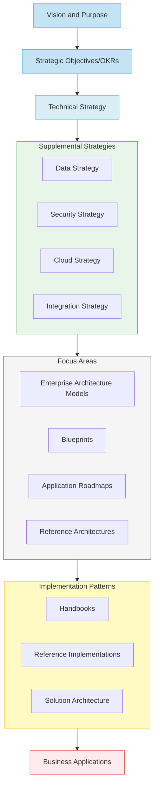

# From Project to Product: Architecting the Future of Enterprise Technology
*A CIO and Chief Architect's Perspective on Transformational Change*

## Introduction

For CIOs leading enterprise transformations, portfolio health isn’t just an operational indicator—it’s a real-time pulse on time-to-market and resilience in a digital-first economy. Understanding and tracking the right software delivery metrics is essential to inform strategic decisions that drive continuous improvement.

In a world that demands rapid delivery and systemic resilience, measuring portfolio health becomes mission-critical. Key software delivery metrics—popularized by Dr. Nicole Forsgren, Jez Humble, and Gene Kim in Accelerate—offer a clear lens into how quickly and reliably an organization delivers value. By combining these operational insights with portfolio quality attributes, CIOs and chief architects can connect the dots between technical excellence and business outcomes—ensuring that their enterprises remain competitive, innovative, and secure.

Imagine being tasked with developing a rapidly growing metropolitan area. Would you focus solely on approving individual building permits, or would you first establish a comprehensive city plan that considers infrastructure, sustainability, and community needs? Unfortunately, many organizations still approach their technology landscape like overeager developers rather than thoughtful city planners – focusing on individual projects without considering the broader ecosystem's health and sustainability.

The stakes have never been higher. In today's digital economy, business objectives like "becoming a leading global wealth management firm" or "being a premier destination for top talent" demand more than just technical excellence. They require a fundamental reimagining of how we approach enterprise architecture and technology delivery.

## The Evolution of Enterprise Architecture

Imagine having to build a city with just raw building materials - steel beams, concrete, wiring, and plumbing components. While this offers ultimate flexibility, it requires every builder to become a master of multiple trades: structural engineering, electrical systems, plumbing, HVAC, and more. This mirrors how many organizations handle technology delivery today - we provide teams with basic components and expect them to become experts in everything from Kubernetes to Akamai, from API gateways to routing protocols, from security configurations to cloud infrastructure.

It's as if we're asking every developer to get a master's degree in infrastructure before they can make simple changes to their applications. We hand them raw materials and expect them to build cathedrals, while simultaneously maintaining deep expertise across an ever-expanding set of foundational technologies.

Now imagine instead having access to pre-approved building templates, standardized utility connections for any commidty service, and clear zoning guidelines that enable rapid, reliable construction while ensuring neighborhood cohesion. This is the promise of modern enterprise architecture - providing higher-level building blocks that enable innovation and rapid business reconfiguration while maintaining system integrity. Rather than forcing every team to become infrastructure experts, we create platforms and patterns that abstract away complexity while ensuring quality and consistency. By offering higher-level abstractions—platforms, patterns, guardrails—enterprise architects reduce toil, preserve quality, and accelerate product delivery.

## Creating a Common Language

Just as urban planners needed to develop a shared vocabulary with city officials, developers, and citizens, enterprise architects must establish a common language that bridges technical and business domains. Complex ideas that remain purely verbal often get lost or misunderstood. Documentation and diagrams transform abstract discussions into something tangible. By articulating fitness functions - automated tests tied to specific quality attributes like Reliability, Security, or Performance — teams can visualize and measure system qualities that align with business goals.

Wikipedia defines a software architect as "a software expert who makes high-level design choices and dictates technical standards, including software coding standards, tools, and platforms." But this definition misses the essence of modern enterprise architecture. If we were going to amend this definition it would include that an architect addresses many concerns, enables integration (integration issues are often where architects focus much of their attention) and ensure the evolvability of a system.  The architect often provides and is the custodian of an architecture vision for a product - which supports a a continual and incremental change as a first principles amount multiple dimensions.

Most importantly, architects make difficult problems manageable. They achieve this through models, patterns, and peer review - taking complex challenges and breaking them down into understandable components that stakeholders can grasp and discuss. When you take time to put ideas on paper using language everyone understands, you enable meaningful participation in critical decisions.

The ability to explain technical concepts without jargon, making them accessible to those unfamiliar with protocols and stacks, is perhaps the most crucial skill for working with broad audiences who require clarity without deep technical background.

## II. The "What": Strategic Business Alignment

[TO BE DRAFTED BY CIO]

Key areas to address:
- Alignment between technology capabilities and strategic business OKRs
- Evolution from technical governance to business enablement
- Frameworks for measuring architectural success
- Cultural transformation requirements
- Models for effective stakeholder engagement
- Approaches to investment prioritization
- Risk management in transformation
- Innovation enablement strategies

Just as a city's master plan must align with its economic and social goals, our technical strategy must directly support business objectives. This alignment sets the stage for how we execute our transformation. When tied directly to strategic objectives, software delivery metrics become business enablers, not just technical KPIs. This alignment ensures that improvements in deployment frequency or time-to-restore-service translate into tangible business value—reduced time-to-market, better customer experiences, and stronger competitive advantage.

## III. The "How": Building the Modern Enterprise

Think of your enterprise technology landscape as a growing city. Just as urban planners balance immediate construction needs with long-term community vitality, modern technology leaders must create an environment that enables both rapid delivery and sustainable growth. Let's explore how four essential dimensions of city development map to our technology transformation journey:

### 1. Delivering Compelling Business Value: Building Vibrant Districts

> **Conversation Starter**: “How quickly and reliably can we deliver features that matter to our customers?”

Just as city planners focus on creating thriving neighborhoods that attract residents and businesses, our first objective is to deliver articulated and compelling business value while instilling a product-centric mindset and shared ownership. In tech, this translates to delivering **compelling business value** with minimal friction. This means:

- **Deployment Frequency** (e.g., 1,250 successful deployments per month)  
- **Lead Time for Changes** (shortening idea-to-production cycle)  
- **Change Failure Rate** (tracking rollbacks or service impairments)  

#### Example Targets
- **100% release quality**: Meeting performance, security, and other Non-Functional Requirements (NFRs)  
- **Zero rollbacks** within 2 weeks of deployment  
- **80% of quarterly commitments delivered**  

---

### 2. Enhancing Technical Foundation: Maintaining Critical Infrastructure

> **Conversation Starter**: “Are we maintaining reliable roads and utilities, or are we risking gridlock?”

Like a city's need for reliable utilities and well-maintained roads, we must enhance our technical foundation through continuous, comprehensive health assessments rooted in business priorities. Rather than fixing problems in silos, your technical foundation must be robust and scalable, we take a systematic approach:

- **Time to Restore Service (MTTR)** (P1 target of 4 hours, P2 target of 6 hours)  
- **Incident Reduction** (e.g., 10% decrease in P1/P2 incidents year over year)  
- **Security Posture** (percentage of repos free from vulnerabilities)  

#### Example Targets
- **10% reduction** in P1/P2 incidents YoY  
- **90%** of active code repositories free of vulnerabilities  

---

### 3. Maturing DevSecOps: Modernizing City Services

> **Conversation Starter**: “Are our daily operations stuck in manual processes that slow us down or expose us to risks?”

Similar to upgrading city services while keeping daily operations running smoothly, we're maturing our DevSecOps practices and removing toil. This means building fast and secure without productivity challenges and with fewer systems at risk:

- **CAP Slippage Rate** (goal of 15%)  
- **KRI Composite Score** (95% target)  
- **Modernization Progress** (e.g., 99% of apps in target state, 55% on cloud, 30% SaaS/PaaS)  

---

### 4. Building Global Talent: Developing a Thriving Community

> **Conversation Starter**: “How do we attract and retain the best talent to grow our ‘digital city’?”

Just as great cities need engaged, skilled citizens to thrive, we're focused on building a deep, diverse bench of global talent by promoting learning and career growth. Organizations that invest in talent development see gains in innovation and culture:

- **Staff Engagement**: 75% participation in recognition programs  
- **Learning Opportunities**: 32 hours of training or certification per person  
- **Gallup Survey**: Achieve top quartile in employee satisfaction  

## IV. Evolutionary Architecture in Practice

Just as cities must evolve while preserving their essential character, modern enterprise architecture requires built-in mechanisms for sustainable change. The "big ball of mud" architecture - where everything is tightly coupled and changes have unpredictable impacts - is like a city that grew without planning, where modifying one building might compromise its neighbors' foundations.

### Modularity and Coupling: The District Approach
Modern cities are organized into districts, each able to evolve independently while maintaining connections to the whole. Similarly, our architecture must support modularity along well-defined boundaries. This enables:
- Non-breaking changes to individual components
- Innovation within bounded contexts
- Risk mitigation through isolation
- Parallel evolution of different areas

### Domain-Driven Design: Natural Boundaries
Just as successful cities grow around natural community boundaries rather than arbitrary grid lines, modern architecture increasingly organizes around business domains rather than technical layers. This shift from traditional SOA (where services align with technical functions) to domain-oriented services represents a fundamental change in how we structure systems.

### Experimentation: The Innovation Zone
Progressive cities designate innovation districts where new ideas can be tested safely. Similarly, modern architecture must enable:
- A/B testing of new features
- Canary releases for risk management
- Multiple service versions running simultaneously
- Hypothesis-driven development

A key element of evolutionary architecture is the use of fitness functions—automated checks that continuously validate architecture against desired qualities. These align directly with ISO 25010, which defines critical software quality attributes:

- Functional Suitability: Completeness, correctness, appropriateness
- Performance Efficiency: Time behavior, resource utilization, capacity
- Compatibility: Interoperability, coexistence
- Usability: Learnability, operability, accessibility
- Reliability: Maturity, fault tolerance, recoverability
- Security: Confidentiality, integrity, authenticity
- Maintainability: Modularity, reusability, testability
- Portability: Adaptability, installability, replaceability

> Example: A Performance Efficiency fitness function might continuously measure response times under peak load. A Reliability fitness function might monitor redundancy and failover mechanisms. These automated tests—built into your CI/CD pipeline—prevent regressions, drive continuous improvement, and provide real-time insights into portfolio health.

## V. The New Architect Mindset

An architect’s mindset should evolve from the authoritarian 'Great and Powerful Oz,' who instills fear and questions the courage, heart, and intelligence of others, to one that mirrors Alice’s journey—guided by curiosity and self-discovery—encouraging teams to believe in the impossible and empowering them to achieve it. Today's enterprise architect must encourage teams to take risks, learn continuously, and drive transformational change. This requires new competencies and approaches:

### From Control to Enablement
Traditional architecture focused on controlling change through:
- Detailed design reviews
- Rigid standards enforcement
- Centralized decision-making
- Comprehensive documentation requirements

Modern architects instead enable success through:
- Pattern identification and sharing
- Platform creation that makes "doing the right thing" easy
- Guidance and education rather than enforcement
- Automated guardrails rather than manual gates

### Key Questions for Modern Architects
- Are teams measuring how well their systems meet defined business outcomes?
- Do engineers understand cohesion and coupling principles in practice?
- Are technical decisions based on change capability rather than novelty?
- How effectively do teams respond to business changes?
- Is the architecture enabling or hindering rapid evolution?

## VI. The Modern Architect: Beyond the Blueprint

### From Dictating Designs to Facilitating Growth

The traditional “master builder” approach positioned architects as the sole authority—handing down designs and ensuring compliance. Modern enterprise architecture, however, demands the mindset of an **urban planner**: someone who lays out guiding principles, fosters a shared vision, and enables diverse teams to shape their environment in a coherent, forward-looking way.

### Building Consensus vs. Enforcing Standards

Early architectural models often relied on rigid standards and top-down governance—akin to city ordinances that leave no room for neighborhood character. The modern architect instead focuses on **building consensus**:

- **Collaboration over Command**: Engaging cross-functional teams, listening to feedback, and making shared decisions.  
- **Guiding Principles**: Setting clear guardrails rather than voluminous rulebooks—allowing autonomy within well-defined boundaries.  
- **Contextual Standards**: Encouraging best practices that adapt to different project needs rather than a one-size-fits-all checklist.

### Embracing the IASA Competency Models

The **IASA (International Association of Software Architects)** defines key competencies that today’s architects must cultivate to thrive in a complex, rapidly evolving environment:

1. **Agility in Practice**  
   - Recognize that technology landscapes shift quickly.  
   - Adapt architectural decisions and strategies as new information emerges.

2. **Continuous Learning and Adaptation**  
   - Regularly explore new tools, frameworks, and methodologies.  
   - Invest in ongoing professional development to stay ahead of emerging trends.

3. **Innovation Mindset**  
   - Encourage experimentation and hypothesis-driven development.  
   - Balance pragmatic solutions with opportunities for market differentiation.

4. **Collaboration Skills**  
   - Foster inclusivity and open communication.  
   - Embrace diverse perspectives and avoid the **“Wicked Witch”** archetype of instilling fear and compliance without dialogue.

5. **Accountability and Value Delivery**  
   - Measure success not by adherence to prescriptive standards but by tangible business and customer outcomes.  
   - Own the results of architectural decisions, ensuring they drive measurable value.

### Rethinking Architecture as an Ecosystem

Instead of static blueprints that dictate every detail, modern architects steward an evolving **ecosystem**—one where teams can continuously refine services, products, and platforms. This approach allows:

- **Faster Time-to-Value**: Shortened cycles between idea and production.  
- **De-Risked Change**: Architecture decisions and technology stacks that can shift without major upheavals.  
- **Empowered Teams**: Autonomy in design choices, backed by shared tools, data, and standards that facilitate alignment.

### Putting It All Together

In this urban planner model, the architect’s job is to:

1. **Envision** a cohesive future state aligned to business outcomes.  
2. **Enable** teams with platforms and best-practice patterns.  
3. **Inspire** innovation by reducing friction and celebrating collaboration.  
4. **Hold** the organization accountable to ensuring architectural decisions lead to real, measurable value.

By moving beyond rigid blueprints and embracing an urban planner ethos, the modern architect helps the enterprise navigate complexity, seize opportunities, and build a thriving technology ecosystem—one that combines agility, innovation, and clear alignment with strategic goals.

## VII. Measuring Success: The State-Level Portfolio Health Dashboard

Think of portfolio health as a state-level planning function. Just as state urban development offices monitor the health of different cities and provide targeted guidance based on each city's unique challenges, our portfolio health dashboard offers a comprehensive view that helps guide different business units toward optimal outcomes.

### State-Level Portfolio Health Metrics

Our dashboard tracks three critical dimensions across the state, helping identify where different cities (business units) need different types of attention:

#### 1. Deliver articulated and compelling business value
*Like monitoring economic vitality across cities*
- We will get it right the first time and avoid rework
  * Release Quality (target 100%)
  * Zero rollbacks within 2 weeks
- Measuring delivery pace
  * Deployment Frequency (1,250/month)
  * Quarterly Commitments (80% delivered)

#### 2. Enhance Technical Foundation 
*Like assessing infrastructure health across the state*
- System Reliability
  * P1/P2 incident reduction (10% YoY)
  * P1 MTTR (4 hours)
  * P2 MTTR (6.0 hours)
- Security Posture
  * 90% of repos free from vulnerabilities

#### 3. Mature DevSecOps Practices and Remove Toil 
*Like measuring modernization of city services*
- Risk Management
  * CAP Slippage Rate (15%)
  * KRI Composite Score (95%)
- Modernization Progress
  * Apps in Target State (99%)
  * Cloud Migration (55%)
  * SaaS and PaaS Adoption (30%)
- We will remove productivity hurdles
  * How often is my work getting blocked ? (Qualitative)

### Using State-Level Insights for City Planning

By consolidating these insights, **CIOs** and **Chief Architects** can see where to allocate resources, where risks are growing, and where future innovation might flourish. During each program increment, state-level portfolio health data guides city planners (architecture teams) in several ways:

1. **Identifying Focus Areas**
   - Some cities need infrastructure renewal
   - Others require service modernization
   - Some must improve delivery capabilities

2. **Resource Allocation**
   - Target investments where most needed
   - Share successful patterns across cities
   - Balance local and state-wide improvements
  
## VIII. Practical Implementation Guide

[TO BE ENHANCED AND EXPANDED BY CIO]

### Phase 1: Foundation Building
Just as cities begin with basic infrastructure, we start with:
- Architecture maturity assessment
- Business capability mapping
- Quick win identification
- Baseline metrics establishment
- Initial product domain definition

### Phase 2: Transformation Launch
Like developing new city districts, we focus on:
- Cross-functional team building
- Measurement framework implementation
- Cultural transformation initiation
- Pilot program launches
- Feedback mechanism establishment

### Phase 3: Scale and Optimize
Similar to expanding successful urban development patterns:
- Pattern replication
- Framework refinement
- Automation enhancement
- Business integration deepening
- Governance evolution

## IX. Conclusion: Building Tomorrow's Enterprise

The transformation from project-centric to product-oriented architecture represents more than a change in delivery methodology – it's a fundamental shift in how we create and sustain business value through technology. Just as thriving cities evolve from collections of buildings into vibrant, interconnected communities, our technology landscapes must transform from isolated projects into dynamic product platforms that enable continuous innovation.

> **Vision of the Transformed Enterprise**
> - Technology platforms that enable rather than constrain innovation
> - Self-service capabilities that democratize technology delivery
> - Automated guardrails that ensure quality without slowing progress
> - Clear visibility into system health and business impact
> - Engaged teams focused on continuous improvement
> - Architecture that evolves naturally with business needs
> - Strong technical foundations that enable rapid innovation

This journey requires enterprise architects to embrace a new identity: from gatekeepers to enablers, from standards enforcers to community builders, from project reviewers to product visionaries. Like skilled urban planners, modern architects must orchestrate sustainable growth while ensuring their technology "cities" remain livable, adaptable, and capable of meeting future challenges.

> **Key Takeaways for Technology Leaders**
> - Start with business outcomes, not technical standards
> - Invest in platforms that make "doing the right thing" easy
> - Focus on enabling teams rather than controlling them
> - Measure what matters to the business
> - Build for evolution, not perfection
> - Create clear pathways for modernization
> - Foster a culture of continuous learning and improvement

Remember, just as great cities aren't built in a day, this transformation is a journey rather than a destination. The key is to start now, move purposefully, and keep the focus on enabling business outcomes rather than enforcing technical standards. In doing so, you'll build not just a technology landscape, but a thriving ecosystem that powers your organization's future success.

> **Call to Action: Starting Your Transformation**
> 1. Assess your current state against the framework provided
> 2. Identify your most pressing improvement opportunities
> 3. Build a coalition of business and technology leaders
> 4. Choose a high-impact pilot area for initial focus
> 5. Establish clear metrics for measuring progress
> 6. Share successes and learnings broadly
> 7. Scale proven patterns across the organization
> 8. Maintain focus on continuous improvement

Organizations that successfully navigate this transformation will build competitive advantages through faster response to market opportunities, more efficient use of technology investments, improved ability to attract and retain talent, enhanced capacity for innovation, and greater business-technology alignment.

The time to start is now. Your technology ecosystem's future success depends on the foundations you build today.
