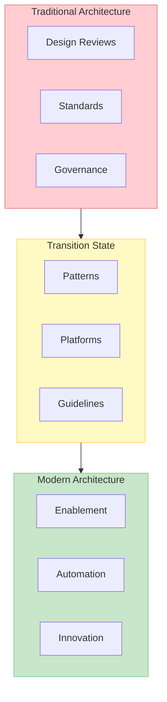
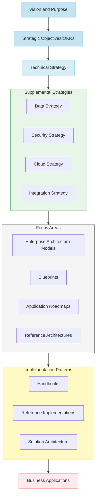
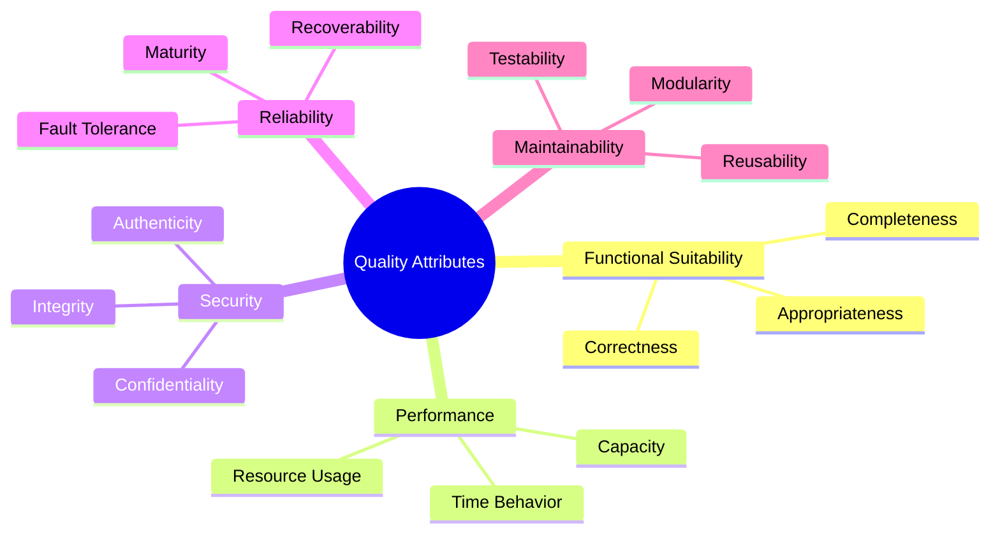

# From Project to Product: Architecting the Future of Enterprise Technology
*A CIO and Chief Architect's Perspective on Transformational Change*

## Executive Summary
For CIOs leading enterprise transformations, portfolio health isn’t just an operational indicator—it’s a real-time pulse on time-to-market and resilience in a digital-first economy. Understanding and tracking the right software delivery metrics is essential to inform strategic decisions that drive continuous improvement. In today's digital-first economy, enterprise architecture must also evolve from a control function to an enablement platform. This transformation requires a fundamental shift in how we approach technology delivery—moving from project-based thinking to product-oriented architecture.

The stakes have never been higher. In today's digital economy, business objectives like "becoming a leading global wealth management firm" or "being a premier destination for top talent" demand more than just technical excellence. They require a fundamental reimagining of how we approach enterprise architecture and technology delivery.

```mermaid
flowchart LR
    subgraph Today[Current State]
        T1[Project Focus]
        T2[Control Mindset]
        T3[Manual Gates]
    end

    subgraph Future[Target State]
        F1[Product Focus]
        F2[Enablement Mindset]
        F3[Automated Guardrails]
    end

    subgraph Pillars[Four Pillars]
        P1[Business Value]
        P2[Technical Foundation]
        P3[DevSecOps Maturity]
        P4[Engineering Community]
    end

    Today --> Pillars
    Pillars --> Future

    style Today fill:#ffcdd2,stroke:#e57373
    style Future fill:#c8e6c9,stroke:#81c784
    style Pillars fill:#bbdefb,stroke:#64b5f6
```

Key Takeaways:
* Traditional architecture approaches focused on control and standards are failing to meet modern business needs
* Successful transformation requires a shift from "master builder" to "urban planner" mindset and then translated into self-sustainable entities
* Four critical pillars drive success: business value delivery, technical foundation, DevSecOps maturity, and thirving engineering community
* Measuring portfolio health through clear metrics enables data-driven decision making
* Cultural transformation and talent development are as crucial as technical excellence

Expected Benefits:
* Faster time to market for new initiatives
* Small teams focused on well-defined outcomes
* Reduction in system incidents
* Improvement in developer productivity
* Enhanced ability to attract and retain top talent
* Stronger alignment between technology and business outcomes

## I. The Modern Enterprise Architecture Challenge

Today's enterprises face a critical inflection point. In a world where software defines competitive advantage, traditional approaches to enterprise architecture—focused on control, standards, and governance—are failing to deliver the speed and resilience businesses require.

### The Traditional Approach Is Failing
Imagine being tasked with developing a rapidly growing metropolitan area. Would you focus solely on approving individual building permits, or would you first establish a comprehensive city plan that considers infrastructure, sustainability, and community needs? Unfortunately, many organizations still approach their technology landscape like overeager developers rather than thoughtful city planners—focusing on individual projects without considering the broader ecosystem's health and sustainability.

### The Cost of Inaction
Organizations clinging to traditional architecture approaches face:
* Mounting technical debt
* Increasing system complexity
* Rising operational costs
* Difficulty attracting talent
* Slower time to market impacting competitive advantages
* Reduced competitive advantage

## The Evolution of Enterprise Architecture

Modern enterprise architecture requires thinking like an urban planner rather than a building inspector. This means creating environments that enable innovation while ensuring system integrity and sustainability.

### From Building Inspector to Urban Planner
Traditional Approach | Modern Approach
-------------------|----------------
Detailed design reviews | Pattern-based guidance
Manual approvals | Automated guardrails
Standardization | Enablement
Project focus | Product mindset
Control | Empowerment

Now imagine this new evolved world, having access to pre-approved building templates, standardized utility connections for any commodity service, and clear zoning guidelines that enable rapid, reliable construction while ensuring neighborhood cohesion. This is the promise of modern enterprise architecture - providing higher-level building blocks that enable innovation and rapid business reconfiguration while maintaining system integrity. Rather than forcing every team to become infrastructure experts and building their own utilities and commodity services we create platforms and patterns that abstract away complexity while ensuring quality and consistency. By offering higher-level abstractions—platforms, patterns, shared-services, and guardrails—enterprise architects reduce toil, preserve quality, and accelerate product delivery.

## Creating a Common Language

Just as urban planners needed to develop a shared vocabulary with city officials, developers, and citizens, enterprise architects must establish a common language that bridges technical and business domains. Complex ideas that remain purely verbal often get lost or misunderstood. Documentation and diagrams transform abstract discussions into something tangible. By articulating fitness functions - automated tests tied to specific quality attributes like Reliability, Security, or Performance — teams can visualize and measure system qualities that align with business goals.

Wikipedia defines a software architect as "a software expert who makes high-level design choices and dictates technical standards, including software coding standards, tools, and platforms." But this definition misses the essence of modern enterprise architecture. If we were going to amend this definition it would include that an architect addresses many concerns, enables integration (integration issues are often where architects focus much of their attention) and ensure the evolvability of a system.  The architect often provides and is the custodian of an architecture vision for a product - which supports a a continual and incremental change as a first principles among multiple dimensions.

Most importantly, architects make difficult problems manageable. They achieve this through models, patterns, and peer review - taking complex challenges and breaking them down into understandable components that stakeholders can grasp and discuss. When you take time to put ideas on paper using language everyone understands, you enable meaningful participation in critical decisions.

The ability to explain technical concepts without jargon, making them accessible to those unfamiliar with protocols and stacks, is perhaps the most crucial skill for working with broad audiences who require clarity without deep technical background.

## II. The "What": Strategic Business Alignment

In an environment where you need to balance the company vision and strategic plan with delivering near-term value but also having a stable and sustainable technology ecosystem, evolving Enterprise Architecture is key.  Technology capabilities need to be able to support the delivery of strategic business OKRs.  Understanding opportunities and limitations of existing platforms and capabilities informs the city plan to prioritize investments for the growth needed.

Technology governance alone will often just inform you of capability gaps, tech debt and duplication – this could be too late!  A shift for Enterprise Architects to focus on Business Enablement is required.  This is much more pro-active in understanding both the business objectives but also planning and mapping the path for delivery.

Moving to product-based delivery is a significant cultural change.  The delivery of outcomes will depend on evolving the capabilities of multiple products.  Work is no longer expressed as initiatives and funding directly supports outcomes.  Translating those outcomes into features and the corresponding technology implications allows delivery teams to have focus.  

Key areas to address:
- Alignment between technology capabilities and strategic business OKRs
- Evolution from technical governance to business enablement
- Frameworks for measuring architectural success
- Cultural transformation requirements
- Models for effective stakeholder engagement
- Approaches to investment prioritization
- Risk management in transformation
- Innovation enablement strategies

Just as a city's master plan must align with its economic and social goals, our technical strategy must directly support business objectives. This alignment sets the stage for how we execute our transformation. When tied directly to strategic objectives, software delivery metrics become business enablers, not just technical KPIs. This alignment ensures that improvements in deployment frequency or time-to-restore-service translate into tangible business value—reduced time-to-market, better customer experiences, and stronger competitive advantage.

## III. The "How": Building the Modern Enterprise

Think of your enterprise technology landscape as a growing city. Just as urban planners balance immediate construction needs with long-term community vitality, modern technology leaders must create an environment that enables both rapid delivery and sustainable growth. Let's explore how these essential dimensions of city development map to our technology transformation journey.

Think of portfolio health as a state-level planning function. Just as state urban development offices monitor the health of different cities and provide targeted guidance based on each city's unique challenges, our portfolio health dashboard offers a comprehensive view that helps guide different business units toward optimal outcomes.

### State-Level Portfolio Health Metrics

Our dashboard tracks  critical dimensions across the state, helping identify where different cities (business units) need different types of attention:

###  1. Business Value Delivery
> **Conversation Starter**: "How quickly and reliably can we deliver features that matter to our customers?"

Think of this as building vibrant city districts that attract residents and businesses.

| Metric Category | Target | Description | Business Impact |
|-----------------|--------|-------------|-----------------|
| Release Quality | 100% | - Pipeline quality gate effectiveness - Post-release stability - Zero rollbacks within 2 weeks | - Customer satisfaction - Reduced operational costs - Predictable maintenance |
| Deployment Frequency | 1,250/month | - Delivery pipeline efficiency - Team capability - Automation maturity | - Market responsiveness - Competitive advantage - Innovation speed |
| Quarterly Commitments | 80% delivered | - Planning accuracy - Predictable delivery - Stakeholder alignment | - Business trust - Resource optimization - Strategic planning |

###  2. Technical Foundation
> **Conversation Starter**: "Are we maintaining reliable roads and utilities, or are we risking gridlock?"

Like a city's need for reliable infrastructure and well-maintained services.

| Metric Category | Target | Description | Business Impact |
|-----------------|--------|-------------|-----------------|
| Mean Time to Recovery | P1: 4 hours P2: 6 hours | - System observability - Response capability - Resolution efficiency | - Business continuity - Customer trust - Service reliability |
| Incident Reduction | 10% YoY decrease | - System stability - Prevention effectiveness - Maturity growth | - Operational excellence - Cost reduction - Risk management |
| Security Posture | 90% vulnerability-free | - Active scanning - Rapid remediation - Prevention measures | - Risk mitigation - Compliance - Brand protection |

###  3. DevSecOps Maturity
> **Conversation Starter**: "Are our daily operations stuck in manual processes that slow us down or expose us to risks?"

Similar to modernizing city services while maintaining daily operations.

| Metric Category | Target | Description | Business Impact |
|-----------------|--------|-------------|-----------------|
| CAP Slippage Rate | 15% | - Improvement tracking - Delivery capability - Process maturity | - Continuous improvement - Risk reduction - Operational efficiency |
| Modernization Progress | Apps: 99% Cloud: 55% SaaS: 30% | - Technical debt reduction - Platform modernization - Innovation enablement | - Cost optimization - Agility improvement - Future readiness |
| Value Stream Metrics | Flow: 40% WIP adherence | - Resource optimization - Process efficiency - Delivery flow | - Time to market - Resource utilization - Cost effectiveness |

###  4. Engineering Community
> **Conversation Starter**: "How do we attract and retain the best talent to grow our 'digital city'?"

Just as great cities need engaged, skilled citizens to thrive.

| Metric Category | Target | Description | Business Impact |
|-----------------|--------|-------------|-----------------|
| Staff Engagement | 75% participation | - Recognition programs - Community involvement - Innovation contribution | - Talent retention - Knowledge sharing - Innovation culture |
| Learning Growth | 32 hours/person | - Training completion - Certification achievement - Skill development | - Capability building - Career growth - Technical excellence |
| Team Satisfaction | Top quartile | - Gallup survey results - Retention rates - Team effectiveness | - Productivity - Innovation capacity - Delivery quality |

### Using State-Level Insights for City Planning

By consolidating these insights, **CIOs** and **Chief Architects** can see where to allocate resources, where risks are growing, and where future innovation might flourish. During each program increment, state-level portfolio health data guides city planners (architecture teams) in several ways:

1. **Identifying Focus Areas**
   - Some cities need infrastructure renewal
   - Others require service modernization
   - Some must improve delivery capabilities

2. **Resource Allocation**
   - Target investments where most needed
   - Share successful patterns across cities
   - Balance local and state-wide improvements

## Implementation Guidelines:
1. Start with the most impactful metrics for your organization
2. Establish clear baseline measurements before setting targets
3. Automate data collection where possible
4. Review and adjust targets quarterly
5. Use metrics to drive improvement, not punishment
6. Share success stories and learnings across teams

## Common Pitfalls:
- Over-emphasizing quantity over quality
- Neglecting leading indicators
- Using metrics punitively
- Missing business outcome alignment

## IV. Evolutionary Architecture in Practice

Just as cities must evolve while preserving their essential character, modern enterprise architecture requires built-in mechanisms for sustainable change. The "big ball of mud" architecture - where everything is tightly coupled and changes have unpredictable impacts - is like a city that grew without planning, where modifying one building might compromise its neighbors' foundations.

### Modularity and Coupling: The District Approach
Modern cities are organized into districts, each able to evolve independently while maintaining connections to the whole. Similarly, our architecture must support modularity along well-defined boundaries. This enables:
- Non-breaking changes to individual components
- Innovation within bounded contexts
- Risk mitigation through isolation
- Parallel evolution of different areas

### Domain-Driven Design: Natural Boundaries
Just as successful cities grow around natural community boundaries rather than arbitrary grid lines, modern architecture increasingly organizes around business domains rather than technical layers. This shift from traditional SOA (where services align with technical functions) to domain-oriented services represents a fundamental change in how we structure systems.

### Experimentation: The Innovation Zone
Progressive cities designate innovation districts where new ideas can be tested safely. Similarly, modern architecture must enable:
- A/B testing of new features
- Canary releases for risk management
- Multiple service versions running simultaneously
- Hypothesis-driven development

A key element of evolutionary architecture is the use of fitness functions—automated checks that continuously validate architecture against desired qualities. These align directly with ISO 25010, which defines critical software quality attributes:

> Example: A Performance Efficiency fitness function might continuously measure response times under peak load. A Reliability fitness function might monitor redundancy and failover mechanisms. These automated tests—built into your CI/CD pipeline—prevent regressions, drive continuous improvement, and provide real-time insights into portfolio health.

## V. The New Architect Mindset: From Oz to Alice

An architect’s mindset should evolve from the authoritarian 'Great and Powerful Oz,' who instills fear and questions the courage, heart, and intelligence of others, to one that mirrors Alice’s journey—guided by curiosity and self-discovery—encouraging teams to believe in the impossible and empowering them to achieve it. Today's enterprise architect must encourage teams to take risks, learn continuously, and drive transformational change. This requires new competencies and approaches:

### The Transformation of Architecture Leadership

| Aspect | Traditional Mindset ("Oz") | Modern Mindset ("Alice") | Business Impact |
|--------|---------------------------|-------------------------|-----------------|
| **Leadership Style** | - Authoritarian control - Command and direct - Fear-based compliance - Centralized authority | - Curiosity-driven - Guide and enable - Trust-based collaboration - Distributed leadership | - Increased innovation - Better team engagement - Faster decision-making - Improved adaptability |
| **Decision Making** | - Unilateral decisions - Rigid standards - Detailed review gates - Risk avoidance | - Collaborative choices - Flexible guidelines - Automated guardrails - Managed risk-taking | - Faster time to market - Higher quality solutions - Reduced bottlenecks - Greater innovation |
| **Team Interaction** | - Formal reviews - Documentation heavy - Approval-based - Distance from teams | - Regular engagement - Living documentation - Enablement-focused - Embedded with teams | - Better collaboration - Clearer communication - Stronger alignment - Improved productivity |
| **Quality Approach** | - Rigid standards enforcement - Manual quality gates - Compliance checklists - Post-facto reviews | - Automated quality checks - Built-in guardrails - Continuous validation - Preventive guidance | - Higher quality - Faster delivery - Reduced defects - Better compliance |
| **Knowledge Sharing** | - Formal documentation - Required sign-offs - Static guidelines - Limited access | - Living platforms - Shared practices - Dynamic patterns - Open access | - Faster learning - Better reuse - Reduced duplication - Greater innovation |
| **Technology Focus** | - Technology first - Standard stacks - Controlled change - Risk mitigation | - Business value first - Flexible platforms - Continuous evolution - Opportunity enablement | - Better business alignment - Increased agility - Faster innovation - Greater value delivery |

### Key Mindset Shifts in Practice

#### 1. From Control to Enablement
Traditional Practice | Modern Practice | Value Created
--------------------|-----------------|---------------
Detailed design reviews | Pattern libraries and examples | Faster solution design
Manual approvals | Automated guardrails | Reduced bottlenecks
Standard technology stack | Approved technology options | Enhanced innovation
Centralized decisions | Guided decision frameworks | Better outcomes

#### 2. From Documentation to Automation
Traditional Practice | Modern Practice | Value Created
--------------------|-----------------|---------------
Comprehensive documents | Living documentation | Better knowledge sharing
Manual checklists | Automated verification | Faster compliance
Review meetings | Self-service tools | Increased productivity
Written standards | Automated checks | Consistent quality

#### 3. From Projects to Products
Traditional Practice | Modern Practice | Value Created
--------------------|-----------------|---------------
Project deadlines | Continuous delivery | Faster time to market
Fixed requirements | Evolutionary design | Better market fit
One-time delivery | Ongoing enhancement | Sustained value
Handoff to operations | Shared responsibility | Improved quality

### Key Questions for Modern Architects
- Are teams measuring how well their systems meet defined business outcomes?
- Do engineers understand cohesion and coupling principles in practice?
- Are technical decisions based on change capability rather than novelty?
- How effectively do teams respond to business changes?
- Is the architecture enabling or hindering rapid evolution?

## VI. The Modern Architect: Beyond the Blueprint

### From Dictating Designs to Facilitating Growth

The traditional "master builder" approach positioned architects as the sole authority—handing down designs and ensuring compliance. Modern enterprise architecture, however, demands the mindset of an **urban planner**: someone who lays out guiding principles, fosters a shared vision, and enables diverse teams to shape their environment in a coherent, forward-looking way.

### Building Consensus vs. Enforcing Standards

Early architectural models often relied on rigid standards and top-down governance—akin to city ordinances that leave no room for neighborhood character. The modern architect instead focuses on **building consensus**:

- **Collaboration over Command**: Engaging cross-functional teams, listening to feedback, and making shared decisions
- **Guiding Principles**: Setting clear guardrails rather than voluminous rulebooks—allowing autonomy within well-defined boundaries
- **Contextual Standards**: Encouraging best practices that adapt to different project needs rather than a one-size-fits-all checklist

### Embracing the IASA Skills and Competency Model

The International Association of Software Architects (IASA) defines five key pillars of architectural competency that modern architects must master:

| Competency Area | Key Skills | Primary Activities | Success Indicators | Business Impact |
|----------------|------------|-------------------|-------------------|-----------------|
| **Business Technology Strategy** | - Strategic planning - Innovation management - Portfolio optimization - Market analysis - Investment ROI | - Align technology with business goals - Drive digital transformation - Develop technology roadmaps - Guide investment decisions - Identify emerging trends | - Strategic alignment score - Innovation adoption rate - Portfolio performance - Investment efficiency - Market responsiveness | - Competitive advantage - Business agility - Investment optimization - Market leadership - Innovation capacity |
| **Human Dynamics** | - Leadership - Communication - Collaboration - Influence - Mentorship | - Lead cross-functional teams - Build consensus - Manage stakeholders - Foster inclusive culture - Develop talent | - Team effectiveness - Stakeholder satisfaction - Cultural health metrics - Knowledge sharing - Talent retention | - Enhanced productivity - Better engagement - Stronger culture - Talent attraction - Reduced turnover |
| **Quality Attributes** | - Performance engineering - Security architecture - Scalability design - Reliability engineering - Maintainability | - Define quality requirements - Design for resilience - Implement measurements - Balance trade-offs - Create fitness functions | - System performance - Security posture - Scalability metrics - Reliability scores - Maintainability index | - Customer satisfaction - Risk reduction - Cost efficiency - Service reliability - System longevity |
| **IT Environment** | - Cloud architecture - Infrastructure design - Integration patterns - Security compliance - Platform strategy | - Design technology ecosystem - Manage technical debt - Ensure compliance - Optimize platforms - Guide modernization | - Platform health - Integration success - Compliance status - Modernization progress - Technical debt reduction | - Operational efficiency - Cost optimization - Risk management - Innovation enablement - System flexibility |
| **Design Skills** | - Pattern application - System modeling - Decision frameworks - Architecture evaluation - Solution design | - Create reference architectures - Apply design patterns - Make architectural decisions - Model complex systems - Evaluate solutions | - Design effectiveness - Pattern reuse rate - Decision quality - Model accuracy - Solution fitness | - Solution quality - Development speed - System coherence - Innovation capability - Maintenance efficiency |

Each competency area requires both depth and breadth, developing what IASA calls "T-shaped" skills - deep expertise in some areas combined with broad knowledge across many domains. This comprehensive model helps architects become true enablers of organizational success.

### Rethinking Architecture as an Ecosystem

Instead of static blueprints that dictate every detail, modern architects steward an evolving **ecosystem**—one where teams can continuously refine services, products, and platforms. This approach enables:

- **Faster Time-to-Value**: Shortened cycles between idea and production
- **De-Risked Change**: Architecture decisions and technology stacks that can shift without major upheavals
- **Empowered Teams**: Autonomy in design choices, backed by shared tools, data, and standards that facilitate alignment
- **Continuous Evolution**: Architecture that adapts to changing business needs and technological opportunities

### Key Focus Areas for Modern Architects

1. **Vision and Strategy**
   - Develop and communicate clear architectural vision
   - Align technical strategy with business objectives
   - Create roadmaps for evolutionary change
   - Balance innovation with stability

2. **Platform Thinking**
   - Build reusable capabilities and services
   - Create self-service platforms that enable team autonomy
   - Establish clear platform governance models
   - Monitor and optimize platform adoption

3. **Community Building**
   - Foster a culture of knowledge sharing
   - Build communities of practice
   - Enable cross-team collaboration
   - Promote architectural thinking at all levels

4. **Measurement and Improvement**
   - Define clear success metrics
   - Implement feedback loops
   - Track architectural health indicators
   - Drive continuous improvement

### Putting It All Together

In this urban planner model, the architect's job is to:

1. **Envision** a cohesive future state aligned to business outcomes
2. **Enable** teams with platforms and best-practice patterns
3. **Inspire** innovation by reducing friction and celebrating collaboration
4. **Hold** the organization accountable to ensuring architectural decisions lead to real, measurable value

The modern architect must balance multiple perspectives and priorities:
- Technical excellence vs. business pragmatism
- Innovation vs. stability
- Standardization vs. flexibility
- Global optimization vs. local autonomy

By moving beyond rigid blueprints and embracing an urban planner ethos, the modern architect helps the enterprise navigate complexity, seize opportunities, and build a thriving technology ecosystem—one that combines agility, innovation, and clear alignment with strategic goals.
  
## VII. Practical Implementation Guide

Start by establishing some guiding principles as a reference point but also helping teams through their transformation.  Teams should know good enough is acceptable and continuous improvement is encouraged.  Make the best recommendations/decisions based on the information at hand.

### Phase 1: Foundation Building
Just as cities begin with basic infrastructure, we start with:
- Architecture maturity assessment
- Just enough current state knowledge
- Business capability mapping
- Quick win identification
- Baseline metrics establishment
- Initial product domain definition

### Phase 2: Transformation Launch
Like developing new city districts, we focus on:
- Cross-functional team building
- Measurement framework implementation
- Cultural transformation initiation
- Pilot program launches
- Feedback mechanism establishment

### Phase 3: Scale and Optimize
Similar to expanding successful urban development patterns:
- Pattern replication
- Framework refinement
- Automation enhancement
- Business integration deepening
- Governance evolution
- Redefining product domains as you learn/mature

## VIII. Conclusion: Building Tomorrow's Enterprise

The transformation from project-centric to product-oriented architecture represents more than a change in delivery methodology – it's a fundamental shift in how we create and sustain business value through technology. Just as thriving cities evolve from collections of buildings into vibrant, interconnected communities, our technology landscapes must transform from isolated projects into dynamic product platforms that enable continuous innovation.

> **Vision of the Transformed Enterprise**
> - Platforms that accelerate rather than constrain innovation
> - Self-service capabilities that democratize development
> - Automated guardrails ensuring continuous alignment with quality attributes
> - Transparent portfolio health metrics guiding decisions
> - Engaged teams thriving in a culture of continuous learning
> - Architecture designed for evolution, not perfection
> - Strong technical foundations that enable rapid innovation

In the process, architects step out from behind the mysterious curtain—like Oz—and into a role more akin to the curious and imaginative Alice. By fostering collaboration, curiosity, and continuous improvement, you’ll build not just technology solutions, but a resilient digital ecosystem that can adapt to tomorrow’s challenges.

> **Key Takeaways for Technology Leaders**
> - Start with business outcomes, not just technical standards.
> - Align DORA metrics and ISO 25010 quality attributes for holistic insight.
> - Provide platforms and guardrails that make doing the right thing easy.
> - Measure what matters—tie metrics to strategic objectives.
> - Invest in talent and culture: a thriving city needs skilled, motivated citizens.
> - Design for evolution: domain-driven design and modularity enable faster adaptation.
> - Continuously share insights and scale successful patterns.

Remember, just as great cities aren't built in a day, this transformation is a journey rather than a destination. The key is to start now, move purposefully, and keep the focus on enabling business outcomes rather than enforcing technical standards. In doing so, you'll build not just a technology landscape, but a thriving ecosystem that powers your organization's future success.

> **Call to Action: Starting Your Transformation**
> 1. Assess your current state against the framework provided
> 2. Identify your most pressing improvement opportunities
> 3. Build a coalition of business and technology leaders
> 4. Choose a high-impact pilot area for initial focus
> 5. Establish clear metrics for measuring progress
> 6. Share successes and learnings broadly
> 7. Scale proven patterns across the organization
> 8. Maintain focus on continuous improvement

Organizations that successfully navigate this transformation will build competitive advantages through faster response to market opportunities, more efficient use of technology investments, improved ability to attract and retain talent, enhanced capacity for innovation, and greater business-technology alignment.

The time to start is now. Your technology ecosystem's future success depends on the foundations you build today.
