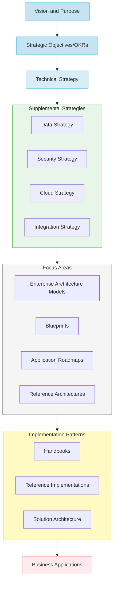

# From Project to Product: Architecting the Future of Enterprise Technology
*A CIO and Chief Architect's Perspective on Transformational Change*

## Introduction

Imagine being tasked with developing a rapidly growing metropolitan area. Would you focus solely on approving individual building permits, or would you first establish a comprehensive city plan that considers infrastructure, sustainability, and community needs? Unfortunately, many organizations still approach their technology landscape like overeager developers rather than thoughtful city planners – focusing on individual projects without considering the broader ecosystem's health and sustainability.

The stakes have never been higher. In today's digital economy, business objectives like "becoming a leading global wealth management firm" or "being a premier destination for top talent" demand more than just technical excellence. They require a fundamental reimagining of how we approach enterprise architecture and technology delivery.

## The Evolution of Enterprise Architecture

Imagine having to build a city with just raw building materials - steel beams, concrete, wiring, and plumbing components. While this offers ultimate flexibility, it requires every builder to become a master of multiple trades: structural engineering, electrical systems, plumbing, HVAC, and more. This mirrors how many organizations handle technology delivery today - we provide teams with basic components and expect them to become experts in everything from Kubernetes to Akamai, from API gateways to routing protocols, from security configurations to cloud infrastructure.

It's as if we're asking every developer to get a master's degree in infrastructure before they can make simple changes to their applications. We hand them raw materials and expect them to build cathedrals, while simultaneously maintaining deep expertise across an ever-expanding set of foundational technologies.

Now imagine instead having access to pre-approved building templates, standardized utility connections, and clear zoning guidelines that enable rapid, reliable construction while ensuring neighborhood cohesion. This is the promise of modern enterprise architecture - providing higher-level building blocks that enable innovation while maintaining system integrity. Rather than forcing every team to become infrastructure experts, we create platforms and patterns that abstract away complexity while ensuring quality and consistency.

## Creating a Common Language

Just as urban planners needed to develop a shared vocabulary with city officials, developers, and citizens, enterprise architects must establish a common language that bridges technical and business domains. Complex ideas in large enterprises that exist only as discussions often lead to confusion and delays.

Wikipedia defines a software architect as "a software expert who makes high-level design choices and dictates technical standards, including software coding standards, tools, and platforms." But this definition misses the essence of modern enterprise architecture. Today's architect is a master of complexity who addresses multiple concerns, enables seamless integration, and ensures system evolvability. They serve as custodians of architectural vision, supporting continual and incremental change across multiple dimensions.

Most importantly, architects make difficult problems manageable. They achieve this through models, patterns, and peer review - taking complex challenges and breaking them down into understandable components that stakeholders can grasp and discuss. When you take time to put ideas on paper using language everyone understands, you enable meaningful participation in critical decisions.

The ability to explain technical concepts without jargon, making them accessible to those unfamiliar with protocols and stacks, is perhaps the most crucial skill for working with broad audiences who require clarity without deep technical background.

## II. The "What": Strategic Business Alignment

[TO BE DRAFTED BY CIO]

Key areas to address:
- Alignment between technology capabilities and strategic business OKRs
- Evolution from technical governance to business enablement
- Frameworks for measuring architectural success
- Cultural transformation requirements
- Models for effective stakeholder engagement
- Approaches to investment prioritization
- Risk management in transformation
- Innovation enablement strategies

Just as a city's master plan must align with its economic and social goals, our technical strategy must directly support business objectives. This alignment sets the stage for how we execute our transformation.

## III. The "How": Building the Modern Enterprise

Think of your enterprise technology landscape as a growing city. Just as urban planners balance immediate construction needs with long-term community vitality, modern technology leaders must create an environment that enables both rapid delivery and sustainable growth. Let's explore how four essential dimensions of city development map to our technology transformation journey:

### Delivering Compelling Business Value: Building Vibrant Districts

Just as city planners focus on creating thriving neighborhoods that attract residents and businesses, our first objective is to deliver articulated and compelling business value while instilling a product-centric mindset and shared ownership. This means:

- Getting it right the first time (like proper construction from day one)
  * 100% release quality (meeting NFRs, IRA, QA, SIT, PIV, Production Readiness)
  * Zero rollbacks or priority bug fixes within 2 weeks of deployment
  * 1,250 successful deployments per month
  * 80% quarterly commitments delivered

### Enhancing Technical Foundation: Maintaining Critical Infrastructure

Like a city's need for reliable utilities and well-maintained roads, we must enhance our technical foundation through continuous, comprehensive health assessments rooted in business priorities. Rather than fixing problems in silos, we take a systematic approach:

- Improving service reliability and recovery
  * 10% reduction in P1/P2 incidents year over year
  * P1 MTTR target of 4 hours
  * P2 MTTR target of 6.0 hours
  * 90% of active code repositories free of vulnerabilities

### Maturing DevSecOps: Modernizing City Services

Similar to upgrading city services while keeping daily operations running smoothly, we're maturing our DevSecOps practices and removing toil. This means building fast and secure without productivity challenges and with fewer systems at risk:

- Supporting smart trade-offs between risk and opportunities
  * 15% CAP slippage rate target
  * 95% KRI composite score
- Showing clear modernization progress
  * 99% of apps converted to target state
  * 55% of apps on cloud
  * 30% SaaS and PaaS adoption

### Building Global Talent: Developing a Thriving Community

Just as great cities need engaged, skilled citizens to thrive, we're focused on building a deep, diverse bench of global talent by promoting learning and career growth:

- Improving staff engagement
  * 75% of staff participating in recognition programs
  * Top quartile results in Gallup surveys
- Expanding learning opportunities
  * 32 hours of certification or learning programs per person

## IV. Evolutionary Architecture in Practice

Just as cities must evolve while preserving their essential character, modern enterprise architecture requires built-in mechanisms for sustainable change. The "big ball of mud" architecture - where everything is tightly coupled and changes have unpredictable impacts - is like a city that grew without planning, where modifying one building might compromise its neighbors' foundations.

### Modularity and Coupling: The District Approach
Modern cities are organized into districts, each able to evolve independently while maintaining connections to the whole. Similarly, our architecture must support modularity along well-defined boundaries. This enables:
- Non-breaking changes to individual components
- Innovation within bounded contexts
- Risk mitigation through isolation
- Parallel evolution of different areas

### Domain-Driven Design: Natural Boundaries
Just as successful cities grow around natural community boundaries rather than arbitrary grid lines, modern architecture increasingly organizes around business domains rather than technical layers. This shift from traditional SOA (where services align with technical functions) to domain-oriented services represents a fundamental change in how we structure systems.

### Experimentation: The Innovation Zone
Progressive cities designate innovation districts where new ideas can be tested safely. Similarly, modern architecture must enable:
- A/B testing of new features
- Canary releases for risk management
- Multiple service versions running simultaneously
- Hypothesis-driven development

## V. The New Architect Mindset

Today's enterprise architect must shift from being the "master builder" to becoming the "city planner" who orchestrates sustainable growth. This requires new competencies and approaches:

### From Control to Enablement
Traditional architecture focused on controlling change through:
- Detailed design reviews
- Rigid standards enforcement
- Centralized decision-making
- Comprehensive documentation requirements

Modern architects instead enable success through:
- Pattern identification and sharing
- Platform creation that makes "doing the right thing" easy
- Guidance and education rather than enforcement
- Automated guardrails rather than manual gates

### Key Questions for Modern Architects
- Are teams measuring how well their systems meet defined business outcomes?
- Do engineers understand cohesion and coupling principles in practice?
- Are technical decisions based on change capability rather than novelty?
- How effectively do teams respond to business changes?
- Is the architecture enabling or hindering rapid evolution?

## VI. Implementation Guide: From Vision to Reality

Like transforming a city, evolving enterprise architecture requires a phased approach that balances immediate needs with long-term objectives.

### Phase 1: Foundation Assessment
Start with understanding your current "city":
- Map existing capabilities and their relationships
- Identify critical pain points and technical debt
- Document current patterns, both good and bad
- Understand team capabilities and constraints
- Establish baseline metrics for improvement

### Phase 2: Strategic Planning
Develop your "master plan":
- Create vision that aligns with business objectives
- Identify key patterns to promote or discourage
- Design platform capabilities that enable teams
- Establish metrics for measuring progress
- Plan for incremental improvements

### Phase 3: Pilot Implementation
Start small but think big:
- Choose high-impact, manageable pilot areas
- Implement initial platform capabilities
- Document and share successful patterns
- Gather metrics and feedback
- Adjust approaches based on learning

## VII. Measuring Success: The State-Level Portfolio Health Dashboard

Think of portfolio health as a state-level planning function. Just as state urban development offices monitor the health of different cities and provide targeted guidance based on each city's unique challenges, our portfolio health dashboard offers a comprehensive view that helps guide different business units toward optimal outcomes.

### State-Level Portfolio Health Metrics

Our dashboard tracks three critical dimensions across the state, helping identify where different cities (business units) need different types of attention:

#### 1. Delivering Business Value
*Like monitoring economic vitality across cities*
- Getting it right the first time
  * Release Quality (target 100%)
  * Zero rollbacks within 2 weeks
- Measuring delivery pace
  * Deployment Frequency (1,250/month)
  * Quarterly Commitments (80% delivered)

#### 2. Technical Foundation
*Like assessing infrastructure health across the state*
- System Reliability
  * P1/P2 incident reduction (10% YoY)
  * P1 MTTR (4 hours)
  * P2 MTTR (6.0 hours)
- Security Posture
  * 90% of repos free from vulnerabilities

#### 3. DevSecOps Maturity
*Like measuring modernization of city services*
- Risk Management
  * CAP Slippage Rate (15%)
  * KRI Composite Score (95%)
- Modernization Progress
  * Apps in Target State (99%)
  * Cloud Migration (55%)
  * SaaS and PaaS Adoption (30%)

### Using State-Level Insights for City Planning

During each program increment, state-level portfolio health data guides city planners (architecture teams) in several ways:

1. **Identifying Focus Areas**
   - Some cities need infrastructure renewal
   - Others require service modernization
   - Some must improve delivery capabilities

2. **Resource Allocation**
   - Target investments where most needed
   - Share successful patterns across cities
   - Balance local and state-wide improvements

## VIII. Conclusion: Building Tomorrow's Enterprise

The transformation from project-centric to product-oriented architecture represents more than a change in delivery methodology – it's a fundamental shift in how we create and sustain business value through technology. Just as thriving cities evolve from collections of buildings into vibrant, interconnected communities, our technology landscapes must transform from isolated projects into dynamic product platforms that enable continuous innovation.

> **Vision of the Transformed Enterprise**
> - Technology platforms that enable rather than constrain innovation
> - Self-service capabilities that democratize technology delivery
> - Automated guardrails that ensure quality without slowing progress
> - Clear visibility into system health and business impact
> - Engaged teams focused on continuous improvement
> - Architecture that evolves naturally with business needs
> - Strong technical foundations that enable rapid innovation

This journey requires enterprise architects to embrace a new identity: from gatekeepers to enablers, from standards enforcers to community builders, from project reviewers to product visionaries. Like skilled urban planners, modern architects must orchestrate sustainable growth while ensuring their technology "cities" remain livable, adaptable, and capable of meeting future challenges.

> **Key Takeaways for Technology Leaders**
> - Start with business outcomes, not technical standards
> - Invest in platforms that make "doing the right thing" easy
> - Focus on enabling teams rather than controlling them
> - Measure what matters to the business
> - Build for evolution, not perfection
> - Create clear pathways for modernization
> - Foster a culture of continuous learning and improvement

Remember, just as great cities aren't built in a day, this transformation is a journey rather than a destination. The key is to start now, move purposefully, and keep the focus on enabling business outcomes rather than enforcing technical standards. In doing so, you'll build not just a technology landscape, but a thriving ecosystem that powers your organization's future success.

> **Call to Action: Starting Your Transformation**
> 1. Assess your current state against the framework provided
> 2. Identify your most pressing improvement opportunities
> 3. Build a coalition of business and technology leaders
> 4. Choose a high-impact pilot area for initial focus
> 5. Establish clear metrics for measuring progress
> 6. Share successes and learnings broadly
> 7. Scale proven patterns across the organization
> 8. Maintain focus on continuous improvement

Organizations that successfully navigate this transformation will build competitive advantages through faster response to market opportunities, more efficient use of technology investments, improved ability to attract and retain talent, enhanced capacity for innovation, and greater business-technology alignment.

The time to start is now. Your technology ecosystem's future success depends on the foundations you build today.
