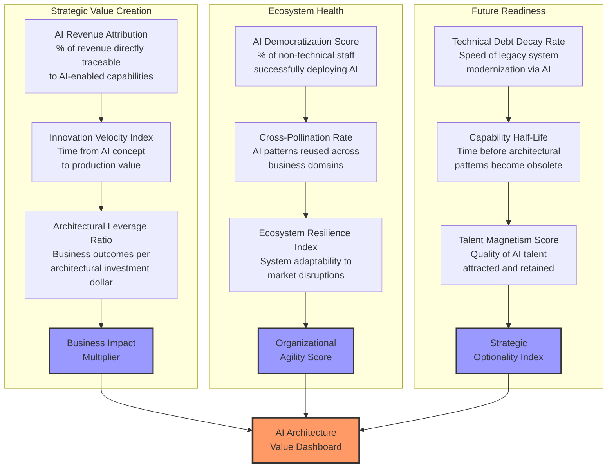

# From Fixed Frameworks to Strategic Enablers: Architecting AI Transformation

Traditional architectural approaches have become unsustainable for technology leaders navigating today's AI-driven landscape. Architecture is no longer a checkpoint at the end of development but must be woven throughout the entire AI transformation lifecycle. As organizations demand more tangible evidence of AI value and competitive advantage, enterprises must fundamentally transform how they approach architecture, shifting from rigid frameworks to strategic enablement.

## Key Takeaways: Architects as Strategic Business Enablers

1. **Shift from Rigid Control to Distributed Enablement**: Move from centralized architectural governance to distributed frameworks that empower innovation while maintaining necessary guardrails.

2. **Embrace the Product Mindset**: Transform architectural thinking from project-centric deliverables to product-oriented capabilities that continuously deliver business value.

3. **Develop New Skills and Competencies**: Invest in architectural talent that combines technical expertise with strategic business acumen to lead AI transformation.

4. **Implement Outcome-Based Metrics**: Measure architectural success through business outcomes rather than technical compliance.

5. **Create Self-Sustainable Systems**: Design architectural frameworks that adapt and evolve without constant manual intervention, just as well-planned cities grow organically.

> "As the tech function shifts from leading digital transformation to leading AI transformation, forward-thinking leaders are using this as an opportunity to redefine the future of IT." — [Deloitte Tech Trends 2025](https://www2.deloitte.com/us/en/insights/focus/tech-trends.html)

## Breaking Free from the Order-Taking Trap

Many IT organizations have devolved into sophisticated order-taking operations, where architecture teams simply implement strategies handed down from business units without meaningful input into their formation. This execution-only mindset has created several critical dysfunctions.

### The Feature Factory Syndrome

When IT operates purely as a feature delivery engine, architecture becomes reactive rather than proactive. Teams rush to implement disconnected capabilities without considering the broader ecosystem impact. This creates a devastating cycle: business requests lead to feature development, which accumulates technical debt, increases integration complexity, creates maintenance burden, reduces innovation capacity, and ultimately generates more feature requests.

The feature factory syndrome is particularly dangerous in AI initiatives because it treats AI capabilities as isolated features rather than integrated intelligence that requires careful orchestration across the enterprise. Each disconnected AI implementation creates its own data silos, model inconsistencies, and governance gaps, making enterprise-wide AI strategy nearly impossible.

### From Integration Team to Innovation Partner

The transformation requires architects to shift from being passive integrators to active innovation partners:

| Current State (Order Taker) | Future State (Strategic Partner) | Transformation Actions |
|---------------------------|--------------------------------|---------------------|
| **Receives predetermined solutions** | **Co-creates strategic options** | Embed architects in business strategy sessions from day one |
| **Implements without questioning fit** | **Challenges and refines approaches** | Establish architecture review boards with veto power on strategic initiatives |
| **Focuses on technical feasibility** | **Drives business possibility** | Create innovation labs where architects prototype future capabilities |
| **Measures delivery speed** | **Measures value creation** | Implement outcome-based metrics tied to business results |
| **Maintains system stability** | **Enables competitive advantage** | Develop architectural patterns that accelerate market differentiation |

## Building the Strategic AI Design Pathway

Building on the concept of a "golden path" for software development, we can establish a "strategic AI design pathway" that integrates architecture at every stage of the AI transformation lifecycle:

| Stage | Who | Theme | How | Goal |
|-------|-----|-------|-----|------|
| **Strategy & Vision** | Enterprise architects | Digital Advantage | Establish cross-functional steering committees with executive sponsorship | Define clear value metrics for AI initiatives that balance innovation with risk |
| | Business strategists | Value Creation | Map AI initiatives to strategic business priorities with ROI expectations | Create business-led prioritization framework for AI deployment |
| | AI ethics specialists | Responsible AI | Develop ethical AI principles and governance guardrails | Ensure responsible development and deployment aligned with organizational values |
| **Design & Development** | Solution architects | Pattern Design | Create reusable architectural patterns and reference implementations | Accelerate development while maintaining architectural integrity |
| | Developers | Implementation | Employ agile development with architecture-as-code practices | Deliver high-quality, well-architected AI components rapidly |
| | Data scientists | Intelligence | Develop model evaluation frameworks and quality standards | Ensure AI models meet performance and ethical standards |
| **Integration & Deployment** | Technology architects | Interoperability | Define interface standards and integration patterns | Create a cohesive ecosystem that enables seamless AI integration |
| | DevOps | Automation | Implement CI/CD pipelines with built-in architectural validation | Automate deployment with continuous architecture assessment |
| | Platform engineers | Scalability | Design flexible infrastructure that grows with usage | Support seamless scaling without architectural compromise |
| **Continuous Evolution** | Enterprise architects | Strategic Alignment | Regular architecture reviews tied to business outcomes | Maintain alignment between architecture and evolving business needs |
| | Product owners | Feedback Integration | Operate feedback loops that capture real-world usage patterns | Drive continuous improvement based on actual usage data |
| | Business analysts | Value Measurement | Track and report on value realization against projections | Ensure ongoing value delivery and course correction |

## Revolutionary Architectural Success Metrics

Traditional IT metrics fail to capture the true value of architectural enablement in the AI era. We need a radical shift toward measures that reflect architecture's role as a strategic business accelerator.

### Next-Generation Metrics Framework

**Strategic Value Creation Metrics** move beyond cost savings to revenue generation:
- **AI Revenue Attribution**: Percentage of total revenue directly traceable to AI-enabled capabilities (target: >15% by Year 2)
- **Innovation Velocity Index**: Time from AI concept to production value (target: <90 days)  
- **Architectural Leverage Ratio**: Business outcomes per architectural investment dollar (target: 10:1 ROI)

**Ecosystem Health Metrics** measure true organizational transformation:
- **AI Democratization Score**: Percentage of non-technical staff successfully deploying AI solutions (target: >40%)
- **Cross-Pollination Rate**: AI patterns reused across business domains (target: >70% reuse)
- **Ecosystem Resilience Index**: System adaptability during disruptions (target: >85% stability)

**Future Readiness Metrics** quantify strategic flexibility:
- **Technical Debt Decay Rate**: Speed of legacy modernization via AI (target: -25% annually)
- **Capability Half-Life**: Time before patterns need updates (target: >18 months)
- **Talent Magnetism Score**: Quality of AI talent attracted and retained (target: top 20% industry)

## Transforming from Service Provider to Strategic Leader

The shift from order-taker to strategic partner requires fundamental changes in how architecture teams operate, measure success, and engage with the business. This transformation challenges deeply ingrained organizational behaviors and power structures.

### The Psychology of Organizational Transformation

Architecture teams face three psychological barriers when attempting this transformation:

**Learned Helplessness**: After years of being told what to build, teams develop a passive mindset. They stop proposing ideas because "the business always decides anyway." Breaking this requires:
- Small wins strategy: Start with low-risk initiatives where architects can demonstrate strategic value
- Failure amnesty: Create safe spaces for strategic experiments without career consequences  
- Success amplification: Publicly celebrate when architectural insights drive business value

**Identity Crisis**: Technical experts often resist business engagement, viewing it as "not real architecture work." Address this through:
- Role redefinition: Frame business acumen as advanced architectural skill
- Peer recognition: Elevate architects who successfully bridge business and technology
- Skills scaffolding: Provide business training without diminishing technical expertise

**Power Dynamic Shifts**: Moving from service provider to strategic partner disrupts established hierarchies. Manage this by:
- Executive sponsorship: C-suite must visibly empower architecture teams
- Gradual escalation: Build influence incrementally rather than demanding immediate authority
- Coalition building: Partner with progressive business leaders who value technical insight

According to [McKinsey research](https://www.mckinsey.com/capabilities/mckinsey-digital/our-insights/superagency-in-the-workplace-empowering-people-to-unlock-ais-full-potential-at-work), "companies that invest strategically can go beyond using AI to drive incremental value and instead create transformative change."

The transformation requires establishing a new social contract: moving from "Architecture ensures technical standards compliance" to "Architecture enables competitive advantage through technology." This shift demands mutual accountability where business includes architects early while architects own business outcomes.

## Quick Start Guide for CIOs

**First 30 Days:**
1. Conduct honest assessment of your architecture function's current operating model
2. Identify 2-3 AI initiatives where architectural guidance could immediately add value
3. Engage business leaders to understand their perception of architecture
4. Challenge the order-taking mentality with one unsolicited strategic initiative
5. Establish metrics measuring business impact, not just technical delivery

**Phase 1 (Months 1-2): Foundation**
- Assess architectural maturity against AI-readiness criteria
- Map business value chains to technical capabilities  
- Define architectural vision and principles

**Phase 2 (Months 2-3): Strategic Alignment**
- Create product-oriented capability model
- Establish cross-functional architecture council
- Develop AI architecture pattern library

According to [Gartner research](https://www.gartner.com/smarterwithgartner/enterprise-architecture-enables-digital-innovation), "Today's enterprise architects are responsible for designing intelligence into the business and operating models, identifying ways to help their organization use data, analytics and artificial intelligence to plan, track and manage digital business investments."

## The Future of Competitive Advantage

The organizations that succeed in the AI era will be those where architecture evolves from a constraining factor to a strategic enabler. By embracing architecture's role as the connective tissue between business ambition and technical possibility, CIOs can position their organizations to harness AI's transformative potential while managing inherent risks.

To lead this transformation, CIOs must:

1. **Reposition architecture as a strategic business function** rather than a technical control point, demonstrating its value through business outcomes rather than technical deliverables. This means embedding architects in strategy sessions and measuring their impact on revenue generation and competitive advantage.

2. **Champion product thinking across the technology organization**, moving funding and resourcing models away from project-based approaches to continuous value delivery. AI capabilities require sustained investment and evolution, not one-time implementations.

3. **Invest in architectural talent development** that bridges technical expertise with business acumen, either through upskilling existing staff or strategic hiring. The architects of tomorrow must speak both technology and business strategy fluently.

4. **Establish new architectural performance metrics** that measure business value enablement rather than compliance with standards. Success should be measured by innovation velocity, AI democratization, and revenue attribution, not technical documentation completion.

5. **Partner proactively with business leaders** to ensure architectural guidance enables rather than constrains their AI-powered innovation ambitions. This requires moving from reactive service provision to proactive strategic partnership.

The future lies not in building the most sophisticated AI systems but in creating the most effective architectural ecosystems to harness their power. CIOs who lead this transformation will unlock AI's true business value and establish sustainable competitive advantage in an AI-driven economy.
