# From Fixed Frameworks to Strategic Enablers: Architecting the Future of AI Transformation

Traditional architectural approaches have become unsustainable for technology leaders navigating today's AI-driven landscape. Architecture is no longer a checkpoint at the end of development but must be woven throughout the entire AI transformation lifecycle. As organizations demand more tangible evidence of AI value and competitive advantage, enterprises must fundamentally transform how they approach architecture, shifting from rigid frameworks to strategic enablement.

## Key Takeaways: Architects as Strategic Business Enablers

1. **Shift from Rigid Control to Distributed Enablement**: Move from centralized architectural governance to distributed frameworks that empower innovation while maintaining necessary guardrails.

2. **Embrace the Product Mindset**: Transform architectural thinking from project-centric deliverables to product-oriented capabilities that continuously deliver business value.

3. **Develop New Skills and Competencies**: Invest in architectural talent that combines technical expertise with strategic business acumen to lead AI transformation.

4. **Implement Outcome-Based Metrics**: Measure architectural success through business outcomes rather than technical compliance.

5. **Create Self-Sustainable Systems**: Design architectural frameworks that adapt and evolve without constant manual intervention, just as well-planned cities grow organically.

> "As the tech function shifts from leading digital transformation to leading AI transformation, forward-thinking leaders are using this as an opportunity to redefine the future of IT." — Deloitte Tech Trends 2025

The stakes are clear. In today's AI economy, business objectives like "becoming an intelligent enterprise" or "achieving digital advantage while protecting data" require more than technical deployments; they demand enterprise-wide architectural thinking that evolves beyond traditional constraints.

## Breaking Free from the Order-Taking Trap

Many IT organizations have devolved into sophisticated order-taking operations, where architecture teams simply implement strategies handed down from business units without meaningful input into their formation. This execution-only mindset has created several critical dysfunctions:

### The Feature Factory Syndrome

When IT operates purely as a feature delivery engine, architecture becomes reactive rather than proactive. Teams rush to implement disconnected capabilities without considering the broader ecosystem impact. This leads to:

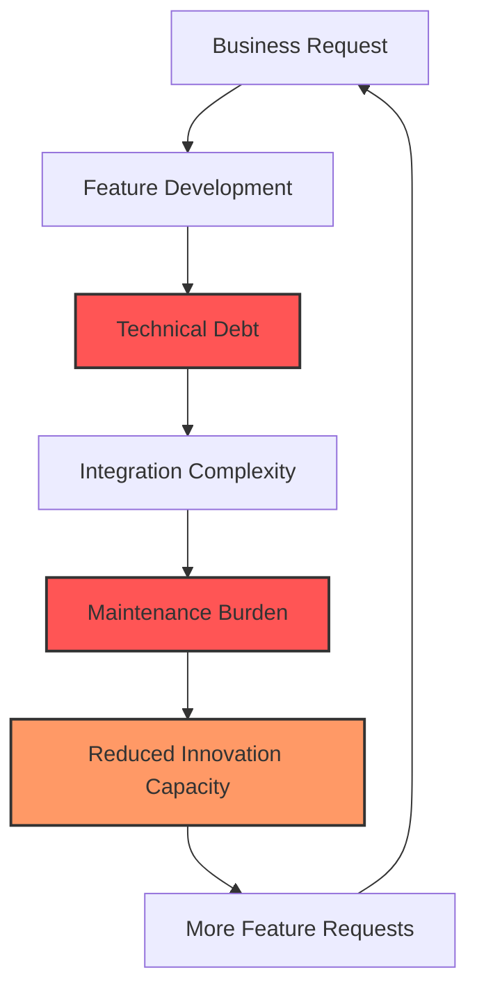

### From Integration Team to Innovation Partner

The transformation requires architects to shift from being passive integrators to active innovation partners:

| Current State (Order Taker) | Future State (Strategic Partner) | Transformation Actions |
|---------------------------|--------------------------------|---------------------|
| **Receives predetermined solutions** | **Co-creates strategic options** | Embed architects in business strategy sessions from day one |
| **Implements without questioning fit** | **Challenges and refines approaches** | Establish architecture review boards with veto power on strategic initiatives |
| **Focuses on technical feasibility** | **Drives business possibility** | Create innovation labs where architects prototype future capabilities |
| **Measures delivery speed** | **Measures value creation** | Implement outcome-based metrics tied to business results |
| **Maintains system stability** | **Enables competitive advantage** | Develop architectural patterns that accelerate market differentiation |

### The Strategic Architecture Transformation Model

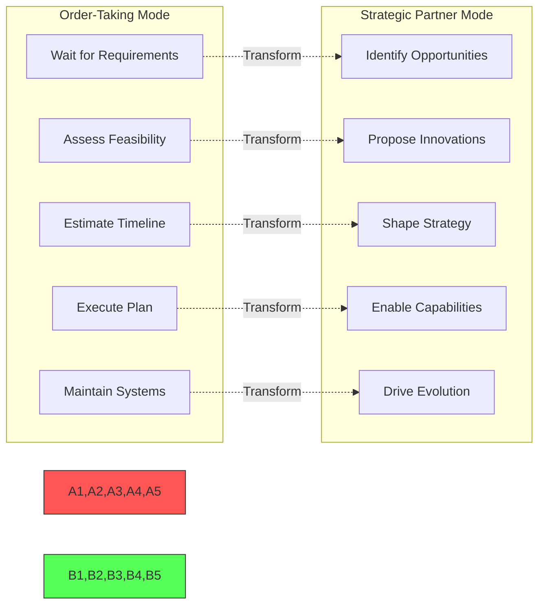

### Breaking the Execution-Only Mindset

To transform from order-takers to strategic enablers, architecture teams must:

1. **Earn a Seat at the Strategy Table**
   - Demonstrate business acumen beyond technical expertise
   - Speak in terms of market opportunities, not system capabilities
   - Present architectural decisions as business investments

2. **Shift from Reactive to Predictive**
   - Anticipate business needs before they're articulated
   - Build capabilities ahead of demand
   - Create architectural runways for future innovation

3. **Transform Governance from Gatekeeping to Enabling**
   - Replace approval processes with enablement frameworks
   - Provide self-service architectural patterns
   - Measure success by innovation velocity, not compliance

4. **Redefine the Architect Role**
   - From technical expert to business strategist
   - From system designer to capability enabler
   - From risk mitigator to opportunity creator

## The Matrix of Fixed Thinking

In the film "The Matrix," Agent Smith reveals how the first Matrix was designed as a perfect human world but ultimately failed because humans couldn't accept a program without imperfection or struggle. Similarly, many organizations design perfect architectural blueprints detached from real-world implementation challenges, creating a disconnect between theory and practice. When architecture exists only as pristine documentation, it becomes rejected by the very systems and teams it's meant to guide.

As Agent Smith explains, "The perfect world was a dream... but your primitive cerebrum kept trying to wake up from it." In the same way, organizations that attempt to impose rigid architectural frameworks find their teams constantly "waking up" from and working around these idealized structures. The solution isn't abandoning architecture but recognizing that effective architectural thinking must embrace the messiness of real-world implementation, creating systems that account for human factors, organizational realities, and the natural evolution of technology.

## From "Master Builder" to "Urban Planner": A New Architectural Mindset

Traditional architecture approaches in many enterprises are failing to deliver the speed and resilience required in the AI era. Organizations clinging to these outdated models often focus on individual projects without considering the broader ecosystem's health and sustainability, like developers focused on individual buildings rather than comprehensive city planning.

### Escaping the Integration Team Trap

When architecture teams become merely sophisticated integration units, connecting systems that others have decided to buy or build, they lose their strategic influence. This relegation to technical plumbing work creates a vicious cycle:

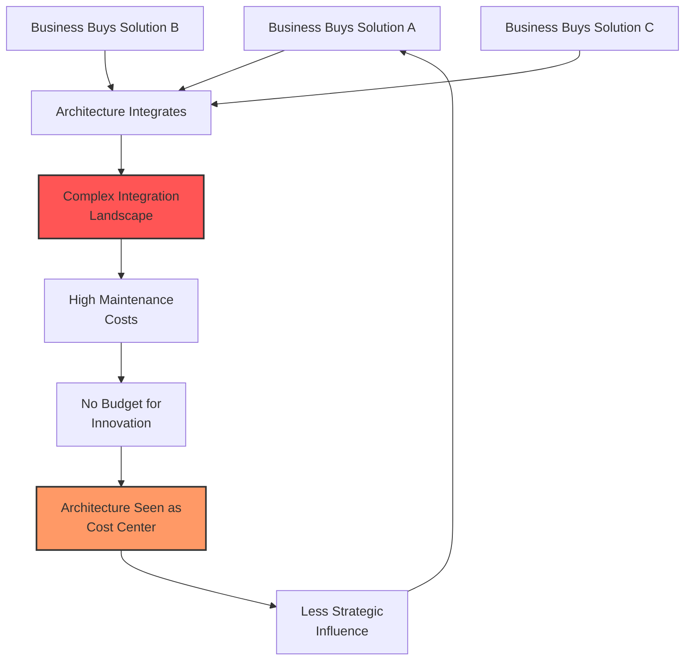

### The Strategic Architecture Value Chain

To break free from this trap, architecture must insert itself earlier in the value chain:

| Traditional Position | Strategic Position | Value Created |
|---------------------|-------------------|---------------|
| **After vendor selection** | **Before market scanning** | Shape buy vs. build decisions |
| **During implementation** | **During strategy formation** | Influence capability roadmaps |
| **As technical consultant** | **As business advisor** | Drive competitive differentiation |
| **When problems arise** | **Before opportunities emerge** | Enable new business models |

## Breaking Down Centralized Thinking

For decades, enterprises have operated with centralized IT models that served them well during predictable technology evolution. However, the AI revolution requires breaking free from this matrix of thinking. Like Neo discovering the truth about his reality, organizations must recognize that the traditional architecture approach, where all decisions flow from the center, is merely an illusion of control in today's fast-paced AI landscape.

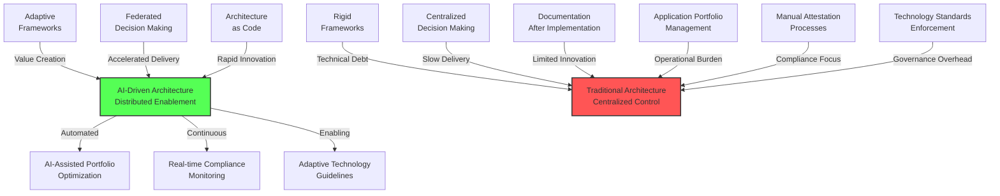

The new paradigm requires a shift from centralized build-and-maintain models to human-in-the-loop, collaborative architecture that enables citizen developers while ensuring governance. This isn't about abandoning control but rather reimagining it as a distributed framework that guides rather than restricts innovation. Traditional operational aspects of enterprise architecture, like application portfolio management, standards enforcement, and attestation processes, must evolve from administrative burdens into strategic enablers.

## The Inefficiencies of Traditional Software Development

Traditional software development approaches have created significant inefficiencies that hamper an organization's ability to capitalize on AI opportunities:

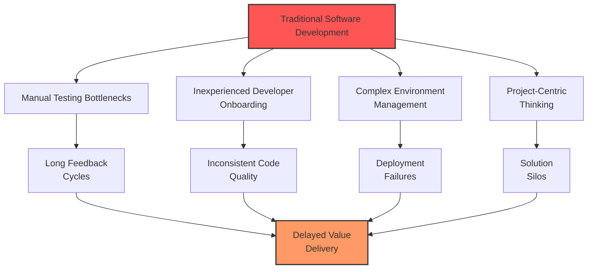

| Traditional Issue | Impact on AI Initiatives | Architectural Solution |
|-------------------|--------------------------|------------------------|
| **Manual Testing** | Slows innovation cycles and fails to adequately test complex AI scenarios | Automated testing with AI-generated test cases |
| **Inexperienced Developers** | Lack of AI expertise leads to misapplication of technologies | Architecture-as-code with embedded patterns and guardrails |
| **Complex Environments** | Multiple environments with different configurations create inconsistent AI behavior | Infrastructure-as-code with environment parity |
| **Project-Centric Thinking** | Short-term focus prevents strategic AI capability development | Product-oriented architecture with long-term value measurement |

## From Project to Product: The New Architecture Paradigm

The transformation from project-centric to product-oriented architecture represents a fundamental shift in how we create and sustain business value through technology. Just as cities evolve from collections of buildings into vibrant, interconnected communities, our technology landscapes must transform from disconnected projects into cohesive, value-driven products.

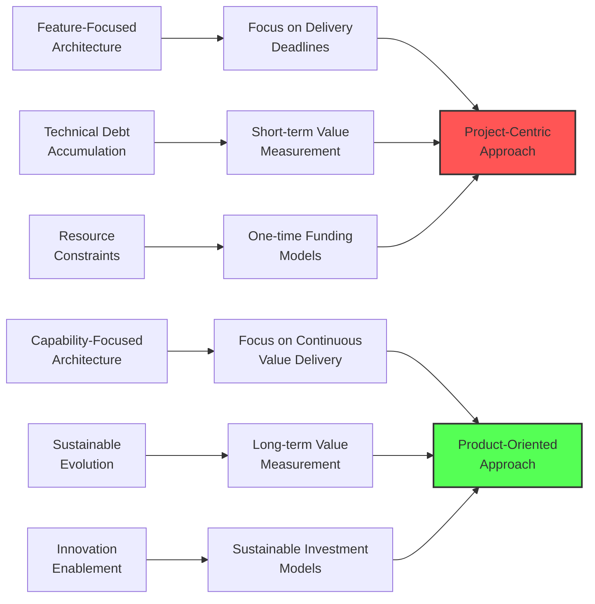

Moving to product-based delivery is a significant cultural change, especially for AI initiatives. Traditional project-focused architectures struggle with AI's continuous evolution and experimentation needs. Product-oriented architecture treats AI capabilities as living assets that continuously evolve, are measured by business outcomes, and align with enterprise strategy, just like successful city planning balances immediate needs with long-term sustainability.

## Transforming from Service Provider to Strategic Leader

The shift from order-taker to strategic partner requires fundamental changes in how architecture teams operate, measure success, and engage with the business:

### The Architecture Influence Pyramid

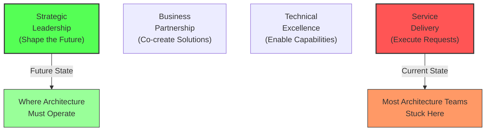

### Practical Transformation Strategies

1. **Create Architecture-Led Innovation Initiatives**
   - Launch "Art of the Possible" sessions showcasing emerging technologies
   - Build proof-of-concepts before business asks
   - Demonstrate ROI through pilot programs

2. **Establish Architecture Business Partners**
   - Embed architects within business units
   - Require architects to own business KPIs
   - Rotate architects through business roles

3. **Shift from Cost to Investment Mindset**
   - Track revenue enabled by architectural decisions
   - Measure time-to-market improvements
   - Quantify risk reduction in financial terms

4. **Build Strategic Foresight Capabilities**
   - Create technology radar for executive leadership
   - Develop competitive intelligence on architectural trends
   - Provide quarterly briefings on disruption risks and opportunities

## Building the "Strategic AI Design Pathway"

Building on the concept of a "golden path" for software development, we can establish a "strategic AI design pathway" that integrates architecture at every stage of the AI transformation lifecycle, shifting from the architect as "master builder" to "urban planner."

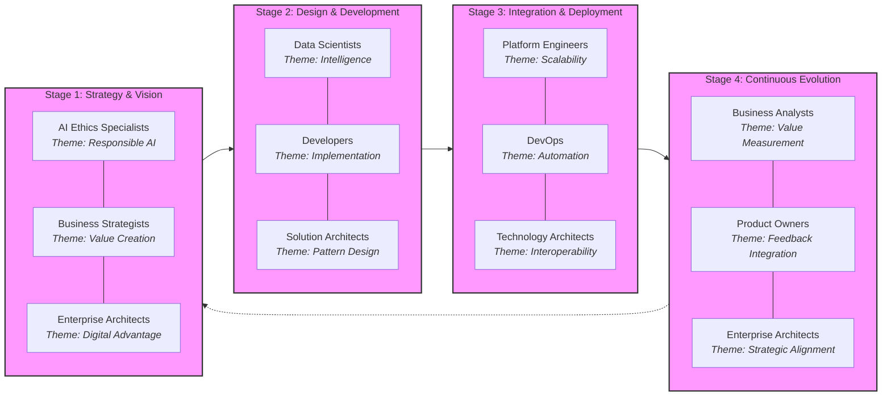

| Stage | Who | Theme | How | Goal |
|-------|-----|-------|-----|------|
| **Strategy & Vision** | Enterprise architects | Digital Advantage | Establish cross-functional steering committees with executive sponsorship | Define clear value metrics for AI initiatives that balance innovation with risk |
| | Business strategists | Value Creation | Map AI initiatives to strategic business priorities with ROI expectations | Create business-led prioritization framework for AI deployment |
| | AI ethics specialists | Responsible AI | Develop ethical AI principles and governance guardrails | Ensure responsible development and deployment aligned with organizational values |
| **Design & Development** | Solution architects | Pattern Design | Create reusable architectural patterns and reference implementations | Accelerate development while maintaining architectural integrity |
| | Developers | Implementation | Employ agile development with architecture-as-code practices | Deliver high-quality, well-architected AI components rapidly |
| | Data scientists | Intelligence | Develop model evaluation frameworks and quality standards | Ensure AI models meet performance and ethical standards |
| **Integration & Deployment** | Technology architects | Interoperability | Define interface standards and integration patterns | Create a cohesive ecosystem that enables seamless AI integration |
| | DevOps | Automation | Implement CI/CD pipelines with built-in architectural validation | Automate deployment with continuous architecture assessment |
| | Platform engineers | Scalability | Design flexible infrastructure that grows with usage | Support seamless scaling without architectural compromise |
| **Continuous Evolution** | Enterprise architects | Strategic Alignment | Regular architecture reviews tied to business outcomes | Maintain alignment between architecture and evolving business needs |
| | Product owners | Feedback Integration | Operate feedback loops that capture real-world usage patterns | Drive continuous improvement based on actual usage data |
| | Business analysts | Value Measurement | Track and report on value realization against projections | Ensure ongoing value delivery and course correction |

## Revolutionary Architectural Success Metrics

Traditional IT metrics fail to capture the true value of architectural enablement in the AI era. We need a radical shift toward measures that reflect architecture's role as a strategic business accelerator, not just a technical governance function.

### Next-Generation Metrics Framework

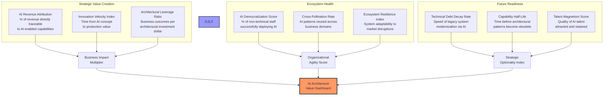

### Breakthrough Metrics Categories

#### 1. **Strategic Value Creation Metrics**

| Metric | Description | Target | Why It's Novel |
|--------|-------------|--------|----------------|
| **AI Revenue Attribution** | Percentage of total revenue directly traceable to AI-enabled capabilities through architectural patterns | >15% by Year 2 | Moves beyond cost savings to revenue generation |
| **Innovation Velocity Index** | Composite score measuring speed from AI concept to production value (includes ideation, POC, scaling phases) | <90 days | Captures end-to-end innovation speed, not just deployment |
| **Architectural Leverage Ratio** | Business outcomes achieved per dollar invested in architectural capabilities | 10:1 ROI | Quantifies architecture as investment multiplier |
| **Value Concentration Risk** | Percentage of AI value dependent on single architectural components | <20% | Ensures resilient value distribution |

#### 2. **Ecosystem Health Metrics**

| Metric | Description | Target | Why It's Novel |
|--------|-------------|--------|----------------|
| **AI Democratization Score** | Percentage of non-technical staff successfully deploying AI solutions using architectural guardrails | >40% | Measures true organizational transformation |
| **Cross-Pollination Rate** | Number of AI patterns successfully reused across different business domains | >70% reuse | Tracks knowledge multiplication effect |
| **Architectural Antibody Response** | Time to detect and neutralize architectural anti-patterns in AI implementations | <48 hours | Proactive health monitoring vs reactive fixes |
| **Ecosystem Resilience Index** | System's ability to maintain performance during market disruptions or technology shifts | >85% stability | Future-proofs against uncertainty |

#### 3. **Future Readiness Metrics**

| Metric | Description | Target | Why It's Novel |
|--------|-------------|--------|----------------|
| **Technical Debt Decay Rate** | Speed at which legacy systems are modernized through AI-assisted refactoring | -25% annually | AI as transformation accelerator |
| **Capability Half-Life** | Average time before architectural patterns require significant updates | >18 months | Measures sustainable innovation |
| **Talent Magnetism Score** | Quality and retention rate of AI architects and engineers | Top 20% industry | Architecture as talent attractor |
| **Option Value Creation** | Number of future strategic options enabled by current architectural decisions | >5 per initiative | Quantifies strategic flexibility |

## Implementing Metrics with Your Existing Tool Stack

For organizations using Jira, GitHub, ServiceNow, and LeanIX, here's how to practically measure these revolutionary metrics:

### Pattern Deviation Score Implementation

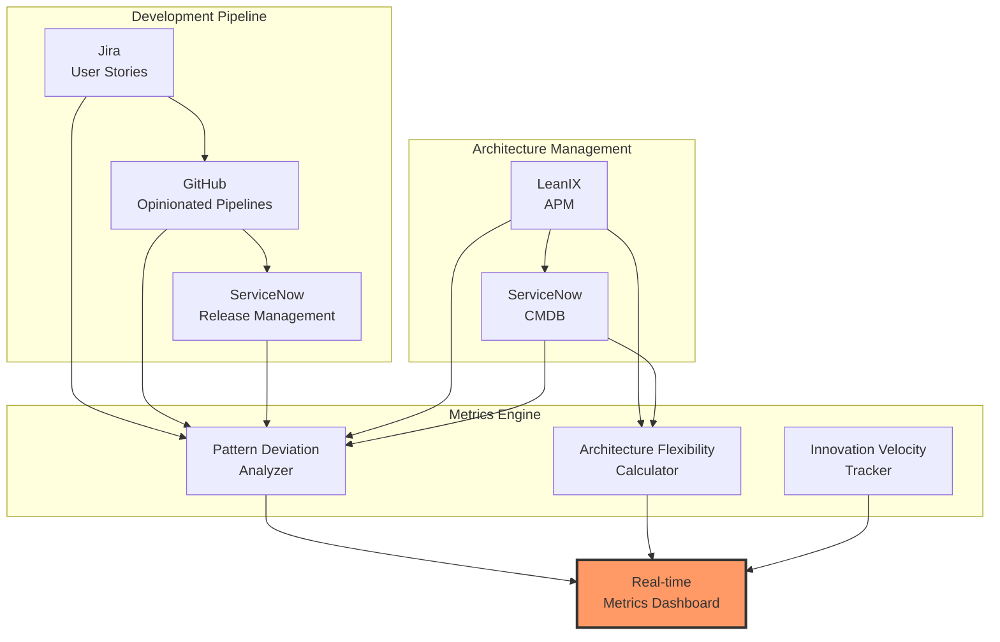

**Key Implementation Steps:**

1. **GitHub Actions Integration**: Automatically analyze code against LeanIX-stored patterns on every push
2. **Jira Custom Fields**: Link user stories to architectural patterns with compliance scoring
3. **ServiceNow Business Rules**: Create release gates based on pattern deviation thresholds
4. **LeanIX GraphQL Queries**: Extract approved patterns and reference architectures for comparison

### Architecture Flexibility Score Components

| Component | Data Source | Measurement Method |
|-----------|-------------|-------------------|
| **Modularity Index** | LeanIX + GitHub | Independent deployable units / total components |
| **Coupling Score** | GitHub dependency graphs | 1 - (interdependencies / possible connections) |
| **API Versioning** | GitHub + ServiceNow CMDB | % APIs with proper versioning |
| **Config Externalization** | GitHub configs | % external config vs hardcoded |
| **Feature Toggle Coverage** | Jira + GitHub | % features behind toggles |

### Real-Time Architectural Intelligence Dashboard

| Dashboard Component | Key Indicators | Threshold Alerts | Strategic Actions |
|-------------------|----------------|------------------|-------------------|
| **Value Pulse** | AI initiative success rate, Time-to-value acceleration, Revenue impact tracking | <70% success rate, >120 days to value, <5% revenue impact | Pattern optimization, Process streamlining, Business alignment |
| **Innovation Radar** | Emerging pattern adoption, Experimentation velocity, Cross-team collaboration | <3 new patterns/quarter, <10 experiments/month, <50% collaboration score | Innovation sprints, Hackathon events, Knowledge sharing |
| **Risk Monitor** | Architectural debt ratio, Compliance automation coverage, Security vulnerability trends | >30% debt ratio, <80% automation, Rising vulnerabilities | Debt reduction sprints, Automation expansion, Security hardening |
| **Talent Tracker** | Skill coverage heatmap, Architect productivity index, Knowledge retention rate | <70% skill coverage, Declining productivity, <80% retention | Targeted training, Tool enhancement, Retention programs |

## Moving from Build-and-Maintain to Architect-Strategize-Innovate

Enterprise IT has consistently been looking at Lean IT with higher outsourcing to lower-cost providers, viewing architecture as overhead rather than strategic advantage. This new AI revolution requires a fundamental shift in thinking, from building and maintaining to architecture, strategy, and innovation.

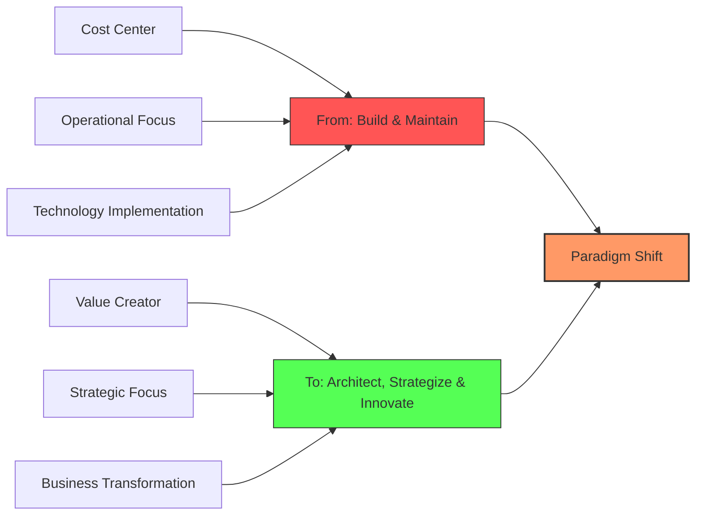

The real value of architecture in the AI era isn't documentation but orchestrating the complex interplay between business capabilities, technical possibilities, and organizational readiness. It's about:

| Dimension | Traditional Function | Future Focus |
|-----------|----------------------|--------------|
| **Strategic Thinking** | IT-Business Alignment | AI Capability-Business Value Creation |
| **Talent Transformation** | Technical Skills Development | AI-Ready Workforce Preparation |
| **Innovation Enablement** | Process Control | Acceleration Frameworks |
| **Ethical Governance** | Compliance | Transparent, Fair, Explainable AI |
| **Business Learning** | Requirements Gathering | Cross-Domain Knowledge Integration |

## The Atlas Model: Building Architecture Capabilities for AI Transformation

The IASA Global Atlas program represents a promising approach to this challenge, focusing on improving education at both university and enterprise levels. Just as geography students use atlases to understand physical landscapes, organizations need architectural "maps" to navigate the complex terrain of AI transformation.

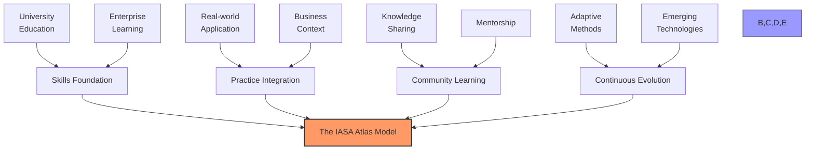

The Atlas approach emphasizes four key dimensions:

| Dimension | University Focus | Enterprise Application |
|-----------|------------------|------------------------|
| **Skills Foundation** | Core architectural competencies curriculum | Structured education programs |
| **Practice Integration** | Project-based learning | Real business context applications |
| **Community Learning** | Academic-practitioner exchange | Cross-functional knowledge sharing |
| **Continuous Evolution** | Research-driven updates | Adapting to business requirements |

## Closing the Gap: Education, Skills, and Talent Development

As Deloitte's Tech Trends 2025 highlights, engineering and talent are critical pillars in AI transformation. Organizations need a clear strategy for developing architectural capabilities before AI becomes ubiquitous.

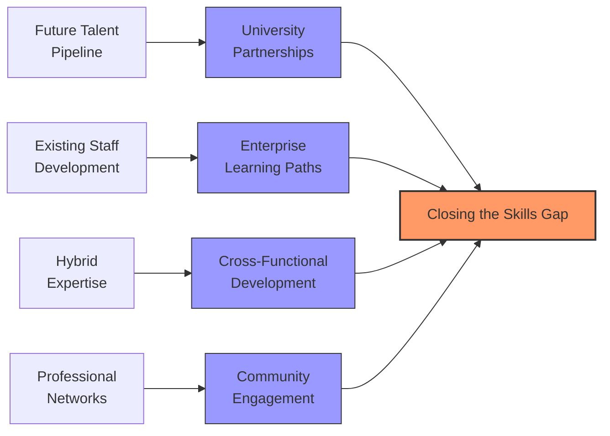

| Approach | Current State | Future Vision |
|----------|---------------|---------------|
| **University Partnerships** | Traditional IT curriculum | Integrated AI architecture programs |
| **Enterprise Learning Paths** | Technical certification focus | Strategic capability development |
| **Cross-Functional Development** | Siloed expertise | Business-technology hybrid roles |
| **Community Engagement** | Limited participation | Active contribution to IASA and similar bodies |

## Playbook: Transforming Architecture for AI Success

The journey from fixed frameworks to strategic enablement requires a structured approach that balances immediate needs with long-term vision. This playbook provides actionable steps to help CIOs and technology leaders transform their architectural approach to maximize AI's value potential.

### Phase 1: Foundation Assessment (1-2 months)

| Action | Description | Key Deliverable |
|--------|-------------|-----------------|
| **Conduct Architectural Maturity Evaluation** | Assess current architectural practices against AI-readiness criteria including flexibility, scalability, and product orientation | Maturity scorecard with prioritized gaps |
| **Map Business Value Chains to Technical Capabilities** | Identify how current technical assets support critical business capabilities and where AI could enhance performance | Business-technology value map |
| **Inventory Architectural Barriers to AI Adoption** | Catalog technical debt, inflexible frameworks, and process bottlenecks that limit AI experimentation and deployment | Barrier prioritization matrix |
| **Define Architectural Vision and Principles** | Establish guiding principles for architectural transformation that balance governance with innovation | Digital architecture charter |

**Success Indicators**: Comprehensive current-state assessment, clear vision articulated to stakeholders, executive sponsorship secured

### Phase 2: Strategic Alignment (2-3 months)

| Action | Description | Key Deliverable |
|--------|-------------|-----------------|
| **Create Product-Oriented Capability Model** | Reframe technical capabilities as products with measurable business outcomes and dedicated teams | AI capability product catalog |
| **Establish Cross-Functional Architecture Council** | Form a governance body with representation from business, technology, data science and ethics teams | Council charter with decision rights |
| **Develop AI Architecture Pattern Library** | Create reusable architectural patterns for common AI use cases and implementation scenarios | Pattern library with implementation guides |
| **Align Funding Models to Product Thinking** | Work with finance to redesign funding models that support continuous product evolution rather than fixed projects | Product funding framework |

**Success Indicators**: Product teams established, architectural patterns in use, initial funding realignment completed

### Phase 3: Capability Development (3-6 months)

| Action | Description | Key Deliverable |
|--------|-------------|-----------------|
| **Implement Architecture-as-Code Practices** | Automate architectural guardrails and patterns through code templates and validation pipelines | Self-service architecture repository |
| **Launch Architectural Skills Acceleration Program** | Develop training and mentoring programs to build AI-specific architectural skills | Skills development roadmap |
| **Create AI Experimentation Environment** | Establish a sandbox environment for low-risk AI experimentation with architectural guardrails | AI experimental platform |
| **Deploy Architectural Success Metrics Dashboard** | Implement metrics tracking to measure architectural value contribution to AI initiatives | Real-time metrics dashboard |

**Success Indicators**: Architecture automation established, skills development underway, metrics dashboard operational

### Phase 4: Scale and Optimize (Ongoing)

| Action | Description | Key Deliverable |
|--------|-------------|-----------------|
| **Establish Continuous Architecture Review Process** | Implement regular review cycle to assess effectiveness of architectural guidance and evolve as needed | Feedback and adaptation framework |
| **Build External Partnership Network** | Connect with academia, vendors, and industry groups to stay current on architectural innovations | Strategic partnership map |
| **Implement AI Governance Framework** | Establish guardrails for responsible AI use while enabling innovation | Governance documentation |
| **Drive Architectural Community of Practice** | Foster knowledge sharing across the organization through communities of practice | Community engagement plan |

**Success Indicators**: Continuous improvement mechanisms established, demonstrable business value from architectural enablement

### Getting Started: First 30 Days

1. **Conduct an honest assessment** of how your architecture function currently operates, as a control-focused governance body or a value-enabling strategic function?

2. **Identify 2-3 AI initiatives** where architectural guidance could immediately add value without adding bureaucracy.

3. **Engage with business leaders** to understand their perception of architecture and align on expectations for AI transformation support.

4. **Map technical debt and barriers** that would prevent rapid experimentation with AI capabilities.

5. **Develop a compelling vision** for how architectural transformation will enable rather than constrain AI-powered business transformation.

6. **Challenge the order-taking mentality** by proposing one unsolicited strategic initiative that demonstrates architectural thought leadership.

7. **Establish metrics** that measure business impact, not just technical delivery, to shift perception from cost center to value creator.

Remember: Successful architectural transformation isn't about creating perfect models; it's about enabling business value through thoughtful guardrails that accelerate rather than impede innovation.

## CIO Imperative: Leading the Architectural Revolution

For CIOs navigating the AI transformation journey, adopting a new architectural mindset is not optional—it's essential for sustainable competitive advantage. As AI capabilities evolve at breakneck speed, traditional architecture approaches will increasingly become barriers rather than enablers.

To lead this transformation, CIOs must:

1. **Reposition architecture as a strategic business function** rather than a technical control point, demonstrating its value through business outcomes rather than technical deliverables.

2. **Champion product thinking across the technology organization**, moving funding and resourcing models away from project-based approaches to continuous value delivery.

3. **Invest in architectural talent development** that bridges technical expertise with business acumen, either through upskilling existing staff or strategic hiring.

4. **Establish new architectural performance metrics** that measure business value enablement rather than compliance with standards.

5. **Partner with business leaders** to ensure architectural guidance enables rather than constrains their AI-powered innovation ambitions.

The organizations that succeed in the AI era will be those where architecture evolves from a constraining factor to a strategic enabler—from fixed frameworks to flexible foundations that support continuous innovation. By embracing architecture's role as the connective tissue between business ambition and technical possibility, CIOs can position their organizations to harness AI's transformative potential while managing its inherent risks.

The future of competitive advantage lies not in building the most sophisticated AI systems but in creating the most effective architectural ecosystems to harness their power. CIOs who lead this transformation will be the ones who truly unlock AI's business value.
