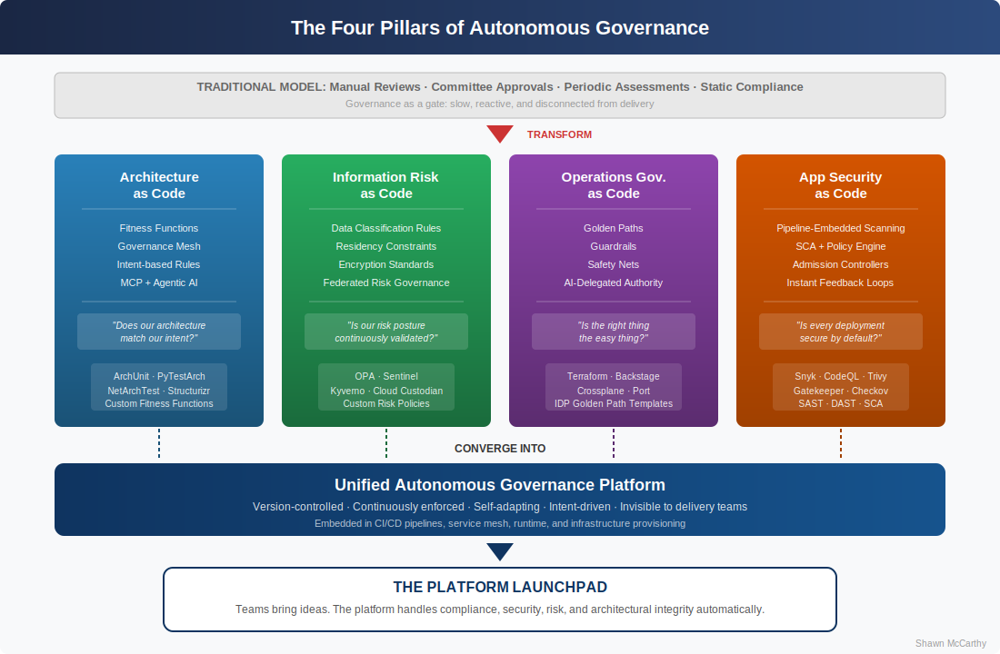
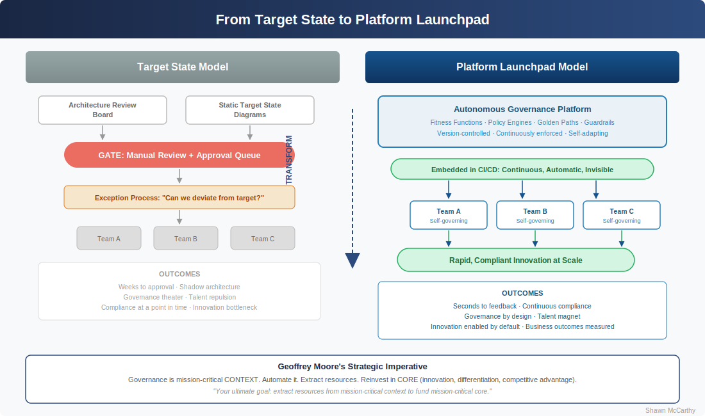
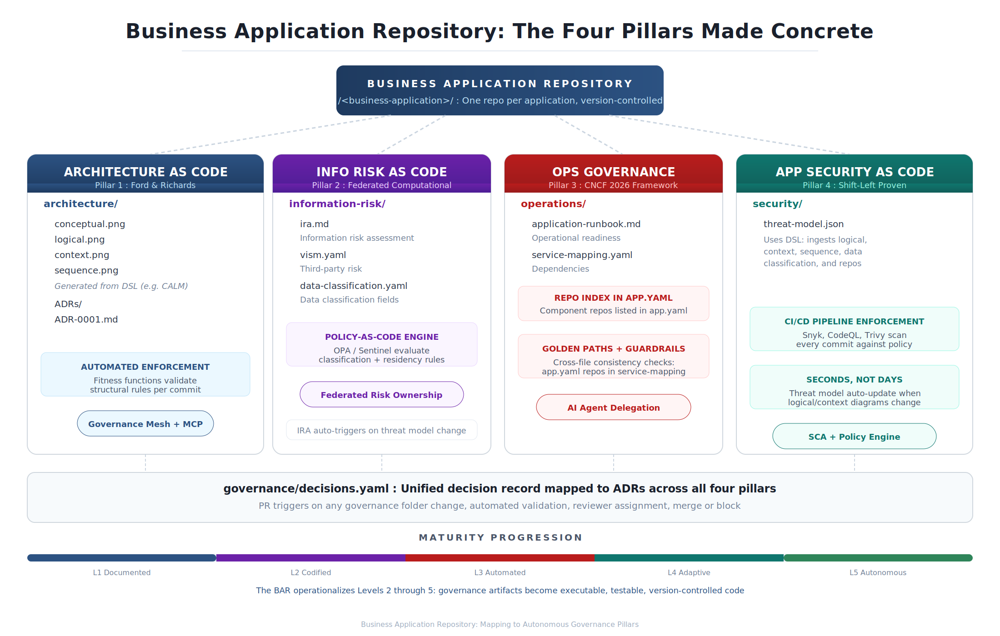
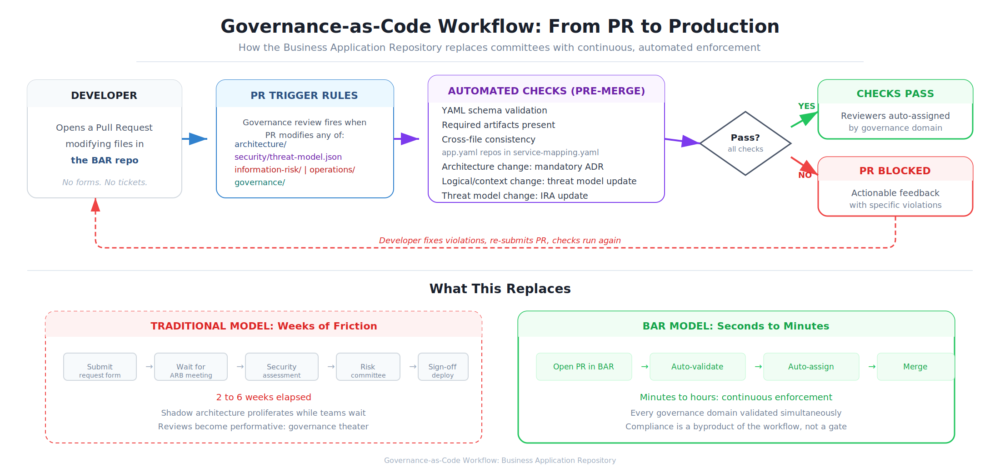

# From gatekeepers to launchpads: How autonomous governance transforms enterprise architecture

## The enterprise that governs itself wins the race. Here's how to make architecture, security, risk, and operations governance invisible, and unstoppable.

Traditional governance models are choking enterprise velocity. Architecture review boards that meet biweekly, security assessments that take weeks, risk sign-offs that bottleneck deployments: these are the artifacts of an era when technology change was slow enough to govern by committee. That era is over. As enterprises race to operationalize AI, embed intelligence into every product, and compress delivery cycles from quarters to days, governance must evolve from something that happens *to* teams to something that happens *for* them.

The shift is fundamental: from governance as a gate to governance as a platform. From architects who say no to architects who make yes effortless. From compliance as a checkpoint to compliance as invisible infrastructure. This is autonomous governance, and it represents the most significant evolution in enterprise architecture practice since the move from waterfall to agile.

The opportunity is not just faster delivery. It is the creation of technology platforms that become genuine launchpads for enterprise innovation, platforms where teams bring ideas and the platform handles compliance, security, risk, and architectural integrity automatically, behind the scenes.

**Key takeaways:**

* **Governance must become code, not committees**: Encoding architecture, security, risk, and operations governance as executable rules enables continuous, automated enforcement at the speed of delivery.
* **The "as code" convergence is the enabling force**: Architecture as code, information risk as code, operations governance as code, and application security as code are converging into a unified governance platform that operates autonomously.
* **Target state architecture is insufficient**: Static blueprints and disposition-based models cannot keep pace with modern enterprises. Platforms that embed governance become launchpads that generate velocity rather than constrain it.
* **Core vs. context strategy demands automation**: Governance is mission-critical context, essential but not differentiating. Automating it frees architects and engineers to focus on core activities that create competitive advantage.
* **The architect's role transforms, not diminishes**: Autonomous governance elevates the architect from gatekeeper to platform designer, the person who designs the system that makes the right thing easy and the wrong thing hard.

> "As the complexity of software systems grows, the benefits of dynamic, enforceable architecture become indispensable." - Neal Ford and Mark Richards, [Architecture as Code](https://www.oreilly.com/library/view/architecture-as-code/9798341640368/)

## I. The governance paradox: Why more control produces less safety

Every enterprise architect knows the paradox intimately. The more governance you impose through manual processes, the more teams find ways to route around it. Architecture review boards create approval queues that incentivize teams to avoid review entirely. Security assessments that take three weeks encourage teams to under-report changes. Risk sign-offs that require multiple committee approvals motivate teams to batch changes into large, risky releases rather than small, safe ones.

This is not a people problem. It is a systems design problem. When governance creates friction disproportionate to the value it provides, rational actors will minimize their exposure to it. The result is the opposite of what governance intends: less visibility, less compliance, and more risk, not less.

### The cost of authoritarian governance

The symptoms are predictable and pervasive:

* **Deployment queues**: Teams wait days or weeks for architecture and security approvals, destroying the velocity that [product-oriented delivery](https://www.cio.com/article/3802289/from-project-to-product-architecting-the-future-of-enterprise-technology.html) is designed to create.
* **Shadow architecture**: When the "official" path is too slow, teams build unofficial solutions that bypass governance entirely, creating the exact risks governance was designed to prevent.
* **Governance theater**: Reviews become performative. Architects rubber-stamp designs they don't have time to evaluate deeply. Security checklists get completed without substantive analysis. The governance function exists on paper but delivers no real assurance.
* **Talent repulsion**: Top engineering talent gravitates toward organizations where they can ship fast and own outcomes. Bureaucratic governance is a talent repellent in a market where [developer experience](https://www.infoworld.com/article/2336541/how-to-build-a-developer-first-company.html) is a competitive differentiator.

The answer is not less governance. The answer is governance that operates differently: embedded, automated, continuous, and invisible to the teams it serves. Governance that enables rather than commands.

## II. The "as code" convergence: Four pillars of autonomous governance

The technology industry has spent a decade proving that codifying operational concerns (infrastructure as code, configuration as code, pipelines as code) produces faster, safer, more reliable outcomes than manual processes. Now that same principle is converging across all four governance domains simultaneously, creating the conditions for truly autonomous governance.



### Pillar 1: Architecture as code

Neal Ford and Mark Richards are advancing the most significant theoretical contribution here through their forthcoming book [*Architecture as Code*](https://www.oreilly.com/library/view/architecture-as-code/9798341640368/) and their concept of [architectural fitness functions](https://www.oreilly.com/radar/how-agentic-ai-empowers-architecture-governance/), which provide objective integrity checks for architectural characteristics. Think of fitness functions as unit tests for architecture: automated, repeatable, and executable in pipelines rather than conference rooms.

The breakthrough is the concept of a **governance mesh**, an aspect-oriented architecture that unifies governance constraints across multiple intersection points. Rather than a centralized review board evaluating each solution against static standards, the governance mesh embeds architectural rules into the delivery fabric itself. Tools like [ArchUnit](https://www.archunit.org/) for Java, [PyTestArch](https://pypi.org/project/PyTestArch/) for Python, and [NetArchTest](https://github.com/BenMorris/NetArchTest) for .NET already enable teams to define and enforce structural architecture rules as executable tests.

Where this becomes transformative for enterprise architects is Ford and Richards' integration of [agentic AI and the Model Context Protocol (MCP)](https://www.oreilly.com/radar/how-agentic-ai-empowers-architecture-governance/). Enterprise architects can now state **governance intent** (the *what* and *why* of an architectural constraint) without specifying implementation details. The AI agent interprets intent, adapts to the specific project context, and enforces governance automatically. This solves the brittleness problem that has historically prevented enterprise-wide fitness functions: rules that were too specific broke when applied across diverse technology stacks, and rules that were too general provided no meaningful governance.

**What this looks like in practice**: An enterprise architect defines the intent "all services must validate data integrity across domain boundaries." Rather than writing specific implementation rules for every platform, the governance mesh (powered by MCP and agentic AI) interprets this intent for each project's technology context and applies the appropriate fitness function automatically.

### Pillar 2: Information risk as code

Information risk governance in most enterprises still operates on a cycle of periodic assessments, risk registers maintained in spreadsheets, and committee reviews that evaluate risk posture at a point in time. This model was adequate when technology changed on annual release cycles. It is dangerously inadequate when teams deploy multiple times per day.

Information risk as code extends the [policy-as-code](https://platformengineering.org/blog/policy-as-code) paradigm into the risk domain. Data classification requirements, residency constraints, encryption standards, access control policies, and privacy regulations are encoded as machine-readable rules that are evaluated automatically: at deployment time, at runtime, and continuously.

The architecture pattern that enables this is **federated computational governance**, borrowed from [data mesh](https://labs.sogeti.com/emerging-trends-policy-as-code-for-governance-enforcement/) theory. Individual domain teams own their risk posture, but organization-wide risk policies are consistently applied across all domains without creating dependency on a central risk team. Policy engines like [Open Policy Agent](https://www.openpolicyagent.org/) and [HashiCorp Sentinel](https://www.hashicorp.com/en/blog/policy-as-code-explained) provide the execution framework, while the policy definitions themselves are version-controlled, peer-reviewed, and continuously tested, just like application code.

**What this looks like in practice**: A development team deploys a new service that processes customer financial data. The pipeline automatically evaluates the deployment against information risk policies, checking data classification handling, encryption at rest and in transit, access control configurations, and data residency compliance. Non-compliant deployments are rejected with specific, actionable feedback. No risk committee meeting required.

### Pillar 3: Operations governance as code

The [Cloud Native Computing Foundation's 2026 forecast](https://www.cncf.io/blog/2026/01/23/the-autonomous-enterprise-and-the-four-pillars-of-platform-control-2026-forecast/) provides the most actionable framework for operations governance, defining four distinct control mechanisms that together form a complete autonomous governance system:

|  |  |  |
| --- | --- | --- |
| **Control Mechanism** | **Function** | **Autonomy Level** |
| **Golden paths** | Curated, pre-approved blueprints that make the secure, compliant choice the easiest choice. AI agents compose, validate, and provision compliant infrastructure from high-level intent. | Fully autonomous |
| **Guardrails** | Hard, non-negotiable constraints (the crash barriers) that prevent configurations compromising security or stability. Think blocking public storage buckets or enforcing binary authorization. | Fully autonomous |
| **Safety nets** | Reactive controls that detect and remediate issues that slip past guardrails: anomaly detection, auto-rollback, drift correction. | Semi-autonomous |
| **Manual review** | The remaining human-in-the-loop touchpoints, reserved for genuinely novel or high-risk decisions where automated judgment is insufficient. | Human-driven |

The critical shift here: AI's role evolves from copilot to agent with **delegated authority**. The platform engineer's role shifts from building and operating infrastructure to curating and quality-controlling the AI-powered golden path, ensuring the best practice is always the default practice.

**What this looks like in practice**: A developer inputs "I need a secure, scalable service for my application in AWS US-East." The AI agent composes the infrastructure, validates it against golden path standards and guardrail policies, provisions it in compliance with organizational requirements, and monitors it continuously with safety nets. The developer never interacts with a governance process. They interact with a platform.

### Pillar 4: Application security as code

This is the most mature "as code" domain and provides the proving ground for the other three. [Application security as code](https://www.cncf.io/blog/2025/07/08/why-policy-as-code-is-a-game-changer-for-platform-engineers/) embeds security policy enforcement directly into CI/CD pipelines through tools like [Snyk](https://snyk.io/), [CodeQL](https://codeql.github.com/), and [Trivy](https://trivy.dev/), evaluating every code commit, dependency update, and deployment against organizational security policies automatically.

The pattern that application security as code has proven, and that the other three pillars should emulate, is the compression of feedback loops from days to seconds. When a developer submits a deployment with a critical vulnerability, the admission controller rejects it instantly and returns the specific CVE identifier and severity. Compare this to the traditional workflow: deploy, wait for a security scan, receive a ticket three days later, schedule a rollback. The automated model is not just faster. It is fundamentally safer because it prevents non-compliant code from ever reaching production.

The [Software Composition Analysis (SCA)](https://medium.com/@cdxlabs.abhiram/policy-as-code-and-automated-governance-for-open-source-security-5ac84f048cc4) integration model demonstrates the architecture: SCA tools act as the data source, scanning and inventorying all components, while the policy-as-code engine evaluates the inventory against organizational rules. The tools generate the intelligence; the policies enforce the intent.

**What this looks like in practice**: A team introduces a new open-source library. The pipeline automatically evaluates its license compatibility, known vulnerabilities, and maintenance status against organizational security policy. If the library violates policy, the build fails with a clear explanation and suggested alternatives. If it passes, it's deployed without human intervention. Security governance is continuous, consistent, and invisible.

## III. Why target state architecture is not enough

For decades, [enterprise architecture](https://www.cio.com/article/4020233/from-fixed-frameworks-to-strategic-enablers-architecting-ai-transformation.html) has operated on the premise of defining a target state (a desired future architecture) and managing the portfolio's transition toward it. Disposition-based models refine this by categorizing existing capabilities into tolerate, invest, migrate, or eliminate buckets. Both approaches share a fundamental limitation: they are static representations of a dynamic reality.

### The three failures of static target states

**Target states become obsolete before they are achieved.** The average enterprise architecture target state takes six to twelve months to define and socialize. In an environment where cloud providers release hundreds of new capabilities per quarter and AI is reshaping technology paradigms monthly, a twelve-month-old target state is not a North Star. It is a historical artifact.

**Rigid mandates create perverse outcomes.** Consider an organization that mandates all system integration through REST APIs as its target state. When a SaaS vendor only supports file-based integration, architects face a choice: over-engineer a complex API wrapper to satisfy the mandate, or request an exception that undermines the standard. Neither outcome serves the organization. The mandate optimizes for architectural purity at the expense of pragmatic delivery.

**Disposition is backward-looking.** Categorizing the existing portfolio tells you what you have and what to do with it. It does not generate new possibilities. It does not create velocity. It does not enable teams to innovate within guardrails. Disposition-based architecture is fundamentally a management tool, not a generative one.

### From target state to platform launchpad

The alternative is not to abandon architectural direction. It is to change the medium through which direction is expressed. Rather than communicating direction through documents, diagrams, and review boards, direction is expressed through **platforms that embed governance as executable capabilities**.



|  |  |
| --- | --- |
| **Target State Model** | **Platform Launchpad Model** |
| Direction expressed as documents and diagrams | Direction expressed as code, golden paths, and fitness functions |
| Compliance verified through manual review | Compliance verified continuously and automatically |
| Innovation requires permission (exception process) | Innovation is enabled by default within guardrails |
| Governance is a separate process from delivery | Governance is embedded in the delivery platform |
| Static, updated periodically | Dynamic, evolves continuously as patterns emerge |
| Measures compliance with the target | Measures business outcomes delivered through the platform |
| Restricts choices to approved options | Generates velocity by making approved options effortless |

The platform launchpad model inverts the traditional relationship between governance and delivery. Instead of governance constraining what teams can build, the platform *generates* new possibilities by providing pre-validated, pre-approved building blocks that teams can compose rapidly. Teams don't ask permission to build. They build on a platform that embeds permission into its structure.

This is the crucial distinction: **a target state tells teams where they should end up. A platform launchpad gives them the vehicle to get there, and beyond.**

## IV. The strategic imperative: Geoffrey Moore's core vs. context

Geoffrey Moore's [core vs. context framework](https://geoffreyamoore.com/topics/) from *Dealing with Darwin* provides the strategic rationale for why autonomous governance is not merely a technical improvement but a competitive necessity.

**Core** is any activity that creates sustainable competitive differentiation, what makes an enterprise unique and creates customer preference. **Context** is everything else: essential activities that must be done well but do not differentiate the enterprise from its competitors.

Moore's strategic prescription is unambiguous: focus scarce resources on core. Systematize, automate, and where possible outsource context. The goal is to extract resources from context activities to fund core activities.

### Governance is mission-critical context

Governance across architecture, security, risk, and operations is the textbook definition of mission-critical context. It is absolutely essential. It carries significant risk if done poorly. But no enterprise has ever won market share because of a superior architecture review board. No customer has ever chosen a financial services provider because its risk governance committee meets more frequently than the competition's.

Moore's specific guidance for [mission-critical context](https://www.linkedin.com/pulse/core-context-future-work-geoffrey-moore) is prescriptive: "Build an analytical approach to these workflows that is as data-driven and transparently public as you can possibly manage. Federate the risk. Treat each workflow as a manufacturing line. Invest in systems for quality control, visibility and early detection, iterative improvement, anything that can reduce errors and reduce human involvement. Your ultimate goal: extract resources from mission-critical context to fund mission-critical core."

This is a direct strategic mandate for autonomous governance. Every hour an architect spends in a review board meeting evaluating routine deployments is an hour not spent designing the platforms and capabilities that differentiate the enterprise. Every week a security professional spends conducting manual assessments is a week not spent on threat modeling for genuinely novel AI capabilities. Every month a risk team spends processing routine sign-offs is a month not spent on emerging risk categories that require genuine human judgment.

### The fractal insight

Moore observes that core and context are [fractal](https://www.inc.com/tech-blog/interviewing-geoffrey-moore-core-versus-context.html): "There is always a little bit of core in every bit of context, and there is always a little bit of context in every bit of core." This insight is crucial for autonomous governance because it prevents the false binary of "automate everything" versus "keep humans in every loop."

Within governance itself, there is both core and context:

* **Core governance decisions** require human expertise, judgment, and deliberation. These include genuinely novel architectural choices, complex risk trade-offs involving competing business priorities, and strategic technology bets with long-term implications. These should remain high-touch and architect-led.
* **Context governance decisions** should be fully automated. Standard compliance checks, pattern conformance validation, security baseline verification, naming conventions, and resource configuration policies all follow known rules and produce deterministic outcomes. Humans add no value by evaluating them manually.

Autonomous governance does not eliminate the architect. It eliminates the 80% of governance activity that is context (routine, rule-based, and deterministic) so that architects can invest their full capacity in the 20% that is core (strategic, judgment-intensive, and differentiating).

## V. The organizational design: Team Topologies for autonomous governance

Autonomous governance requires more than technology. It requires an organizational design that distributes governance responsibility across the right team structures. Matthew Skelton and Manuel Pais's [Team Topologies](https://teamtopologies.com/) framework provides the organizing model.

### Platform teams deliver governance as a service

[Platform teams](https://learn.microsoft.com/en-us/platform-engineering/team) build and maintain the governance platform: the golden paths, fitness functions, policy engines, and automated enforcement mechanisms that stream-aligned teams consume. The platform team's product is governance capability itself, delivered as self-service infrastructure.

This is a fundamental identity shift for architecture and governance functions. Rather than operating as review boards that evaluate other teams' work, they operate as product teams that build tools and platforms enabling other teams to govern themselves. The governance platform is their product. Stream-aligned teams are their customers. Developer experience is their quality metric.

### Enabling teams build governance capability

[Enabling teams](https://martinfowler.com/bliki/TeamTopologies.html) comprising security specialists, risk experts, and senior architects partner temporarily with stream-aligned teams to build governance maturity. They coach, they pair, they transfer knowledge. And critically, they disengage once the stream-aligned team is self-sufficient. The enabling team's success metric is not how many reviews they conduct but how quickly they make themselves unnecessary.

### Stream-aligned teams own their governance posture

In the autonomous governance model, stream-aligned teams own their compliance. They consume governance services from the platform, receive coaching from enabling teams, and operate within guardrails. But ownership sits with them. This is not governance by abdication. It is governance by design. The platform makes the right thing easy and the wrong thing hard. Teams make decisions within a structure that has already encoded the enterprise's risk appetite and architectural intent.

### Interaction modes that enable, not constrain

|  |  |  |
| --- | --- | --- |
| **Interaction Mode** | **Governance Application** | **When to Use** |
| **X-as-a-Service** | Platform teams deliver governance tools (linting, policy checks, security scanning, fitness functions) as self-service capabilities | Mature, well-understood governance domains with established policies |
| **Facilitating** | Enabling teams coach stream-aligned teams on emerging governance practices, then disengage | New governance domains, teams adopting new technology stacks, post-incident capability building |
| **Collaboration** | Cross-team co-creation for genuinely novel governance challenges | Novel risk categories (e.g., AI model governance), first-of-kind architectural patterns |

## VI. The autonomous governance maturity model

The transition from authoritarian to autonomous governance does not happen in a single leap. It requires a deliberate progression through increasing levels of automation, trust, and organizational maturity.

### Level 1: Documented governance
Governance exists as policies in documents, wikis, and slide decks. Enforcement happens through manual review: architecture boards, security assessments, risk committees. Compliance is measured by reviews completed, not outcomes achieved. This is where most large enterprises operate today.

### Level 2: Codified governance
Key policies are translated into machine-readable rules. Some automated checks run in CI/CD pipelines. Manual review remains the primary enforcement mechanism, but automated checks catch the most common violations before review, reducing noise and improving focus. Architecture and security teams begin thinking of their policies as code to be tested and maintained.

### Level 3: Automated governance
Comprehensive policy-as-code across all four domains: architecture, security, risk, and operations. Governance checks are fully integrated into deployment pipelines. Compliance is continuous rather than periodic. Human review is reserved for exceptions, novel situations, and high-risk decisions. The governance platform becomes a product with its own backlog, roadmap, and customer satisfaction metrics.

### Level 4: Adaptive governance
AI-driven policy generation and optimization. Governance rules evolve based on observed outcomes: policies that generate excessive false positives are refined, new patterns that emerge across teams are codified into golden paths, and risk thresholds adapt to the enterprise's demonstrated capabilities. Self-healing mechanisms automatically remediate policy violations for known resolution patterns.

### Level 5: Autonomous governance
Full intent-based governance. Architects express strategic goals and constraints; the governance platform interprets, enforces, and adapts automatically. Compliance posture is continuous across all dimensions. Governance is invisible infrastructure, and teams experience it as "things just work." Human involvement is limited to genuinely strategic governance decisions that require judgment about competing priorities, novel risk categories, and emerging technology paradigms.

### The Business Application Repository: Governance made tangible

The maturity levels described above may seem abstract. Codified governance, automated enforcement, adaptive policy — these concepts are compelling in theory, but Chief Architects need to see what they look like at the level of a single business application. The Business Application Repository (BAR) provides that answer: a lightweight, version-controlled GitHub repository created for every business application that serves as the connective tissue between architecture decisions, threat models, risk assessments, and operational readiness.

The BAR is not a code repository. It is a governance artifact — a single source of truth that ties together every domain an enterprise must govern. Each folder in its structure maps directly to one of the four pillars of autonomous governance described in Section II, making the abstract concrete and the theoretical executable.



#### Structure: One repository, four pillars

The BAR's directory structure is deliberately minimal. Every artifact it contains exists because it serves a governance purpose, and every governance purpose is represented by an artifact. There is no documentation for documentation's sake. The structure is the strategy.

```
/<business-application>/
|
├── app.yaml                          # Business application metadata, criticality, lifecycle
|
├── architecture/                     # PILLAR 1: Architecture as Code
│   ├── conceptual.png                #   Generated from DSL (e.g. CALM)
│   ├── logical.png                   #   Generated from DSL (e.g. CALM)
│   ├── context.png                   #   Generated from DSL (e.g. CALM)
│   ├── sequence.png                  #   Generated from DSL (e.g. CALM)
│   └── ADRs/
│       └── ADR-0001.md
|
├── security/                         # PILLAR 4: Application Security as Code
│   └── threat-model.json             #   Uses DSL — logical, context, sequence,
|                                     #   data classification, and repos for larger view
|
├── information-risk/                 # PILLAR 2: Information Risk as Code
│   ├── ira.md                        #   Information risk assessment
│   ├── vism.yaml                     #   Third-party risk
│   └── data-classification.yaml      #   Data classification fields
|
├── operations/                       # PILLAR 3: Operations Governance as Code
│   ├── application-runbook.md        #   Operational readiness
│   └── service-mapping.yaml          #   Dependencies
|
├── repos/
│   └── index.yaml                    #   Individual repos that make up the business application
|
└── governance/
    └── decisions.yaml                #   Governance decisions — mapped to ADRs
```

The `architecture/` folder is Pillar 1 made real. Diagrams are generated from a domain-specific language like CALM rather than hand-drawn in a slide deck, which means they are parseable, diffable, and testable. Architecture Decision Records live alongside the diagrams they justify, creating an auditable trail from intent to implementation. When Ford and Richards describe architectural fitness functions that validate structural rules per commit, this is the structure those fitness functions validate against.

The `information-risk/` folder operationalizes Pillar 2's federated computational governance. The information risk assessment, third-party risk inventory, and data classification definitions are version-controlled YAML and markdown — not spreadsheets emailed between risk analysts and application teams. When a policy-as-code engine like Open Policy Agent evaluates a deployment against data classification and residency rules, these files are its authoritative source. Domain teams own their risk posture, but organization-wide risk policies are consistently applied because the policy engine reads from a standardized, machine-readable structure.

The `operations/` and `repos/` folders ground Pillar 3's golden paths and guardrails. The service mapping defines dependencies, the repo index inventories every component, and the runbook codifies operational readiness. Cross-file consistency checks — does every repository in `repos/index.yaml` appear in `operations/service-mapping.yaml`? — replace the manual coordination that typically falls through the cracks between architecture, development, and operations teams.

The `security/` folder brings Pillar 4's shift-left enforcement to the application level. The threat model is stored as structured JSON that ingests the logical, context, and sequence diagrams along with data classification and repo information to produce a comprehensive, machine-readable threat assessment. When Snyk, CodeQL, or Trivy scan every commit against organizational security policy, the threat model provides the application-specific context that transforms generic scanning into targeted, meaningful governance.

The `governance/` folder is the unifying layer. Every governance decision across all four domains is recorded in `decisions.yaml` and mapped back to the Architecture Decision Records that justify it. This creates a complete, version-controlled decision history that is searchable, auditable, and — critically — diffable. When a regulator asks "why was this architectural choice made?" the answer is not in someone's memory or an archived email thread. It is in a Git commit with a timestamp, an author, and a linked ADR.

#### The workflow: Governance that happens for teams, not to them

Recall the governance paradox from Section I: the more governance you impose through manual processes, the more teams route around it, creating the shadow architecture and governance theater that governance was designed to prevent. The BAR's automated workflow is the direct antidote. Governance does not happen in a conference room two weeks after a team submits a request. It happens in the pull request, seconds after a change is proposed.



A governance review is triggered automatically when a pull request modifies any governance-sensitive path: `architecture/`, `security/threat-model.json`, `information-risk/`, `operations/`, or `governance/`. The trigger is precise — changes to non-governance files do not create unnecessary review overhead, and changes to governance files cannot bypass review.

Before any pull request can merge, the pipeline validates YAML schemas, confirms all required artifacts are present — conceptual diagrams, threat models, risk assessments, runbooks — and checks cross-file consistency. The cascade logic encodes the dependency relationships between governance domains: if a developer modifies the logical or context architecture without updating the corresponding threat model, the PR is blocked automatically with actionable feedback explaining exactly what needs to change. If the threat model changes but the information risk assessment has not been updated to reflect the new threat surface, the PR is blocked again. Each governance domain is aware of the others because the automation encodes the relationships that manual processes routinely fail to enforce.

When all automated checks pass, the appropriate reviewers are assigned by governance domain — not by a project manager consulting a RACI matrix, but by the pipeline itself based on what changed. When checks fail, the developer receives specific, actionable feedback and fixes the violations before resubmitting. No tickets are filed. No meetings are scheduled. No one waits.

This is the promise of Section I delivered at the atomic level: governance as invisible infrastructure. Teams experience it as "things just work." They open a PR, the platform tells them whether they are compliant, and they either merge or fix. The enterprise gets continuous, consistent enforcement across every business application. The result is not less governance — it is more governance, applied more frequently, with greater consistency, at a fraction of the friction.

#### Why the BAR is the atomic unit of autonomous governance

The BAR is the smallest complete expression of the autonomous governance model. A single BAR for a single business application demonstrates that architecture, security, risk, and operations governance can be codified, automated, and continuously enforced without committees, without approval queues, and without the deployment bottlenecks that drive teams toward shadow architecture.

When this pattern is multiplied across the enterprise portfolio — one BAR per business application, each continuously validated, each feeding into enterprise-wide governance dashboards — the Chief Architect's role shifts from reviewing individual applications to curating the governance platform that validates all of them. The BAR does not replace the architect's judgment. It replaces the 80% of governance activity that is context (routine, rule-based, and deterministic) so that the architect can invest full capacity in the 20% that is core (strategic, judgment-intensive, and differentiating).

That shift from gatekeeper of individual decisions to designer of the system that makes thousands of correct decisions automatically is where the action plan begins.

### Business Application Repository
The Business Application Repository (BAR) is a lightweight GitHub repository created for every Business Application. It holds a minimal set of version‑controlled artifacts required to streamline Architecture, Information Risk, Security Architecture, and Operations Governance workflows.

## VII. Getting started: The Chief Architect action plan

### First 30 days: Assess and align

* **Audit your governance friction**: Map every governance touchpoint in your delivery process. Measure elapsed time from "team requests approval" to "team receives approval" for architecture, security, risk, and operations governance. This data will shock your executive team, and create the burning platform for change.
* **Identify your highest-friction governance domain**: Which of the four domains (architecture, security, risk, or operations) creates the most delivery friction? Start there. Quick wins in the highest-friction domain build organizational momentum and credibility.
* **Engage your architecture community**: Reframe the conversation from "we're automating away governance" to "we're elevating architects from reviewers to platform builders." The best architects will embrace this. Those who resist may be identifying with the gatekeeper role rather than the enabling role.

### Phase 1 (Months 1-3): Prove the pattern

* Select one governance domain and one delivery team as a pilot.
* Implement [policy-as-code](https://www.hashicorp.com/en/blog/policy-as-code-explained) for the highest-volume, most routine governance checks in that domain.
* Integrate automated checks into the team's CI/CD pipeline.
* Measure the impact: time saved, violations caught earlier, deployment frequency change.
* Publicize results to build organizational appetite.

### Phase 2 (Months 3-6): Expand and integrate

* Extend policy-as-code across all four governance domains for the pilot team.
* Establish a governance platform team with a product mindset.
* Begin building golden paths: pre-approved architectural templates that encode governance by design.
* Implement [architectural fitness functions](https://www.oreilly.com/radar/how-agentic-ai-empowers-architecture-governance/) for the enterprise's most critical architectural constraints.
* Transition architecture and security review capacity from routine reviews to enabling team activities.

### Phase 3 (Months 6-12): Scale and mature

* Roll out the governance platform to additional delivery teams.
* Introduce AI-driven policy optimization, analyzing false positive rates, exception patterns, and emerging risks.
* Establish intent-based governance pilots where enterprise architects define outcomes and the platform determines enforcement.
* Redefine success metrics from compliance to business outcomes.

## VIII. The architect's new identity

Autonomous governance does not diminish the architect's role. It elevates it. The architect who spends their days reviewing deployment diagrams and signing off on technology selections is performing context work. The architect who designs the governance platform, who encodes architectural intent into fitness functions, who creates the golden paths that make thousands of correct decisions per day without human intervention, who shapes the guardrails within which an entire enterprise innovates: that is core work.

This is the transition from gatekeeper to launchpad designer. From the person who approves the flight plan to the person who builds the runway.

The enterprises that make this transition will not only move faster. They will move *safer*, because governance that runs continuously and automatically provides fundamentally stronger assurance than governance that depends on humans reviewing documents in meetings. They will attract better talent, because engineers want to build, not wait. And they will redirect their most experienced architects toward the strategic work that actually differentiates the enterprise.

The gatekeeper era served its purpose. The launchpad era is what comes next.
