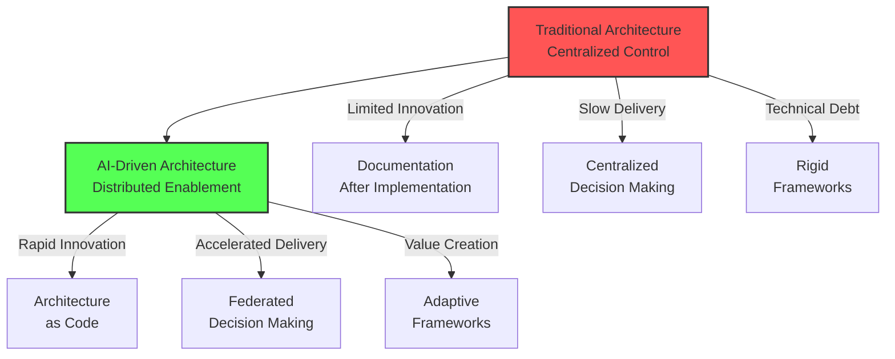
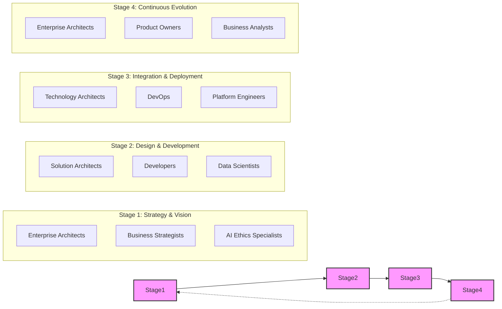
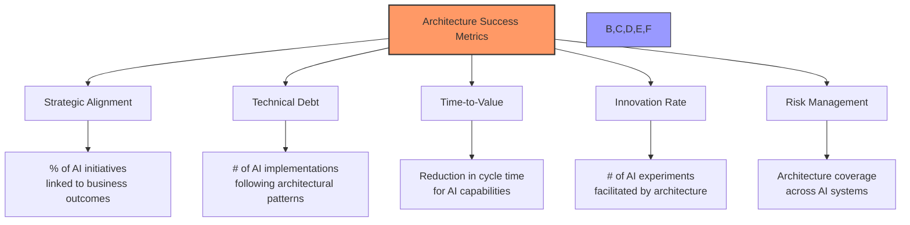
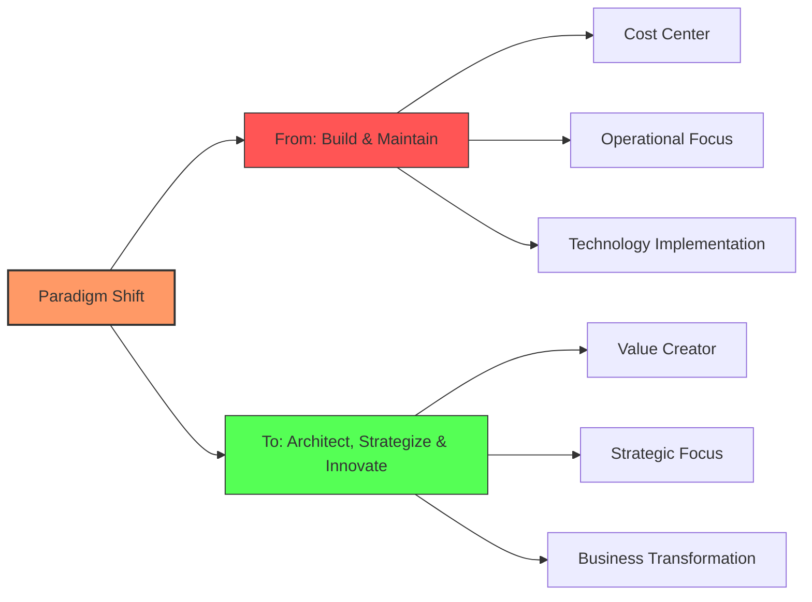
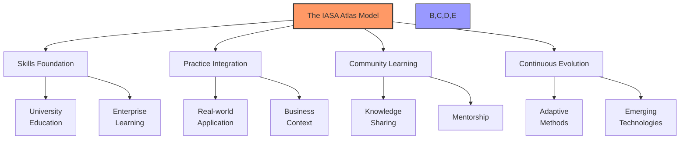
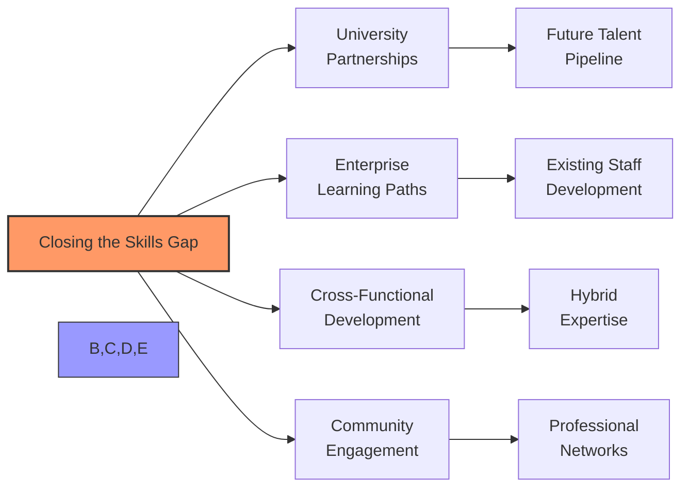

# Architecture is Dead: Long Live Strategic AI Design

Traditional technology architecture approaches have become unsustainable for leaders navigating today's AI-driven landscape. Architecture is no longer a checkbox at the end of development but must be woven throughout the entire AI transformation lifecycle. As organizations demand more tangible evidence of AI value and competitive advantage, enterprises must fundamentally transform how they approach architecture—shifting from reactive implementation to proactive strategic design.

> "As the tech function shifts from leading digital transformation to leading AI transformation, forward-thinking leaders are using this as an opportunity to redefine the future of IT." — Deloitte Tech Trends 2025

The stakes are clear. In today's AI economy, business objectives like "becoming an intelligent enterprise" or "achieving digital advantage while protecting data" require more than technical deployments; they demand enterprise-wide architectural thinking.

## From Passive Documentation to Strategic Enablement

In the film "The Matrix," Agent Smith reveals how the first Matrix was designed as a perfect human world but ultimately failed because humans couldn't accept a program without imperfection or struggle. Similarly, many organizations design perfect architectural blueprints detached from real-world implementation challenges, creating a disconnect between theory and practice. When architecture exists only as pristine documentation, it becomes rejected by the very systems and teams it's meant to guide.

As Agent Smith explains, "The perfect world was a dream... but your primitive cerebrum kept trying to wake up from it." In the same way, organizations that attempt to impose rigid architectural frameworks find their teams constantly "waking up" from and working around these idealized structures. The solution isn't abandoning architecture but recognizing that effective architectural thinking must embrace the messiness of real-world implementation—creating systems that account for human factors, organizational realities, and the natural evolution of technology.

## The Matrix Has You: Breaking Down Centralized Thinking

For decades, enterprises have operated with centralized IT models that served them well during predictable technology evolution. However, the AI revolution requires breaking free from this matrix of thinking. Like Neo discovering the truth about his reality, organizations must recognize that the traditional architecture approach—where all decisions flow from the center—is merely an illusion of control in today's fast-paced AI landscape.

The new paradigm requires a shift from centralized build-and-maintain models to human-in-the-loop, collaborative architecture that enables citizen developers while ensuring governance. This isn't about abandoning control but rather reimagining it as a distributed framework that guides rather than restricts innovation.

## Building the "Secure Golden Pathway" for AI Transformation

Building on the concept of a "golden path" for software development, we can establish a "strategic AI design pathway" that integrates architecture at every stage of the AI transformation lifecycle:

| Stage | Who | How | Goal |
|-------|-----|-----|------|
| **Strategy & Vision** | Enterprise architects, business strategists, AI ethics specialists | Collaborative vision with cross-functional participation | Define AI value, ethics, and governance requirements |
| **Design & Development** | Solution architects, developers, data scientists | Automated architectural patterns in AI pipelines | Detect design issues early in development |
| **Integration & Deployment** | Technology architects, DevOps, platform engineers | Automated architecture gates with clear remediation paths | Validate architectural integrity before production deployment |
| **Continuous Evolution** | Enterprise architects, product owners, business analysts | Shared responsibility model with clear accountabilities | Maintain architectural alignment throughout AI product lifecycle |

## The New Architectural Success Metrics Dashboard

To effectively manage what you measure, a comprehensive architecture metrics dashboard should track key indicators across the AI transformation lifecycle:

| Metric Category | Key Performance Indicator | Target |
|-----------------|---------------------------|--------|
| **Strategic Alignment** | % of AI initiatives linked to business outcomes | >80% |
| **Technical Debt** | % of AI implementations following architectural patterns | >75% |
| **Time-to-Value** | Reduction in cycle time for AI capabilities | -30% |
| **Innovation Rate** | # of AI experiments facilitated by architectural patterns | +50% |
| **Risk Management** | % Architecture coverage across AI systems | >85% |

## Moving from Build-and-Maintain to Architect-Strategize-Innovate

Enterprise IT has consistently been looking at Lean IT with higher outsourcing to lower-cost providers, viewing architecture as overhead rather than strategic advantage. This new AI revolution requires a fundamental shift in thinking—from building and maintaining to architecture, strategy, and innovation.

The real value of architecture in the AI era isn't documentation but orchestrating the complex interplay between business capabilities, technical possibilities, and organizational readiness. It's about:

| Dimension | Traditional Function | Future Focus |
|-----------|----------------------|--------------|
| **Strategic Thinking** | IT-Business Alignment | AI Capability-Business Value Creation |
| **Talent Transformation** | Technical Skills Development | AI-Ready Workforce Preparation |
| **Innovation Enablement** | Process Control | Acceleration Frameworks |
| **Ethical Governance** | Compliance | Transparent, Fair, Explainable AI |
| **Business Learning** | Requirements Gathering | Cross-Domain Knowledge Integration |

## The Atlas Model: Building Architecture Capabilities for AI Transformation

The IASA Global Atlas program represents a promising approach to this challenge, focusing on improving education at both university and enterprise levels. Just as geography students use atlases to understand physical landscapes, organizations need architectural "maps" to navigate the complex terrain of AI transformation.

The Atlas approach emphasizes four key dimensions:

| Dimension | University Focus | Enterprise Application |
|-----------|------------------|------------------------|
| **Skills Foundation** | Core architectural competencies curriculum | Structured education programs |
| **Practice Integration** | Project-based learning | Real business context applications |
| **Community Learning** | Academic-practitioner exchange | Cross-functional knowledge sharing |
| **Continuous Evolution** | Research-driven updates | Adapting to business requirements |

## Closing the Gap: Education, Skills, and Talent Development

As Deloitte's Tech Trends 2025 highlights, engineering and talent are critical pillars in AI transformation. Organizations need a clear strategy for developing architectural capabilities before AI becomes ubiquitous.

| Approach | Current State | Future Vision |
|----------|---------------|---------------|
| **University Partnerships** | Traditional IT curriculum | Integrated AI architecture programs |
| **Enterprise Learning Paths** | Technical certification focus | Strategic capability development |
| **Cross-Functional Development** | Siloed expertise | Business-technology hybrid roles |
| **Community Engagement** | Limited participation | Active contribution to IASA and similar bodies |

## Conclusion: The New Architecture Imperative

The question is no longer whether architecture is necessary but how quickly organizations can transform their architectural approach to enable rather than restrict AI innovation. Those who succeed will be those who recognize that architecture is not dead but evolving—from static documentation to dynamic strategic enablement.

In this new era, the architect emerges as a crucial translator between business ambition and technical possibility, between ethical considerations and innovation speed, between governance requirements and citizen development. The future belongs not to those who build the most sophisticated AI systems but to those who design the most effective architectural frameworks to harness AI's power while mitigating its risks.

The age of passive, documentation-focused architecture is dead. Long live strategic AI design.
