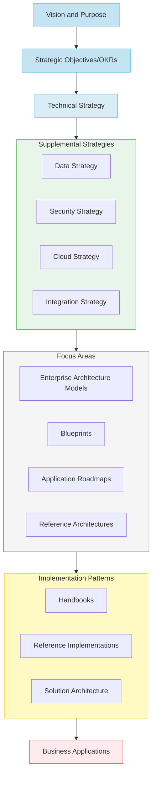

# From Project to Product: Architecting the Future of Enterprise Technology
*A CIO and Chief Architect's Perspective on Transformational Change*

## Abstract

In today's rapidly evolving business landscape, enterprises face a critical inflection point: continue with traditional project-based IT delivery or embrace a product-oriented mindset that aligns technology directly with business outcomes. This article presents a comprehensive framework for this transformation, drawing upon the rich metaphor of urban planning to illustrate how modern enterprises can architect their future.

Just as a city planner must consider multiple elevations – from underground infrastructure to soaring skyscrapers – we explore how enterprise architecture operates across different altitudes of business strategy. Starting at "cruising altitude" with organizational vision, we demonstrate how strategic objectives descend through technical strategy into ground-level implementation, much like an aircraft's carefully planned approach to landing.

Drawing from our experience leading a global financial services firm's transformation, we present a practical guide that explores:

- How the evolution from project to product mirrors the shift from building isolated structures to comprehensive urban planning
- A multi-layered architectural approach that connects business objectives to technical implementation, illustrated through our "City Planning" model of enterprise architecture
- Practical strategies for evolving technical capabilities while maintaining business continuity, similar to how modern cities undergo continuous renewal
- The changing role of enterprise architects from "master builders" to "urban planners," facilitating growth rather than dictating designs
- A metrics-driven approach to measuring architectural health, similar to how cities track various quality-of-life indicators

Our article provides both strategic insights and tactical guidance for technology leaders navigating this transformation. We incorporate principles from ThoughtWorks' evolutionary architecture framework and IASA's competency models, grounded in real-world examples from our organization's journey from project-centric to product-oriented delivery.

This piece will be particularly valuable for CIOs, Enterprise Architects, and technology leaders who are looking to align their technology organization more closely with business outcomes while building a foundation for continuous innovation and adaptation.

*Len van Greuning and Shawn McCarthy*

*Target Length: 2,500-3,000 words*

*Primary Audience: CIOs, Enterprise Architects, Technology Leaders*

# From Project to Product: Architecting the Future of Enterprise Technology
*A CIO and Chief Architect's Perspective on Transformational Change*

## I. Introduction: The Architectural Evolution
- **Primary Analogy**: Comparing traditional project-based IT to building individual structures without a city plan, versus product-based approach as modern urban planning
- Set up the tension between old project-centric thinking and new product-oriented mindset
- Highlight how strategic business OKRs demand a different approach to technology delivery

## II. The "What": Aligning Technology with Business Altitude

- **Primary Analogy**: Aircraft Navigation Layers (from cruising altitude to ground operations)
  - Vision/Purpose (Cruising Altitude): Long-term destination
  - Strategic OKRs (Flight Level): Navigation points
  - Technical Strategy (Approach Path): Route planning
  - Implementation (Ground Operations): Actual delivery
- Detail how business OKRs like "becoming a leading global wealth management firm" cascade down through technology decisions
- Explore how talent attraction/retention OKRs influence technology choices and architecture

## III. The "How": Building the Modern Enterprise
- **Primary Analogy**: City Planning and Urban Development
  - Enterprise Architecture Models as Zoning Laws
  - Blueprints as District Development Plans
  - Reference Architectures as Building Codes
  - Solution Architecture as Individual Building Plans
- Deep dive into:
  - DevSecOps maturity as infrastructure development
  - Toil reduction as process optimization
  - Technology foundation enhancement as utility upgrades

## IV. The Elevation Model of Enterprise Architecture
- **Primary Analogy**: Architectural Cross-Section of a Modern City
  - Ground Floor: Business Applications (street-level activity)
  - Middle Layers: Technical Implementation (building infrastructure)
  - Upper Levels: Strategic Vision (penthouses and observation decks)
- Explore how each layer supports and enables those above and below
- Detail the interconnections between layers using real-world examples

## V. Evolutionary Architecture in Practice
- **Primary Analogy**: Living Cities vs. Ancient Ruins
  - How modern cities adapt and grow
  - The importance of flexible infrastructure
  - Planning for change while maintaining stability
- Integration of ThoughtWorks' evolutionary architecture principles
- Real-world examples of successful architectural evolution

## VI. The Modern Architect: Beyond the Blueprint
- **Primary Analogy**: Master Builder to Urban Planner Evolution
  - From dictating designs to facilitating growth
  - Building consensus vs. enforcing standards
- Incorporate IASA competency models:
  - Agility in practice
  - Continuous learning and adaptation
  - Innovation mindset
  - Collaboration skills (Not the Wicked Witch approach!)
  - Accountability and value delivery

## VII. Measuring Success: The Portfolio Health Dashboard
- **Primary Analogy**: City Health Metrics
  - Infrastructure stability
  - Growth indicators
  - Quality of life measures
- Detail how to:
  - Track architectural health
  - Measure risk and security posture
  - Monitor operational excellence
  - Align with PI planning

## VIII. Practical Implementation Guide
- **Primary Analogy**: City Transformation Projects
  - Starting with pilot districts
  - Scaling successful changes
  - Managing transitions
- Step-by-step approach to:
  - Initiating the transformation
  - Building stakeholder buy-in
  - Managing the cultural shift
  - Measuring and communicating progress

## IX. Conclusion: The Future State
- Return to city planning analogy
- Vision of the fully transformed enterprise
- Key takeaways for technology leaders
- Call to action for organizational transformation

## Key Themes Throughout:
1. Continuous evolution over rigid planning
2. Collaboration over diktat
3. Value delivery over process adherence
4. Strategic alignment over tactical wins
5. Product thinking over project execution
