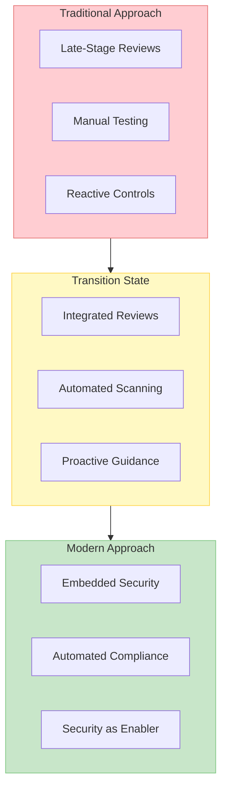
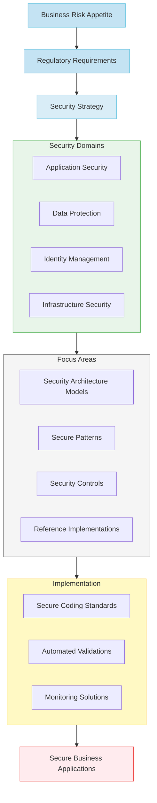
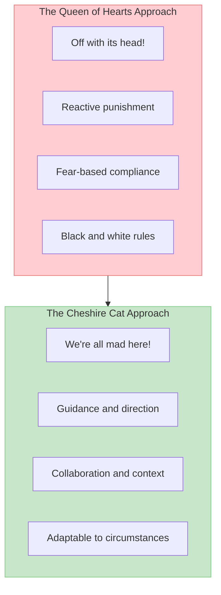
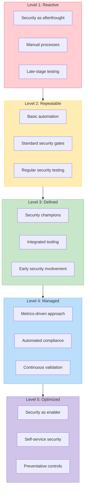

# Shifting Risk Left: Transforming Information Security in the Digital Enterprise
*A CIO's Guide to Reimagining Risk Management in Modern Software Development*

## Executive Summary
For technology leaders navigating today's complex threat landscape, traditional security approaches have become unsustainable. Information risk management is no longer a checkpoint at the end of development but must be woven throughout the entire software delivery lifecycle. As regulators demand more tangible evidence of security controls and compliance, organizations must fundamentally transform how they approach risk—shifting from reactive gatekeeping to proactive enablement.

> "Regulators today are no longer satisfied with frameworks, documentation, and audit validation alone; they want tangible evidence, including end-to-end testing, as well as compliance program management that is baked into day-to-day operating processes." - 2020 Banking Regulatory Outlook, Deloitte

The stakes are clear. In today's digital economy, business objectives like "becoming a trusted financial partner" or "protecting customer data while driving innovation" require more than technical controls and documentation. They demand a reimagining of how we integrate security and compliance into every stage of software delivery.

```mermaid
flowchart LR
    subgraph Today[Current State]
        T1[Risk as Police]
        T2[End-of-Cycle Validation]
        T3[Manual Compliance]
    end

    subgraph Future[Target State]
        F1[Risk as Partner]
        F2[Continuous Assessment]
        F3[Automated Controls]
    end

    subgraph Pillars[Four Foundations]
        P1[Collaboration]
        P2[Automation]
        P3[Visibility]
        P4[Prevention]
    end

    Today --> Pillars
    Pillars --> Future

    style Today fill:#ffcdd2,stroke:#e57373
    style Future fill:#c8e6c9,stroke:#81c784
    style Pillars fill:#bbdefb,stroke:#64b5f6
```

**Key Takeaways:**
* Traditional security approaches focused on late-stage gatekeeping are failing to meet modern business and regulatory needs
* Successful transformation requires a shift from "security guard" to "trusted advisor" mindset
* Four critical foundations drive success: collaboration, automation, visibility, and prevention
* Measuring security posture through clear metrics enables data-driven risk management
* Cultural transformation and capability development are as crucial as technical controls

**Expected Benefits:**
* Reduced security-related delays in software delivery
* Decrease in post-release vulnerabilities and incidents
* Lower remediation costs through early detection
* Improved regulatory compliance and audit readiness
* Enhanced collaboration between security and development teams
* Stronger security posture with minimal delivery friction

## I. The Modern Security Challenge: Risk in Wonderland

In Lewis Carroll's "Alice in Wonderland," the Queen of Hearts famously declares, "Sentence first—verdict afterward." This absurd approach to justice parallels how many organizations handle security today—enforcing controls after development is complete, when changes are most expensive and disruptive. This approach creates an adversarial relationship where security is perceived as the villain rather than a vital partner in delivering safe, reliable software.

### The Traditional Approach Is Failing

Imagine a city where building inspections only occur after construction is complete. Developers would face devastating costs when structural issues are discovered too late, leading to expensive remediation or even complete rebuilds. Unfortunately, many organizations still approach information security this way—waiting until development is nearly complete before conducting security reviews, penetration tests, and compliance checks.

### The Cost of Late-Stage Security

Organizations clinging to traditional security approaches face:
* Costly rework and delayed releases
* Adversarial relationships between security and development
* Mounting security debt
* Increased exposure to threats
* Rising operational risks
* Compliance challenges and regulatory scrutiny

## II. The Evolution of Risk Management

Modern information security requires thinking like a trusted advisor rather than a checkpoint guardian. This means creating environments that enable secure development while ensuring system integrity and regulatory compliance.

### From Security Guard to City Planner

| Traditional Approach | Modern Approach |
|---------------------|-----------------|
| End-stage security reviews | Security in requirements |
| Manual compliance checks | Automated policy enforcement |
| Security as blocker | Security as enabler |
| Project-based security | Product security mindset |
| Perimeter defense | Zero-trust principles |

Now imagine a new world where developers have access to pre-approved security patterns, automated compliance verification, and clear security guidelines that enable rapid, reliable construction while ensuring protection. This is the promise of modern security integration—providing higher-level security building blocks that enable innovation and rapid business reconfiguration while maintaining system integrity. Rather than forcing every team to become security experts, we create platforms and patterns that abstract away complexity while ensuring quality and consistency.

## III. The "What": Strategic Security Alignment

In an environment where you need to balance business agility with regulatory compliance and security requirements, evolving your security approach is key. Security capabilities need to support rapid delivery of business value while ensuring appropriate protection against threats.

The shift for security teams to focus on business enablement rather than just protection is essential. This means proactively understanding both the business objectives and planned delivery paths, then integrating security seamlessly into those journeys.

Moving to "Shift-Left" security is a significant cultural change. Security is no longer expressed as a gate at the end of development, but as an integral part of the entire delivery process. Translating security requirements into actionable guidance and controls allows delivery teams to build secure systems from the start.

Key areas to address:
- Alignment between security capabilities and business risk appetite
- Evolution from security checkpoints to security enablement
- Frameworks for measuring security effectiveness
- Cultural transformation requirements
- Models for effective cross-team collaboration
- Approaches to security investment prioritization
- Automated compliance monitoring
- Secure innovation enablement strategies

Just as a city's safety depends on building codes being applied from the initial planning stages, our security strategy must be integrated throughout the development lifecycle. This integration ensures that improvements in security posture translate into tangible business value—reduced incidents, better compliance readiness, and stronger customer trust.

## IV. The "How": Building Secure Digital Products

### 1. Security in Requirements Review
> **Conversation Starter**: "How do we ensure security is considered from the very beginning?"

Just as building codes are consulted before architectural plans are drawn, security requirements must be established early in the development process.

| Focus Area | Key Activities | Business Impact |
|------------|---------------|-----------------|
| Risk Assessment | - Thorough assessment of controls - Authentication & authorization review - Data protection planning - Input validation requirements | - Reduced remediation costs - Improved compliance - Enhanced customer trust |
| Architecture Review | - Network segmentation planning - Data flow security analysis - Application security architecture - Zero-trust implementation | - System resilience - Defense in depth - Reduced attack surface - Compliance by design |
| Data Classification | - Information classification standards - Appropriate control selection - Privacy requirements mapping - Regulatory alignment | - Regulatory compliance - Data breach prevention - Appropriate protection levels - Resource optimization |

### 2. Security in Design Review
> **Conversation Starter**: "How do we identify and address security risks in our architecture?"

Like urban planners considering crime prevention through environmental design, security in design focuses on identifying and mitigating threats early.

| Focus Area | Key Activities | Business Impact |
|------------|---------------|-----------------|
| Threat Modeling | - Systematic risk identification - Attack vector analysis - Potential attacker profiles - Business impact assessment | - Proactive risk mitigation - Targeted security controls - Informed investment decisions - Reduced vulnerabilities |
| Secure Patterns | - Pre-approved security patterns - Security reference architectures - Implementation guidelines - Best practice examples | - Faster development - Consistent security - Reduced design flaws - Knowledge reuse |
| Design Reviews | - Security architecture evaluation - Control effectiveness assessment - Design pattern validation - Expert guidance | - Enhanced design quality - Early flaw detection - Optimized controls - Reduced technical debt |

### 3. Security in Build and Test
> **Conversation Starter**: "How do we ensure code is secure before it reaches production?"

Similar to building inspections occurring throughout construction, security testing must be integrated into the development process.

| Focus Area | Key Activities | Business Impact |
|------------|---------------|-----------------|
| Secure Coding | - Coding standards implementation - Developer security training - Peer code reviews - Security frameworks | - Fewer vulnerabilities - Developer capability - Consistent quality - Reduced incidents |
| Automated Testing | - Static application security testing - Software composition analysis - Secret scanning - Container security scanning | - Continuous validation - Early detection - Reduced manual effort - Consistent quality |
| Pre-Production Testing | - Dynamic application security testing - Penetration testing - Compliance validation - Security regression testing | - Validation of controls - Comprehensive assessment - Regulatory readiness - Risk reduction |

### 4. Security in Production
> **Conversation Starter**: "How do we maintain security posture once systems are live?"

Like ongoing city safety monitoring and emergency services, production security ensures systems remain protected against evolving threats.

| Focus Area | Key Activities | Business Impact |
|------------|---------------|-----------------|
| Continuous Monitoring | - Security event monitoring - Threat intelligence integration - Anomaly detection - Vulnerability management | - Rapid threat detection - Proactive protection - Breach prevention - Risk management |
| Incident Response | - Response process automation - Playbook development - Cross-team coordination - Recovery procedures | - Minimized impact - Business continuity - Regulatory compliance - Customer trust |
| Continuous Improvement | - Root cause analysis - Control effectiveness review - Process refinement - Knowledge sharing | - Evolving protection - Process maturity - Reduced recurrence - Organizational learning |

## V. Measuring Success: The Security Metrics Dashboard

```mermaid
flowchart LR
    subgraph Input[Security Inputs]
        I1[Requirements]
        I2[Design Reviews]
        I3[Training]
        I4[Assessment]
    end
    
    subgraph Process[Security Process]
        P1[SAST Analysis]
        P2[DAST Testing]
        P3[SCA Scans]
        P4[Pen Testing]
    end
    
    subgraph Output[Security Outcomes]
        O1[Vulnerability Reduction]
        O2[Mean Time to Remediate]
        O3[Secure Release Rate]
        O4[Regulatory Compliance]
    end
    
    Input --> Process
    Process --> Output
    
    style Input fill:#e3f2fd,stroke:#64b5f6
    style Process fill:#e8f5e9,stroke:#81c784
    style Output fill:#fff8e1,stroke:#ffd54f
```

To effectively manage what you measure, a comprehensive security metrics dashboard should track key indicators across the software delivery lifecycle:

### Leading Indicators (Preventative)
- % of projects with completed threat models before development
- % of developers completing security training
- Code scanning coverage and findings per 1000 lines of code
- Security requirements coverage in user stories
- Security architecture review completion rate
- Third-party component risk assessment completion

### Operational Indicators (In-Process)
- Mean time to remediate security findings
- Security debt reduction rate
- Automated security test pass rate
- Vulnerability scan coverage
- Security gate pass/fail metrics
- Secure coding standard compliance

### Lagging Indicators (Results)
- Production security incidents by severity
- Security findings discovered post-release
- Audit compliance status
- Percentage of applications with current penetration tests
- Average vulnerability age by severity
- Security-related release delays

## VI. Practical Implementation Guide: Down the Rabbit Hole

### Phase 1: Foundation Building (1-3 months)
Just as Alice had to understand the rules of Wonderland, start by establishing your security baseline:
- Security maturity assessment across development teams
- Current state risk mapping and gap analysis
- Security governance model definition
- Initial metrics framework establishment
- Pilot team identification and prioritization
- Quick win implementation

### Phase 2: Transformation Launch (3-6 months)
Like Alice's journey through Wonderland, begin your transformation expedition:
- Developer security awareness program implementation
- Automated security tooling integration in CI/CD
- Security champions program establishment
- Secure coding guidelines development
- Threat modeling process implementation
- Initial metrics collection and baseline setting

### Phase 3: Scale and Optimize (6-12 months)
As your journey progresses, expand successful practices:
- Expansion to additional development teams
- Metrics-driven improvement initiatives
- Security automation enhancement
- Advanced threat modeling capabilities
- Developer certification program
- Continuous feedback and optimization loop

## VII. The New Security Mindset: From Queen of Hearts to Cheshire Cat

A security team's mindset should evolve from the authoritarian 'Queen of Hearts,' who demands obedience through fear and threatens to remove heads (or projects) that fail to comply, to one that mirrors the Cheshire Cat—providing guidance, appearing when needed, and helping teams navigate their way through the complex security landscape while respecting their autonomy.

### The Transformation of Security Leadership

| Aspect | Traditional Mindset ("Queen of Hearts") | Modern Mindset ("Cheshire Cat") | Business Impact |
|--------|----------------------------------|----------------------------|-----------------|
| **Leadership Style** | - Command and control - Fear-based compliance - Binary pass/fail - Centralized authority | - Guide and advise - Risk-based decisions - Contextual guidance - Distributed responsibility | - Faster delivery - Improved collaboration - Better security outcomes - Reduced friction |
| **Decision Making** | - Rigid standards - Manual approvals - Gate-driven process - Risk avoidance | - Flexible guidelines - Automated validations - Continuous assessment - Risk management | - Accelerated delivery - Appropriate controls - Consistent protection - Business enablement |
| **Team Interaction** | - Security dictates requirements - After-the-fact reviews - Distant relationship - Approval-based | - Collaborative design - Embedded security expertise - Partnership model - Enablement-focused | - Shared responsibility - Earlier detection - Reduced rework - Team empowerment |

### Key Mindset Shifts in Practice

#### 1. From Enforcer to Enabler
Traditional Practice | Modern Practice | Value Created
--------------------|-----------------|---------------
Security gates | Security guardrails | Reduced delivery friction
Manual security reviews | Self-service security tools | Faster development cycles
Audit-driven compliance | Risk-based protection | Appropriate security investment
Security sign-offs | Automated validations | Continuous compliance

#### 2. From Documentation to Automation
Traditional Practice | Modern Practice | Value Created
--------------------|-----------------|---------------
Manual compliance evidence | Automated evidence collection | Reduced audit overhead
Static security requirements | Security as code | Consistent implementation
Periodic security testing | Continuous security validation | Earlier vulnerability detection
Human-dependent controls | Machine-enforced controls | Scalable security

#### 3. From Project to Product Security
Traditional Practice | Modern Practice | Value Created
--------------------|-----------------|---------------
Point-in-time assessments | Continuous security monitoring | Sustainable security posture
Handover to operations | Shared security responsibility | Improved operational security
Final penetration tests | Frequent security testing | Earlier vulnerability detection
Security debt accumulation | Continuous security improvement | Reduced security incidents

## VIII. Shifting Left in Practice: The Golden Pathway

Building on the concept of a "golden path" for software development, we can establish a "secure golden pathway" that integrates security at every stage of the software delivery lifecycle.

```mermaid
flowchart LR
    subgraph Before["Before Development"]
        B1["Architecture Review"]
        B2["Risk Assessment"]
        B3["Security Requirements"]
    end
    
    subgraph During["During Development"]
        D1["Secure Coding"]
        D2["Automated Scanning"]
        D3["Code Reviews"]
    end
    
    subgraph Before2["Before Release"]
        BR1["Security Testing"]
        BR2["Compliance Validation"]
        BR3["Final Review"]
    end
    
    subgraph Prod["In Production"]
        P1["Monitoring"]
        P2["Incident Response"]
        P3["Continuous Improvement"]
    end
    
    Before --> During
    During --> Before2
    Before2 --> Prod
    
    style Before fill:#e3f2fd,stroke:#64b5f6
    style During fill:#e8f5e9,stroke:#81c784
    style Before2 fill:#fff8e1,stroke:#ffd54f
    style Prod fill:#f3e5f5,stroke:#ab47bc
```

### Before Development
**Activities:**
- Information classification validation
- Third-party risk assessment
- Security architecture review
- Authentication/authorization design
- Threat modeling

**Who:** Information Risk Management, Architecture, Product Teams  
**How:** Local governance with security expertise  
**Goal:** Build security requirements into development backlogs

### During Development
**Activities:**
- Secure coding practices
- Pre-commit security checks
- Static application security testing
- Software composition analysis
- Secret scanning
- Security-focused code reviews

**Who:** Developers, Security Champions, AppSec Engineers  
**How:** Automated tooling in CI/CD pipeline  
**Goal:** Detect and fix vulnerabilities early in development

### Before Release
**Activities:**
- Dynamic application security testing
- Penetration testing
- Infrastructure security validation
- Compliance verification
- Final security review

**Who:** Application Security, Quality Assurance, DevOps  
**How:** Automated security gates with clear remediation paths  
**Goal:** Validate security controls before production deployment

### In Production
**Activities:**
- Security monitoring and alerting
- Vulnerability management
- Incident response readiness
- Security metrics tracking
- Continuous improvement

**Who:** Operations, Security Operations, Product Teams  
**How:** Shared responsibility model with clear accountabilities  
**Goal:** Maintain security posture throughout product lifecycle

## IX. The Integrated Future: DevSecOps Maturity

As your organization matures, security becomes truly embedded in the development process, leading to a fully integrated DevSecOps approach.

### Characteristics of DevSecOps Maturity

| Dimension | Initial Level | Intermediate Level | Advanced Level |
|-----------|---------------|-------------------|----------------|
| **Culture** | - Security as separate function - Compliance-driven - Reactive approach | - Security champions program - Cross-team collaboration - Proactive mindset | - Shared responsibility - Security enablement - Innovation-friendly |
| **Automation** | - Basic scanning tools - Manual approval gates - Limited integration | - Integrated security tooling - Automated security gates - Self-service options | - Comprehensive automation - Policy as code - Preventative controls |
| **Measurement** | - Vulnerability counts - Audit findings - Manual reporting | - Security debt tracking - Process metrics - Automated dashboards | - Risk-based metrics - Business impact measures - Predictive analytics |
| **Governance** | - Traditional security policies - Manual compliance checking - Centralized control | - Modern security standards - Automated compliance - Federated governance | - Adaptive policies - Continuous compliance - Distributed ownership |

### Advanced Security Integration Techniques

As you advance in maturity, explore these advanced security integration techniques:

1. **Infrastructure as Code (IaC) Security**
   - Security policies encoded as infrastructure definitions
   - Automated compliance validation for cloud resources
   - Pre-deployment security verification

2. **Security as Code**
   - Security requirements defined in machine-readable formats
   - Automated testing of security controls
   - Version-controlled security configuration

3. **Continuous Compliance Monitoring**
   - Real-time compliance dashboard
   - Automated evidence collection
   - Continuous control validation

4. **Self-Service Security**
   - Developer-facing security portals
   - On-demand security testing tools
   - Automated security guidance

## X. Conclusion: Navigating the Risk Landscape

The transformation from reactive security to "Shift-Left" risk management represents more than a change in methodology – it's a fundamental reimagining of how we create and sustain secure business value through technology. Just as thriving cities integrate safety considerations from urban planning through construction and ongoing operations, our development approach must transform from late-stage security testing to integrated risk management that enables continuous secure innovation.

> **Vision of the Transformed Enterprise**
> - Security that accelerates rather than constrains innovation
> - Automated controls that ensure compliance without manual intervention
> - Transparent security metrics guiding risk-based decisions
> - Engaged teams sharing security responsibility
> - Architecture designed for protection without compromising agility
> - Strong security foundations that enable continuous compliance

In the process, security teams step out from the enforcement role—like the Queen of Hearts—and into a role more akin to the helpful but unobtrusive Cheshire Cat. By fostering collaboration, contextual guidance, and continuous improvement, you'll build not just secure technology solutions, but a resilient digital ecosystem that can adapt to tomorrow's threats.

> **Key Takeaways for Technology Leaders**
> - Start with business risk appetite, not just technical controls
> - Align security metrics with business outcomes for meaningful insights
> - Provide security platforms and patterns that make secure development easy
> - Measure what matters—tie security metrics to business impact
> - Invest in security capabilities and culture across the organization
> - Design for secure evolution using automated compliance and verification
> - Continuously share insights and scale successful security patterns

Remember, just as great cities aren't built in a day, this transformation is a journey rather than a destination. The key is to start now, move purposefully, and keep the focus on enabling business outcomes while ensuring appropriate protection. In doing so, you'll build not just a secure technology landscape, but a thriving ecosystem that powers your organization's future success—safely and confidently.

> **Call to Action: Starting Your Transformation**
> 1. Assess your current security integration maturity
> 2. Identify your most pressing security improvement opportunities
> 3. Build a coalition of business, technology, and security leaders
> 4. Choose a high-impact pilot area for initial focus
> 5. Establish clear metrics for measuring security improvement
> 6. Share successes and learnings broadly
> 7. Scale proven patterns across the organization
> 8. Maintain focus on continuous security improvement

Organizations that successfully navigate this transformation will build competitive advantages through faster, more secure software delivery, more efficient use of security investments, improved ability to meet regulatory requirements, enhanced capacity for secure innovation, and greater business-security alignment.

The time to start is now. Your organization's future security posture depends on the foundations you build today.
