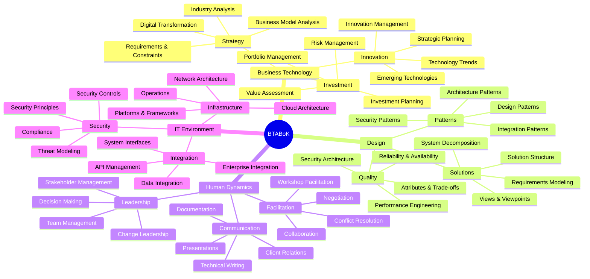
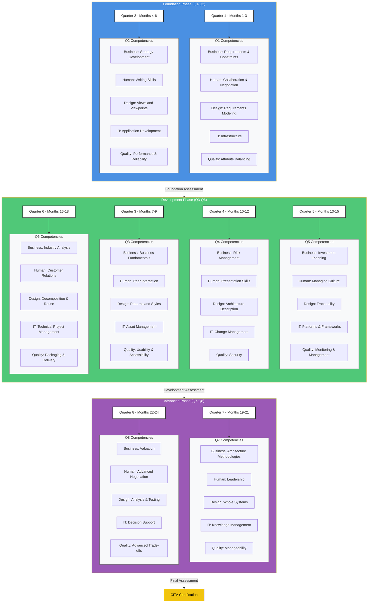
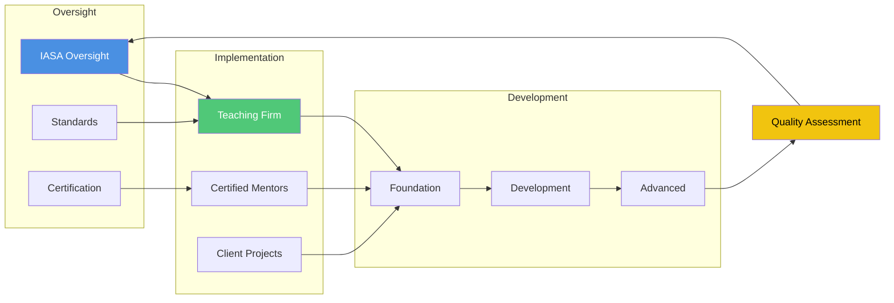
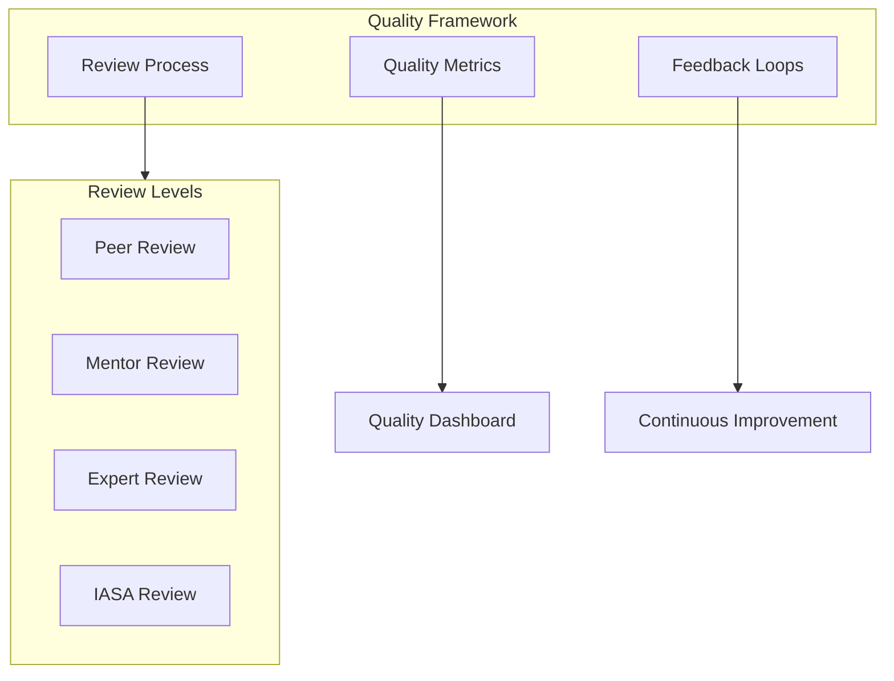

# IASA ATLAS: Executive Summary

## Overview
IASA ATLAS (Architecture Teaching, Learning And Support) introduces a revolutionary approach to developing software architects by applying the teaching hospital model to technology architecture. This program addresses the critical shortage of experienced architects while reducing development costs and maintaining quality.

# Structured Learning Program Overview

## Foundation Phase (Months 1-6)

### Quarter 1 (Months 1-3)
| Competency Area | Focus | Description |
|----------------|-------|-------------|
| Business Strategy | Requirements & Constraints | Eliciting requirements and identifying constraints |
| Human Dynamics | Collaboration & Negotiation | Interdisciplinary teamwork fundamentals |
| Design | Requirements Modeling | Accurate requirement capture and modeling |
| IT Environment | Infrastructure | Foundation of IT infrastructure |
| Quality Attributes | Balancing & Optimization | Performance, scalability, and security basics |

### Quarter 2 (Months 4-6)
| Competency Area | Focus | Description |
|----------------|-------|-------------|
| Business Strategy | Strategy Development | Technology strategy formulation |
| Human Dynamics | Writing Skills | Documentation and technical writing |
| Design | Views & Viewpoints | Stakeholder-focused architecture views |
| IT Environment | Application Development | Development tools and standards |
| Quality Attributes | Performance & Reliability | System performance and reliability design |

## Development Phase (Months 7-18)

### Quarter 3 (Months 7-9)
| Competency Area | Focus | Description |
|----------------|-------|-------------|
| Business Strategy | Business Fundamentals | Financial metrics and organizational structures |
| Human Dynamics | Peer Interaction | Workplace collaboration skills |
| Design | Patterns & Styles | Common architectural solutions |
| IT Environment | Asset Management | Organizational asset control |
| Quality Attributes | User-Centric Design | Usability and accessibility |

### Quarter 4 (Months 10-12)
| Competency Area | Focus | Description |
|----------------|-------|-------------|
| Business Strategy | Risk Management | Architectural risk assessment |
| Human Dynamics | Presentation Skills | Effective communication techniques |
| Design | Architecture Description | ADLs and documentation methods |
| IT Environment | Change Management | Production transition processes |
| Quality Attributes | Security | Core security principles |

### Quarter 5 (Months 13-15)
| Competency Area | Focus | Description |
|----------------|-------|-------------|
| Business Strategy | Investment Planning | Technology investment prioritization |
| Human Dynamics | Cultural Management | Organizational dynamics |
| Design | Lifecycle Traceability | Requirements and decisions tracking |
| IT Environment | Platforms & Frameworks | Technology selection criteria |
| Quality Attributes | Monitoring | Solution monitoring integration |

### Quarter 6 (Months 16-18)
| Competency Area | Focus | Description |
|----------------|-------|-------------|
| Business Strategy | Industry Analysis | Technology trend impact |
| Human Dynamics | Customer Relations | Stakeholder relationship management |
| Design | System Decomposition | Component reuse strategies |
| IT Environment | Project Management | Technical project oversight |
| Quality Attributes | Solution Delivery | Deployment and maintenance |

## Advanced Phase (Months 19-24)

### Quarter 7 (Months 19-21)
| Competency Area | Focus | Description |
|----------------|-------|-------------|
| Business Strategy | Architecture Methods | Advanced frameworks and methodologies |
| Human Dynamics | Leadership | Team and project leadership |
| Design | Holistic Design | Complex system integration |
| IT Environment | Knowledge Management | Organizational knowledge systems |
| Quality Attributes | System Sustainability | Long-term maintenance strategies |

### Quarter 8 (Months 22-24)
| Competency Area | Focus | Description |
|----------------|-------|-------------|
| Business Strategy | Business Valuation | Investment value assessment |
| Human Dynamics | Advanced Negotiation | High-stakes negotiation tactics |
| Design | Analysis & Testing | Comprehensive solution validation |
| IT Environment | Decision Support | Strategic architectural guidance |
| Quality Attributes | Advanced Trade-offs | Complex quality attribute optimization |

Each phase builds upon previous learning, creating a comprehensive pathway from foundational knowledge to advanced architectural expertise. The program maintains consistent focus across all five core competency areas throughout the journey.

## Key Value Propositions
- 40-60% reduction in architect development costs
- Structured pathway for junior architect development
- Quality assurance through standardized mentoring
- Knowledge preservation and transfer framework
- Sustainable architecture practice development

## Core Components
1. **Certified Teaching Environment**

   - IASA-certified mentors
   - Structured learning pathways
   - Quality assurance framework

3. **Business Integration**
   - Progressive responsibility model
   - Blended pricing structure
   - Risk management framework

4. **Quality Assurance**

   - BTABoK alignment
   - Multi-level review system
   - Continuous assessment

## Implementation Timeline
- Months 1-3: Assessment and Certification
- Months 3-6: Program Setup
- Months 6-9: Pilot Program
- Months 9-12: Full Implementation

## Investment and Returns
- Initial investment in mentor certification and program setup
- ROI realized within 12-18 months
- Long-term benefits in talent retention and development
