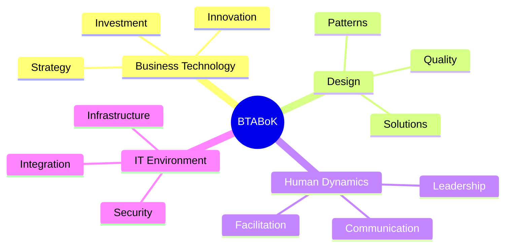
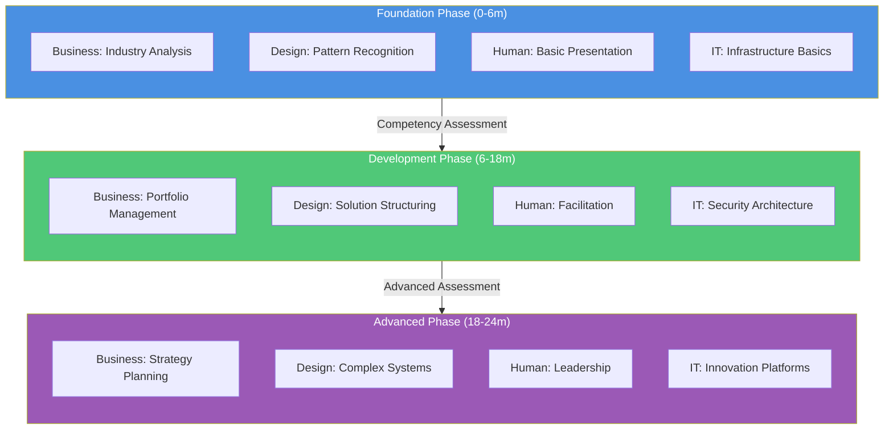
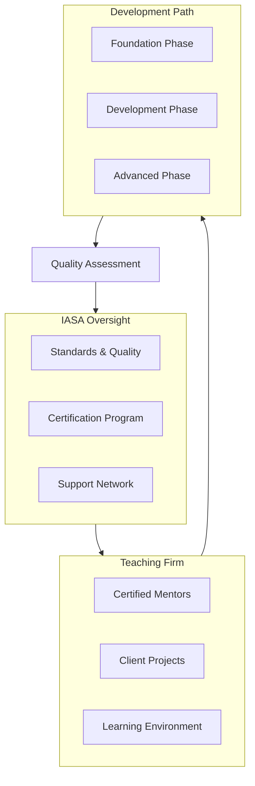
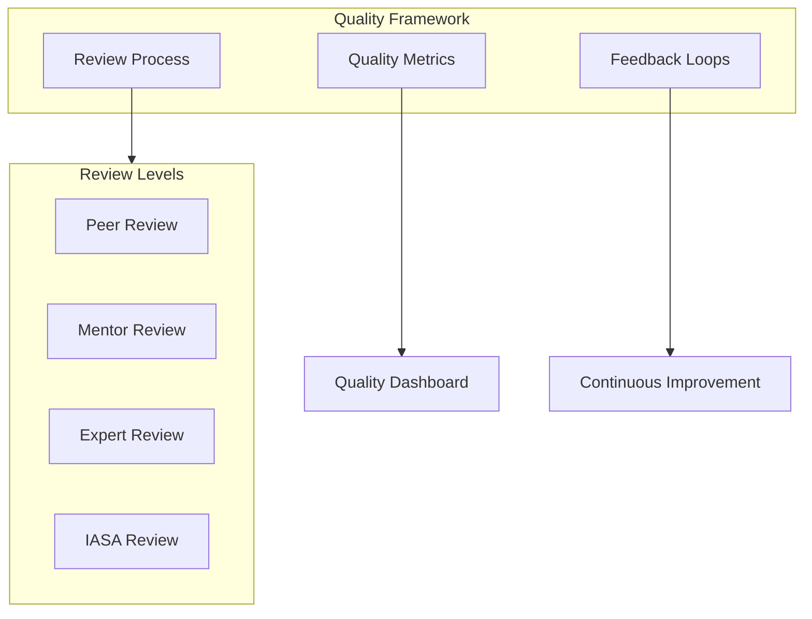

# IASA ATLAS: Executive Summary

## Overview
IASA ATLAS (Architecture Teaching, Learning And Support) introduces a revolutionary approach to developing software architects by applying the teaching hospital model to technology architecture. This program addresses the critical shortage of experienced architects while reducing development costs and maintaining quality.

## Key Value Propositions
- 40-60% reduction in architect development costs
- Structured pathway for junior architect development
- Quality assurance through standardized mentoring
- Knowledge preservation and transfer framework
- Sustainable architecture practice development

## Core Components
1. **Certified Teaching Environment**

   - IASA-certified mentors
   - Structured learning pathways
   - Quality assurance framework

3. **Business Integration**
   - Progressive responsibility model
   - Blended pricing structure
   - Risk management framework

4. **Quality Assurance**

   - BTABoK alignment
   - Multi-level review system
   - Continuous assessment

## Implementation Timeline
- Months 1-3: Assessment and Certification
- Months 3-6: Program Setup
- Months 6-9: Pilot Program
- Months 9-12: Full Implementation

## Investment and Returns
- Initial investment in mentor certification and program setup
- ROI realized within 12-18 months
- Long-term benefits in talent retention and development
