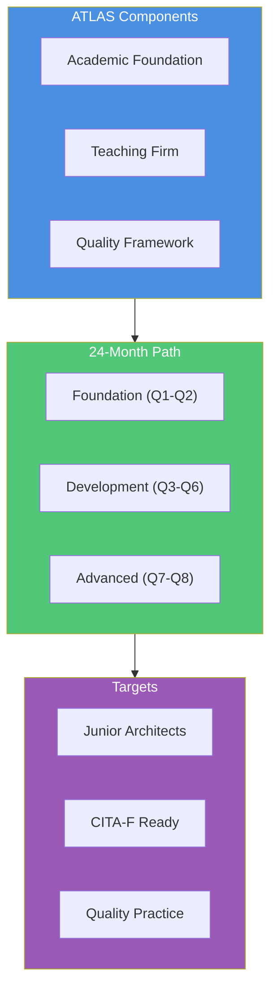
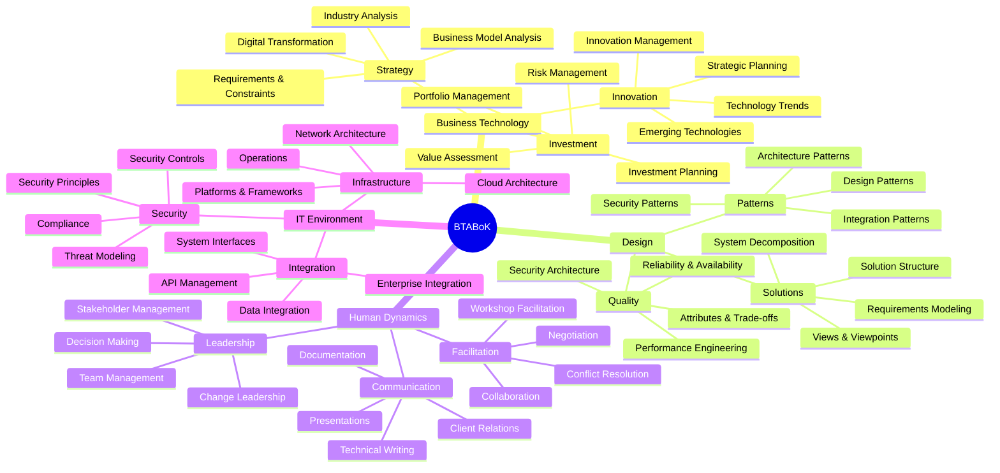
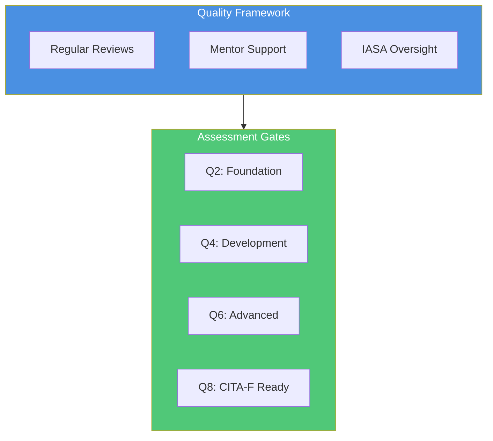
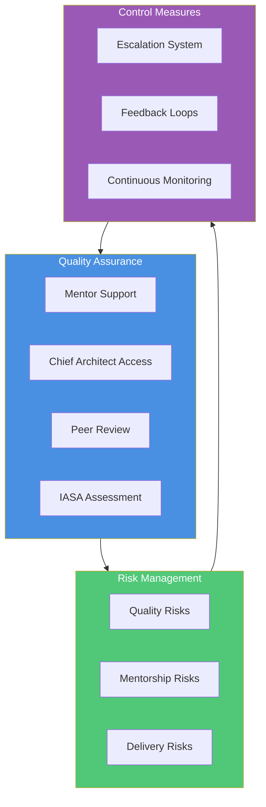

# IASA ATLAS Framework
## Architecture Teaching, Learning And Support

## Executive Summary

IASA ATLAS (Architecture Teaching, Learning And Support) transforms architect development through a teaching hospital model for technology architecture. This 24-month program creates a structured pathway to CITA-F certification while addressing critical industry challenges.

### Key Outcomes
- Industry-ready junior architects
- CITA-F certification preparation
- Reduced development costs
- Standardized quality assurance
- Knowledge preservation framework

## BTABoK Competency Framework

## 24-Month Program Structure

### Foundation Phase (Q1-Q2)

#### Quarter 1: Foundations
- **Business**: Requirements Discovery and Constraints Analysis
- **Human**: Collaboration and Negotiation
- **Design**: Requirements Modeling
- **IT**: Infrastructure Basics
- **Quality**: Basic Attribute Analysis

#### Quarter 2: Application
- **Business**: Strategy Development
- **Human**: Writing Skills
- **Design**: Views and Viewpoints
- **IT**: Application Development
- **Quality**: Performance & Reliability

### Development Phase (Q3-Q6)

#### Quarter 3: Core Skills
- **Business**: Business Fundamentals
- **Human**: Peer Interaction
- **Design**: Patterns and Styles
- **IT**: Asset Management
- **Quality**: Usability & Accessibility

#### Quarter 4: Integration
- **Business**: Risk Management
- **Human**: Presentation Skills
- **Design**: Architecture Description
- **IT**: Change Management
- **Quality**: Security Fundamentals

#### Quarter 5: Advanced Skills
- **Business**: Investment Planning
- **Human**: Cultural Management
- **Design**: Lifecycle Traceability
- **IT**: Platforms & Frameworks
- **Quality**: Monitoring & Management

#### Quarter 6: Synthesis
- **Business**: Industry Analysis
- **Human**: Customer Relations
- **Design**: System Decomposition
- **IT**: Technical Project Management
- **Quality**: Solution Delivery

## Assessment Framework

### Scoring System (1-3 Scale)

1. **Learning (Level 1)**
   - Basic understanding
   - Requires guidance
   - Foundational awareness

2. **Developing (Level 2)**
   - Growing independence
   - Applied knowledge
   - Regular mentoring

3. **CITA-F Ready (Level 3)**
   - Independent work
   - Demonstrated competency
   - Consistent delivery

### Phase Gate Requirements

#### Foundation Gate (Q2)
| Competency | Minimum Score | Evidence Required |
|------------|---------------|-------------------|
| Business | 2.0 | Requirements documentation, Analysis reports |
| Design | 2.0 | Architecture views, Model documentation |
| Human | 2.0 | Team feedback, Communication samples |
| IT | 2.0 | Infrastructure analysis, Technology reports |
| Quality | 2.0 | Quality scenarios, Trade-off analysis |

#### Development Gate (Q4)
| Competency | Minimum Score | Evidence Required |
|------------|---------------|-------------------|
| Business | 2.5 | Business cases, Risk assessments |
| Design | 2.5 | Pattern applications, Architecture decisions |
| Human | 2.5 | Presentations, Team leadership |
| IT | 2.5 | Change management plans, Security designs |
| Quality | 2.5 | Quality implementations, Security models |

## Quality Control Framework

### Risk Management Strategy

#### Technical Quality
- Weekly mentor reviews
- Monthly peer assessments
- Quarterly IASA evaluations
- Portfolio reviews

#### Delivery Assurance
- Project quality gates
- Client feedback integration
- Performance monitoring
- Competency tracking

#### Support Structure
- Chief Architect oversight
- Mentor certification
- IASA guidance
- Community support

## Implementation Support

### Getting Started
1. Initial assessment
2. Mentor certification
3. Program setup
4. Quality framework implementation

### Ongoing Management
1. Progress tracking
2. Quality monitoring
3. Risk management
4. Continuous improvement

## Contact Information

IASA Global
[Contact Details]
