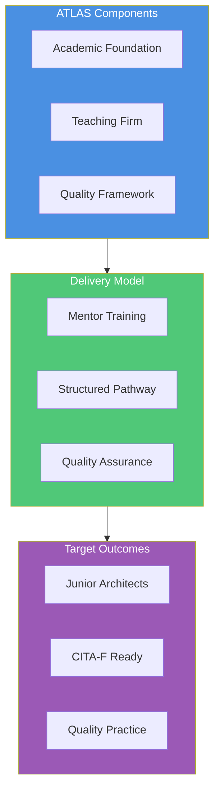
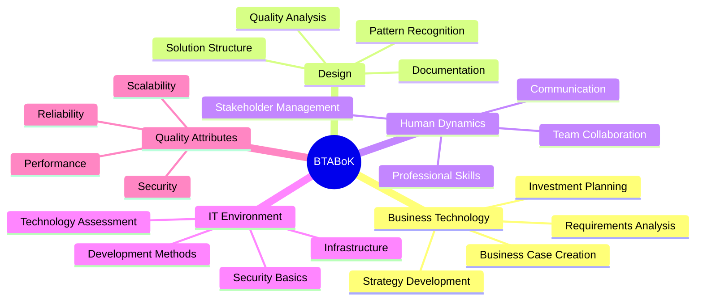
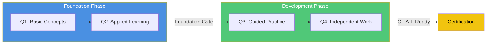
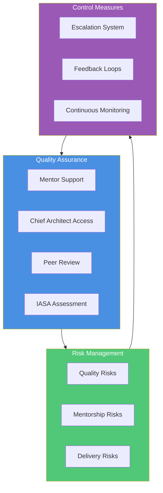
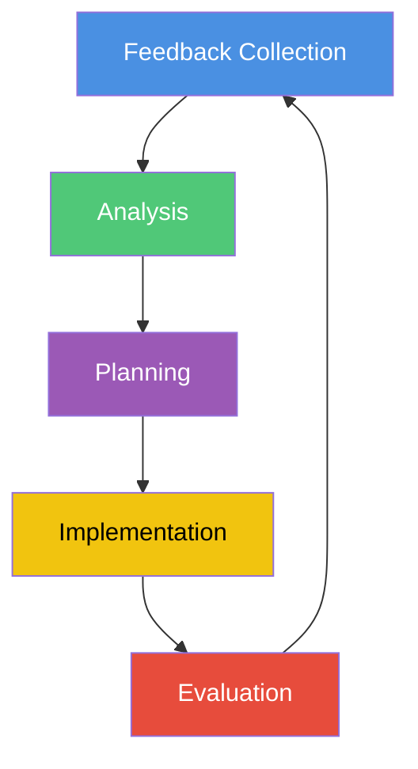

# IASA ATLAS Framework
## Architecture Teaching, Learning And Support

## Table of Contents
1. Executive Summary
2. Program Structure
3. Learning Pathway
4. Assessment Framework
5. Quality Assurance
6. Risk Management
7. Appendices

## 1. Executive Summary

IASA ATLAS combines a teaching firm model with an academic pathway to create junior architects aligned with CITA-F certification. The program addresses critical industry challenges:
- Limited entry paths for junior architects
- High costs of architect development
- Inconsistent training approaches
- Knowledge transfer challenges

### Key Program Elements
- 24-month structured learning pathway
- CITA-F aligned competency development
- Certified teaching environments
- Quality-assured mentorship

## 2. Program Structure

### BTABoK Competency Integration

## 3. Learning Pathway

### Quarter-by-Quarter Progression

### Foundation Phase (Q1-Q2)
- BTABoK fundamentals
- Basic architecture skills
- Professional development
- Technical foundations

### Development Phase (Q3-Q4)
- Applied architecture
- Guided projects
- Stakeholder management
- Technical depth

## 4. Assessment Framework

### Scoring System
1. Learning (Level 1)
   - Initial exposure
   - Basic understanding
   - Guided application

2. Developing (Level 2)
   - Independent practice
   - Basic implementation
   - Growing confidence

3. CITA-F Ready (Level 3)
   - Consistent delivery
   - Independent work
   - Foundation mastery

### Example: First Phase Assessment (Q1-Q2)

| Competency Area | Criteria | Evidence Required | Minimum Score |
|----------------|----------|-------------------|---------------|
| Business Technology | Requirements analysis | Documented requirements, Stakeholder maps | 2.0 |
| Design | Basic modeling | Architecture views, Pattern usage | 2.0 |
| Human Dynamics | Team collaboration | Meeting participation, Documentation | 2.0 |
| IT Environment | Infrastructure basics | Technology evaluations, Platform analysis | 2.0 |
| Quality Attributes | Basic qualities | Quality scenarios, Trade-off analysis | 2.0 |

## 5. Quality Assurance

### Quality Control Measures
1. Weekly mentor reviews
2. Monthly peer assessments
3. Quarterly IASA evaluations
4. Continuous feedback loops

## 6. Risk Management

### Quality Assurance Measures
1. Chief Architect Oversight
   - Regular review sessions
   - Strategic guidance
   - Quality validation
   - Pattern approval

2. Mentorship Quality
   - Mentor certification
   - Regular mentor training
   - Performance monitoring
   - Resource support

3. Delivery Excellence
   - Weekly progress reviews
   - Monthly assessments
   - Client feedback integration
   - Portfolio validation

### Escalation Paths
1. Technical Concerns
   - Mentor -> Chief Architect -> IASA Review
   - 48-hour response commitment
   - Documentation requirements
   - Resolution tracking

2. Quality Issues
   - Immediate mentor notification
   - Weekly quality reviews
   - Monthly program assessment
   - Quarterly IASA audit

### Continuous Improvement

## 7. Appendices

### A. Assessment Templates
[Detailed assessment templates per phase]

### B. Quality Checklists
[Quality control checklists and procedures]

### C. Risk Management Procedures
[Detailed risk management procedures and templates]

### D. Program Materials
[Additional program materials and resources]

---

**Contact Information:**
IASA Global
[Contact Details]
